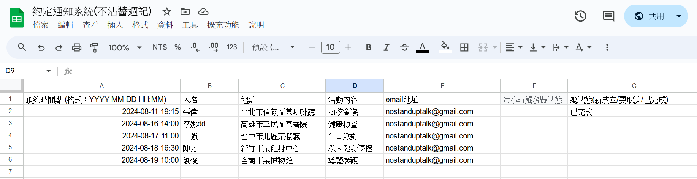
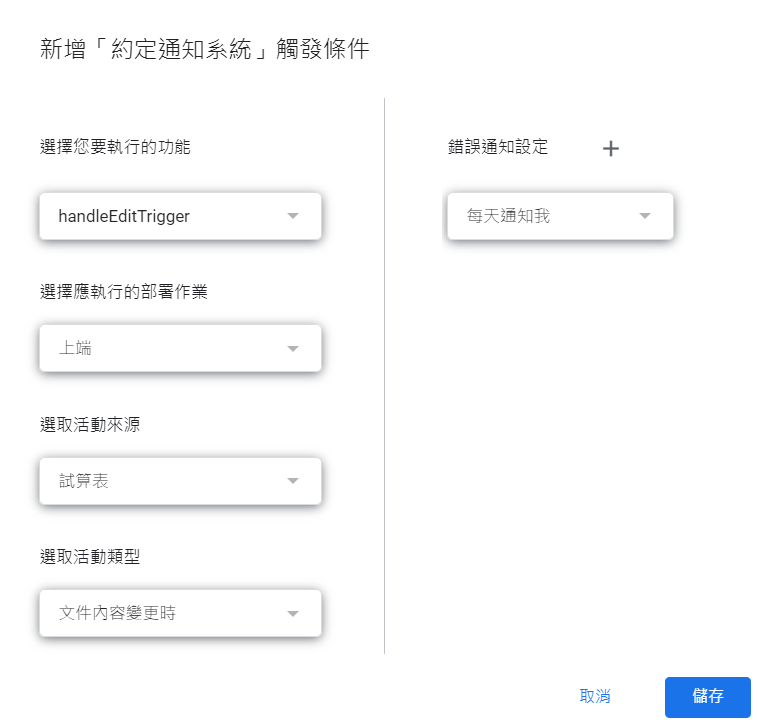
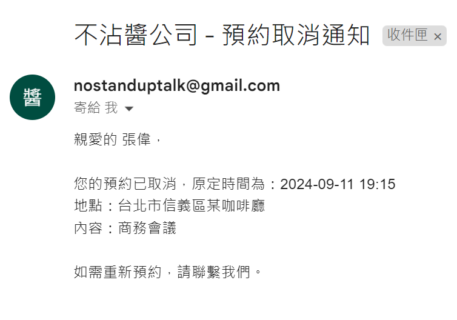

# [程式] Google Apps Script 約定通知系統：自動郵件通知系統


在這個繁忙的世界裡，有效管理時間和預約變得越來越重要。想像一下，有一個系統能夠自動為您發送提醒、更新預約狀態，甚至處理取消請求。本文將介紹一個使用 Google Apps Script 開發的強大工具，它將徹底改變您管理日程的方式。
<!--more-->

[點這裡，索取副本](https://docs.google.com/spreadsheets/d/1flsDUF2xly4gMPFNOEuha6esHxN3lpuEcOGkUeD6giY/edit?usp=sharing "smartCard-inline")

## 程式介紹：預約提醒與自動郵件通知系統

這篇文章介紹了一個使用 Google Apps Script 編寫的自動化程式，專為幫助您管理和跟進各類預約而設計。該系統根據預設`時間點`，自動發送提醒郵件，更新預約狀態，並且支持隨時取消預約，適合需要經常安排會議、活動或其他時間敏感任務的使用者。

#### 核心功能

1. **自動發送提醒郵件**：
   - **48小時前提醒**：預約開始前48小時，系統會自動發送郵件提醒相關人員。
   - **2小時前提醒**：預約開始前2小時，系統再次發送提醒郵件，確保用戶準時參加。
2. **狀態自動更新**：
   - 預約時間過去後，如果狀態為「已成立」，系統會自動更新為「已完成」。
3. **取消預約通知**：
   - 使用者如果決定取消預約，可以將「總狀態」更新為「要取消」。
   - 系統會立即發送取消通知，並將狀態更新為「已取消」，之後不再觸發任何提醒。

#### 使用者流程

1. 建立副本 (檔案--> 建立副本)，連帶程式碼一起，改名。
2. 設定觸發器 (擴充功能 --> App script) `(過程需要使用權限同意)`
   - 設置每小時觸發器：
     點擊編輯器左側的「時鐘」圖標（觸發器設置）。
     點擊右下角的「+ 新增觸發器」按鈕。
     在彈出的對話框中：
     選擇要運行的函數：選擇 hourBasedTrigger。
     選擇事件來源：選擇「時間驅動」。
     選擇事件類型：選擇「小時定時器」。
     選擇時間間隔：選擇「每小時」。
     點擊「保存」。
   - 
   設置編輯觸發器：
   在編輯器左側的「時鐘」圖標（觸發器設置）中，點擊右下角的「+ 新增觸發器」按鈕。
   在彈出的對話框中：
   選擇要運行的函數：選擇 handleEditTrigger。
   選擇事件來源：選擇「試算表」。
   選擇事件類型：選擇「文件內容變更時」。
   點擊「保存」。
   
   
3. **填寫預約資訊**：
   - 在試算表中填寫「預約時間點」、「人名」、「地點」、「活動內容」和「email地址」等欄位，**不要**填寫「總狀態」。
4. **啟動預約**：
   - 當所有資訊填寫完成後，將「總狀態」設為「新成立」。
   - 系統會自動發送確認郵件給相關人員，通知他們預約已成立，並將「總狀態」更新為「已成立」。

   
5. **自動提醒**：
   - 預約狀態為「已成立」後，系統將每小時檢查時間，並根據預約時間，自動發送48小時前和2小時前的提醒郵件。

   
6. **取消預約**：
   - 若需取消預約，將「總狀態」設為「要取消」。
   - 系統會立即發送取消通知，並將「總狀態」更新為「已取消」。
   - 狀態更新為「已取消」後，系統將不再發送任何提醒郵件。

   

#### 流程圖

下圖展示了使用者如何操作該系統的整體流程，從預約填寫、啟動到取消的全過程。


這個流程圖清晰展示了使用者在不同狀態下的操作步驟，確保系統在預約管理中的高效運作。

### 結論

這個自動化預約提醒系統通過多層次的自動化通知和靈活的狀態管理，極大地提升了預約管理的效率。它能確保使用者及時收到提醒，並能夠靈活處理預約的變更或取消需求。如果您經常需要管理多個預約或活動，這個工具將是您理想的選擇。

### 程式碼區

```
// 定義常數
const COLUMN_APPOINTMENT_TIME = 0; // 預約時間點，列索引從0開始
const COLUMN_NAME = 1; // 人名
const COLUMN_LOCATION = 2; // 地點
const COLUMN_EVENT_DETAILS = 3; // 活動內容
const COLUMN_EMAIL_ADDRESS = 4; // email地址
const COLUMN_HOUR_STATUS = 5; // 每小時觸發器狀態
const COLUMN_OVERALL_STATUS = 6; // 總狀態

const NOTIFICATION_REMINDER_2_DAYS = "已通知-2天";
const NOTIFICATION_REMINDER_2_HOURS = "已通知-2小時";
const STATUS_NEW = "新成立";
const STATUS_CONFIRMED = "已成立";
const STATUS_CANCELLED = "已取消";
const STATUS_COMPLETED = "已完成";
const STATUS_TO_BE_CANCELLED = "要取消";


//不沾醬公司 請換成你的企業名稱
function sendEmail(subject, body, emailAddress) {
  subject = "不沾醬公司 - " + subject;
  Logger.log("發送郵件：主旨 - " + subject + ", 收件人 - " + emailAddress);
  MailApp.sendEmail(emailAddress, subject, body);
}
// 新增一個函數來格式化日期時間
function formatDateTime(date) {
  var year = date.getFullYear();
  var month = ('0' + (date.getMonth() + 1)).slice(-2); // 月份從0開始，所以加1
  var day = ('0' + date.getDate()).slice(-2);
  var hours = ('0' + date.getHours()).slice(-2);
  var minutes = ('0' + date.getMinutes()).slice(-2);

  return year + '-' + month + '-' + day + ' ' + hours + ':' + minutes;
}
function hourBasedTrigger() {
  var sheet = SpreadsheetApp.getActiveSpreadsheet().getActiveSheet();
  var data = sheet.getDataRange().getValues();
  var now = new Date();

  Logger.log("開始每小時觸發器執行，當前時間：" + now);

  for (var i = 1; i < data.length; i++) {
    var appointmentTime = new Date(data[i][COLUMN_APPOINTMENT_TIME] + ":00"); // 需要加上秒數
    var appointmentTimeInMail = formatDateTime(data[i][COLUMN_APPOINTMENT_TIME]); // 訊息用
    var name = data[i][COLUMN_NAME];
    var location = data[i][COLUMN_LOCATION];
    var eventDetails = data[i][COLUMN_EVENT_DETAILS];
    var emailAddress = data[i][COLUMN_EMAIL_ADDRESS];
    var hourStatus = data[i][COLUMN_HOUR_STATUS];
    var overallStatus = data[i][COLUMN_OVERALL_STATUS];

    Logger.log("處理第 " + (i + 1) + " 行: 預約時間 - " + appointmentTime);

    // 跳過尚未填寫總狀態的行
    if (!overallStatus) {
      Logger.log("第 " + (i + 1) + " 行總狀態尚未填寫，跳過處理。");
      continue;
    }

    // 檢查是否已取消
    if (overallStatus === STATUS_CANCELLED) {
      Logger.log("第 " + (i + 1) + " 行預約已取消，跳過處理。");
      continue;
    }

    var diffHours = (appointmentTime - now) / (1000 * 60 * 60);

    // 發送48小時前的通知
    if (diffHours <= 48 && diffHours > 46 && hourStatus !== NOTIFICATION_REMINDER_2_DAYS) {
      var subject = "即將到來的預約提醒 (2天後)";
      var body = "親愛的 " + name + "，\n\n" +
                 "您有一個即將到來的預約：\n\n" +
                 "時間：" + appointmentTimeInMail + "\n" +
                 "地點：" + location + "\n" +
                 "內容：" + eventDetails + "\n\n" +
                 "如果無法出席，請提前請假，謝謝。";
      sendEmail(subject, body, emailAddress);
      sheet.getRange(i + 1, COLUMN_HOUR_STATUS + 1).setValue(NOTIFICATION_REMINDER_2_DAYS);
      Logger.log("第 " + (i + 1) + " 行發送了48小時前的通知。");
    }

    // 發送2小時前的通知
    if (diffHours <= 2 && diffHours > 0 && hourStatus !== NOTIFICATION_REMINDER_2_HOURS) {
      var subject = "即將開始的預約提醒 (2小時內)";
      var body = "親愛的 " + name + "，\n\n" +
                 "您有一個即將開始的預約：\n\n" +
                 "時間：" + appointmentTimeInMail + "\n" +
                 "地點：" + location + "\n" +
                 "內容：" + eventDetails + "\n\n" +
                 "請準時出席。";
      sendEmail(subject, body, emailAddress);
      sheet.getRange(i + 1, COLUMN_HOUR_STATUS + 1).setValue(NOTIFICATION_REMINDER_2_HOURS);
      Logger.log("第 " + (i + 1) + " 行發送了2小時前的通知。");
    }

    // 檢查是否超過預約時間，更新狀態為"已完成"
    if (appointmentTime < now && overallStatus === STATUS_CONFIRMED) {
      sheet.getRange(i + 1, COLUMN_OVERALL_STATUS + 1).setValue(STATUS_COMPLETED);
      Logger.log("第 " + (i + 1) + " 行的預約時間已過，狀態更新為「已完成」。");
    }
  }

  Logger.log("每小時觸發器執行結束。");
}

function handleEditTrigger() {
  var sheet = SpreadsheetApp.getActiveSpreadsheet().getActiveSheet();
  var data = sheet.getDataRange().getValues();

  Logger.log("處理編輯觸發器");

  for (var i = 1; i < data.length; i++) {
    var overallStatus = data[i][COLUMN_OVERALL_STATUS];
    var appointmentTimeInMail = formatDateTime(data[i][COLUMN_APPOINTMENT_TIME]); // 訊息用
    var name = data[i][COLUMN_NAME];
    var location = data[i][COLUMN_LOCATION];
    var eventDetails = data[i][COLUMN_EVENT_DETAILS];
    var emailAddress = data[i][COLUMN_EMAIL_ADDRESS];

    Logger.log("第 " + (i + 1) + " 行的總狀態: " + overallStatus);

    if (overallStatus === STATUS_NEW) {
      // 發送約定通知
      var subject = "新的預約通知";
      var body = "親愛的 " + name + "，\n\n" +
                 "您已成功預約以下活動：\n\n" +
                 "時間：" + appointmentTimeInMail + "\n" +
                 "地點：" + location + "\n" +
                 "內容：" + eventDetails + "\n\n" +
                 "謝謝您！";
      sendEmail(subject, body, emailAddress);
      sheet.getRange(i + 1, COLUMN_OVERALL_STATUS + 1).setValue(STATUS_CONFIRMED);
      Logger.log("第 " + (i + 1) + " 行發送了約定通知，狀態更新為「已成立」。");
    } else if (overallStatus === STATUS_TO_BE_CANCELLED) {
      // 發送取消通知
      var subject = "預約取消通知";
      var body = "親愛的 " + name + "，\n\n" +
                 "您的預約已取消，原定時間為：" + appointmentTimeInMail + "\n" +
                 "地點：" + location + "\n" +
                 "內容：" + eventDetails + "\n\n" +
                 "如需重新預約，請聯繫我們。";
      sendEmail(subject, body, emailAddress);
      sheet.getRange(i + 1, COLUMN_OVERALL_STATUS + 1).setValue(STATUS_CANCELLED);
      Logger.log("第 " + (i + 1) + " 行發送了取消通知，狀態更新為「已取消」。");
    }
  }

  Logger.log("編輯觸發器處理結束。");
}


// 設定觸發器

//     設置每小時觸發器：
//         點擊編輯器左側的「時鐘」圖標（觸發器設置）。
//         點擊右下角的「+ 新增觸發器」按鈕。
//         在彈出的對話框中：
//             選擇要運行的函數：選擇 hourBasedTrigger。
//             選擇事件來源：選擇「時間驅動」。
//             選擇事件類型：選擇「小時定時器」。
//             選擇時間間隔：選擇「每小時」。
//         點擊「保存」。

//     設置編輯觸發器：
//         在編輯器左側的「時鐘」圖標（觸發器設置）中，點擊右下角的「+ 新增觸發器」按鈕。
//         在彈出的對話框中：
//             選擇要運行的函數：選擇 handleEditTrigger。
//             選擇事件來源：選擇「試算表」。
//             選擇事件類型：選擇「文件內容變更時」。
//         點擊「保存」。

// 注意事項

//     handleEditTrigger 函數不再接收事件對象（e），而是直接遍歷整個試算表中的資料列。這意味著每次觸發器執行時，它會檢查每一行的狀態。
//     確保每次編輯試算表時，handleEditTrigger 函數會更新所有行的狀態，這可能會影響性能，特別是當試算表有大量資料時。如果需要優化，可能需要根據實際需求調整邏輯。
```
