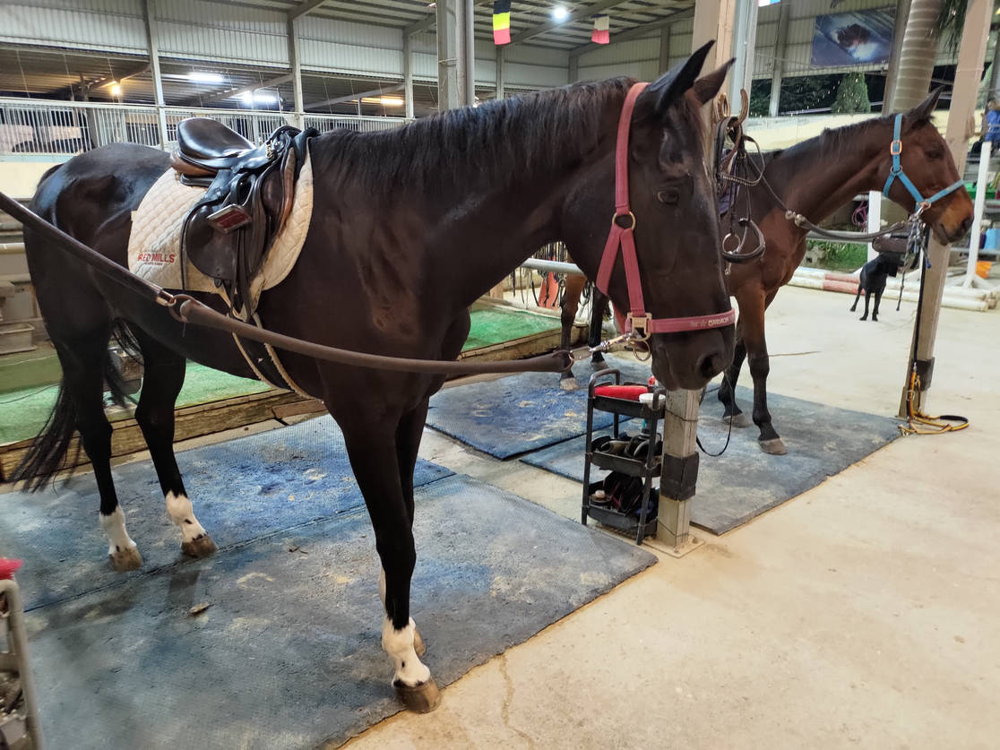

# [旅遊] 騎馬心得

<!--more-->
馬看不到前後，盡量從旁邊接近，不要揮手，不要拍手，避免嚇到馬

不要站在馬後，比較安全

體驗牽馬：站左前方，左手收線不要纏到手上，避免馬暴衝被帶走受傷。右手拉在靠近馬的地方

騎馬牽馬的繩子不一樣

馬幾乎整天站著，睡覺躺一下就會醒來

體驗梳髮：皮很厚，可以用鐵刷，再用毛刷，去除木削

體驗騎馬：有點晃，但還行，下馬柔軟度要好，也要有小樓梯

<iframe width="560" height="315" src="https://www.youtube.com/embed/D1PREVDzIJo?si=MqRLt5LvhtkajB7j" title="YouTube video player" frameborder="0" allow="accelerometer; autoplay; clipboard-write; encrypted-media; gyroscope; picture-in-picture; web-share" allowfullscreen></iframe>
