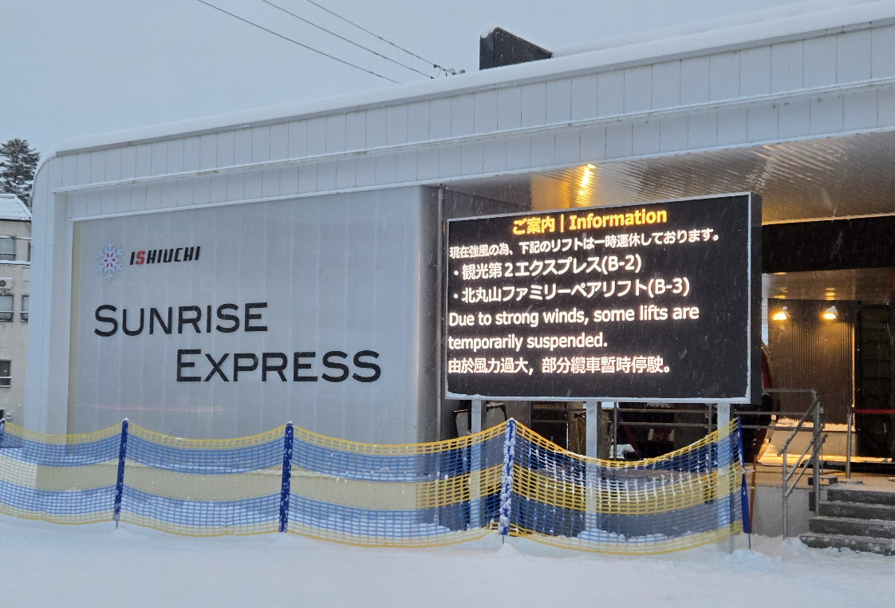
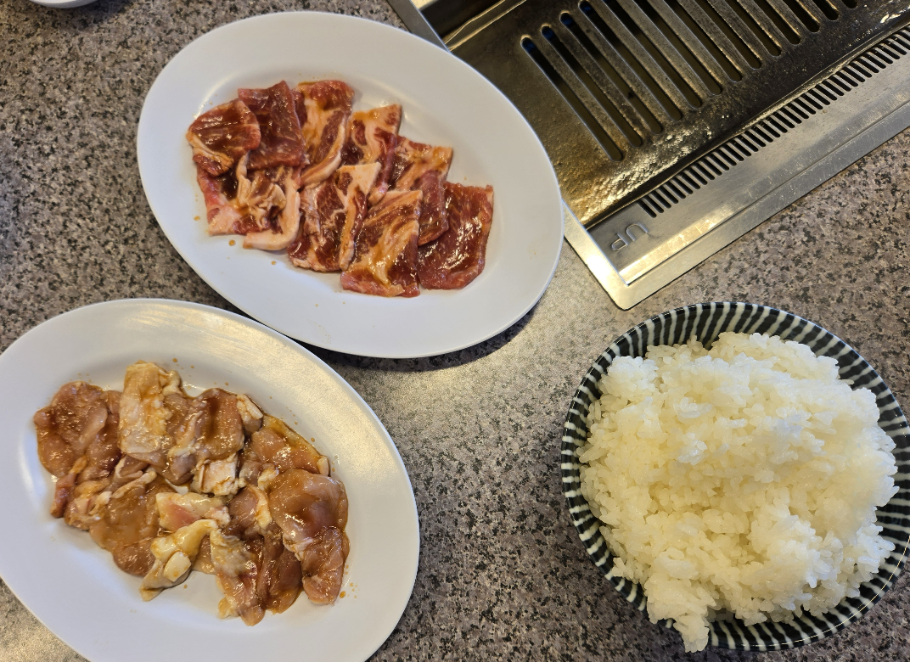

# [旅遊] 2026日本滑雪：石打丸山ishiuchi雪場體驗心得分享

這次在石打丸山上課與滑行，從纜車動線、場地配置，到實際上課學到的技巧，都有不少值得記錄的地方。無論是 Sunrise Express 纜車的體驗、團體課的學習內容，還是雪場設施與美食推薦，都是寶貴的經驗分享。
<!--more-->

---

## 石打丸山滑雪場體驗心得

### 一、纜車與場地心得

一開始集合時，是搭乘 **Sunrise Express** 上山。我覺得大部分來石打丸山的人，應該都是從這條纜車進出的。

Sunrise Express 最大的優點在於它是有**封閉車廂的纜車**，天氣不好的時候特別有感。聽說這條纜車最晚可以開到晚上八點，因此是可以夜滑的，不過這次我沒有待到那麼晚就先離開了。

另外一點我覺得很加分的是，Sunrise Express 也可以**向下搭乘**。如果只是上山找人，或是不想滑某小一段紅線，其實可以直接搭纜車下山，而那段路我這次才在教練帶著的情況下通過挑戰。

---

### 二、其他纜車體驗

除了 Sunrise 之外，我在雪場內還搭到了其他纜車，我就姑且稱它們為 **三號纜車** 與 **四號纜車**。

這次一早到場時，教練帶我搭的是三號纜車，但老實說體驗並不算好。三號纜車一出站就是一段非常長的平地，長到讓人相當痛苦。即使我是雙板，最後也一定會變成搓雪前進，感覺所有力氣都耗在「平地脫困」上，非常累，也不是很喜歡這樣的設計。

三號纜車與四號纜車還有一個共同的問題：**進入纜車前幾乎都需要往上爬**。老實說我不太理解石打丸山在動線上的安排，入口需要往上走這件事本身就很不方便，也讓人沒辦法做到那種理想的流程──一路滑到底，剛好滑進纜車入口，驗票後直接上纜車，入口人多的話，是很難辦到的。

在設備方面，纜車的品質也有些差異。有些纜車有護欄可以放下來保護，但有些沒有；即使有護欄，腳下也沒有可以踩踏的支撐。不過實際使用上還是可以接受，只是體感上差了一點點。

---

### 三、食物心得

吃的部分，個人最推薦的是 **「大丸燒肉」**。

石打丸山內其實還有不少店家可以選擇，但大丸燒肉真的讓人印象深刻。大約一千五百日圓左右，就可以吃到非常好吃的肉，整體來說相當值得。如果下次還有機會再來石打丸山，我應該還會再吃一次。

---

### 四、上課學習心得（團體課）

這次上的是團體課，兩次學員人數剛好兩位。我覺得這樣的人數配置其實很理想，老師雖然需要同時照顧另一位同學，但因為人不多，整體教學品質仍然維持得不錯。如果再多幾個人，我會有點擔心老師的注意力會被分散。

在姿勢本身的部分，我的感覺是：**只要我有意識去調整，其實都不是做不到的問題，比較重要的是動作的時機與用力方式。**

#### 1. 上半圓就開始壓腳、直接入彎

第一個學到、也覺得非常關鍵的重點，是在轉彎的**上半圓就開始壓腳，直接帶入彎道**。

這個動作對我未來挑戰紅線很有幫助，目前已經能理解概念，接下來就是需要多加練習，把它變成自然反應。

另外我也發現，在坡度比較大的地方，這個技巧特別好用，可以更早掌控速度與方向，不會等到下半段才手忙腳亂。

#### 2. 姿勢校準與動作練習

接下來學的是一些用來校準姿勢與用力感覺的練習。有趣的是，老師提到的其中兩個名詞，我原本以為是單板才會用的，但實際做起來，雙板其實也有非常相似的概念。

**落葉漂（Leaf Drifting）**

這個動作是在一個比較斜的坡面上，先大橫向咬住邊，接著稍微放鬆，讓自己慢慢往下滑，再立刻重新咬住。

這個練習對於訓練**雙腿壓力控制**非常有效，可以很清楚感受到自己到底有沒有真的在壓雪，我自己也覺得這是一個非常實用的動作。

**J-Turn**

也就是在雪道上畫出一個 J：先往下衝，然後在最後用力壓腳，去感受力量被釋放出來的過程。

這個練習對我特別有幫助的一點是，它可以用來**加強弱腳**。像我左腳比較不行，就可以透過一連串斜向的 J-Turn，刻意只用左腳去壓，右腳簡單慢速彎即可，避免自己一直依賴強腳，又可以多用弱腳。

---

### 五、小發現與實用補充

這次來還發現一個小變化：**以前接駁車下班後會看到的營業處，目前沒有開放**。因此最後是回到真正的主要入口，一棟外觀看起來像玻璃屋的主建築。

那棟玻璃屋的**二樓空間其實非常好用**，可以休息、換衣服，也能寄放物品。整體環境算舒適，如果需要等人，我也覺得這裡滿適合的，有地方坐，又可以把東西放好，不會影響動線。

寄物方面，這裡的價格我覺得**相對便宜**。大約 400 日圓的置物櫃，就可以放得下像Ｍuji那樣的後背包。如果之後還有機會再來石打丸山、又需要寄物的話，我應該會優先選擇這裡。

---

## 整體小結

- ✅ **技巧層面**：上半圓壓腳入彎、落葉漂、J-Turn 等練習
- ✅ **場地認識**：Sunrise Express 纜車的便利性、其他纜車的特性
- ✅ **弱點理解**：透過 J-Turn 加強弱腳的訓練方式

---

## 官方連結

https://ishiuchi.or.jp/zh-TW/winter/ski/lift-course/#lift

https://ishiuchi.or.jp/zh-TW/winter/

https://ishiuchi.or.jp/zh-TW/winter/news/6285/

---

## 我的連結

- YouTube: https://www.youtube.com/@Daydream-Studio/videos
- Podcast: https://cl4bfh8ww02uu01zgaj2i3d1u.firstory.io/episodes
- FaceBook: https://www.facebook.com/profile.php?id=100082389794254
- Blog: https://nostanduptalk.github.io/

