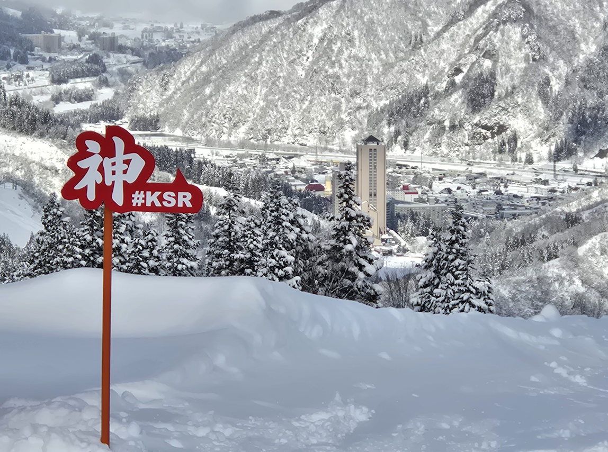
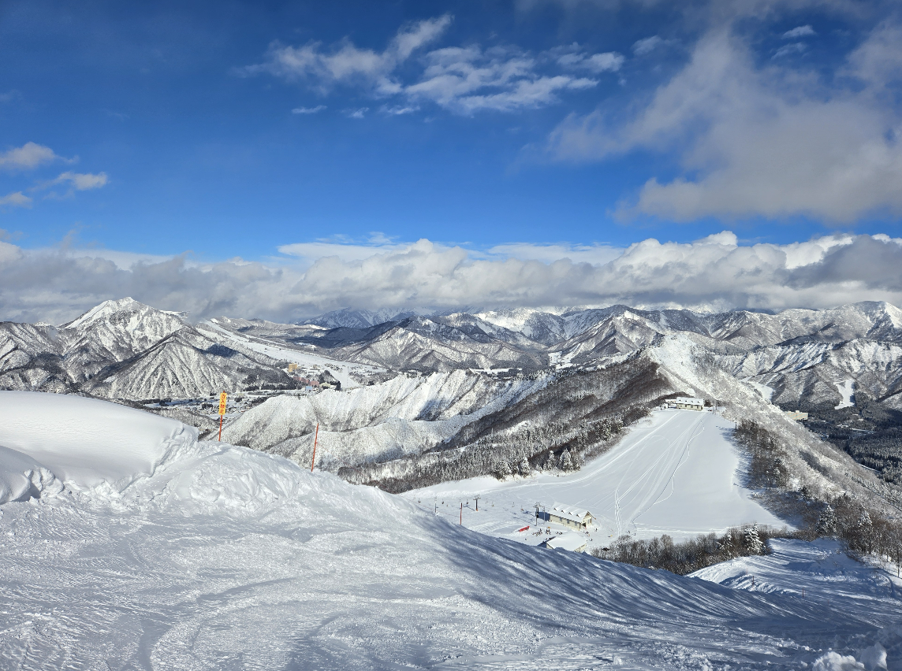
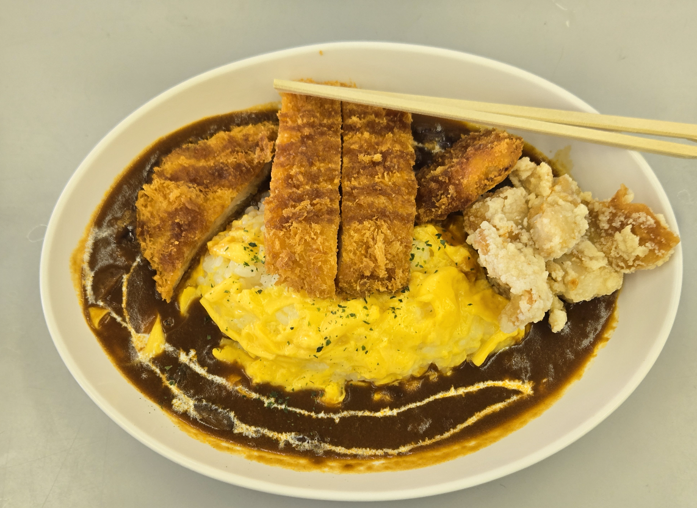

# [旅遊] 2026日本滑雪：神立Kandatsu雪場體驗心得分享

這次來到位於越後湯澤的神立滑雪場，發現一個超值的女生平日方案：**只要 3500 日圓，就送可麗餅和面膜**！加上免費接駁車從 JR 越後湯澤站直達，雪場設施新穎、紅線綠線選擇豐富，還意外獲得日本老爺爺的雙板指導。神立滑雪場究竟值不值得推薦？一起來看看我的初滑體驗！
<!--more-->

---

## 為什麼選神立？

這次會來神立滑雪場，原因很單單純。第一是**沒去過，想踩點新雪場**。第二是因為**女生平日方案真的很划算**，只要 **3500 日圓**，還會送可麗餅跟面膜。

交通方面也很方便，神立本身就有 **JR越後湯澤站** 的接駁車，而且是**免費的**，班次也不算少。

---

## 天氣與雪況

我到的時候第一天其實**風雪蠻大的**。不過即使在這樣的天氣下，整體滑起來的感覺還是 OK，尤其是在 B 纜車那一帶。

---

## 纜車與雪道體驗

### A 纜車

A 纜車我個人覺得算是**開場搭一次就好**，沒有特別需要一直重複，因為對應的雪道其實只是聯絡道路，除非你想要練習幾乎沒有坡度的地方。

### B 纜車

B 纜車對應的是**很長又寬的雪道**，雖然偏長直線，但不是完全平的，中間都會帶一點點坡度。

- 對單板來說，不至於卡住
- 對雙板來說，則**非常適合拿來練習、調整姿勢，或累積速度**

我在這一段滑了很多趟，也是在這裡慢慢把自己的動作修正好，最後**幾乎可以確定在綠線上的滑行姿勢是 OK 的**，不太會有大問題。

---

## 意外的插曲：日本老爺爺教我滑雪

在練習的過程中，發生了一件蠻有趣的事情。有一位**日本老爺爺**在我移動中大聲問我：「你是不是日本人？」（用日文）

我用日文回答他我不是之後，他就開始教我怎麼滑雙板了。可能是因為現場大部分的人都在滑單板，他自己滑雙板有點無聊吧，難得看到我這個外來的小羊，就來指導我。

他指出我一個很重要的問題：**我手的擺法是錯的**。

他理想中的姿勢是：
- 在壓外腿的時候
- **同側的手要往下擺**
- **另一隻對稱的手要往上舉起來**

而我原本的動作剛好是**反過來做**。

後來照他的方式去調整之後，發現整個動作真的輕鬆很多，在雙板平行時也可以自然完成，而且不會再駝背。事後回想，這個姿勢看起來也確實是對的。

---

## 設施與置物櫃

神立給我一個很強烈的感覺就是**很新**。不管是建築、空間，甚至是廁所，看起來都像有重新整修過（或是本來就是新的？），用起來很舒服。

置物櫃的部分，最小的格子是 **200 日圓一次**，而且可以放得下無印良品後背包，價格我覺得算合理。

---

## 紅線進階：C 纜車與 E 纜車

在綠線滑得比較穩之後，我就開始找紅線來挑戰。

### C 纜車

搭 C 纜車可以接到不少紅線，整體滑起來算順，也蠻好玩的。

不過老毛病還是會出現，尤其在坡度比較陡的地方，姿勢就會開始變醜，像是**反應來不及、補償式駝背，或是重心後坐**。

這些問題我自己其實很清楚，下一個雪季一定要把它們好好改善掉。

### E 纜車（平日最高點）

我也有搭到 E 纜車，它基本上是**平日營業纜車中的最高點**。天氣好的時候，從那邊看下去風景真的很好。

下來的時候會經過一段屬於紅線的聯絡道，我自己是覺得**慢慢滑就可以安全通過**，沒有太大的壓力。

---

## 黑線與路線標示的小觀察

神立有一個很明顯的特色，就是**有不少沒有整地的黑線**。老實說，短期內我不會去挑戰，我會希望自己先在紅線能滑得非常穩定之後，再來考慮黑線。

另外有一段我覺得蠻有趣的是，雪場裡有一小段被標成黑線，但實際滑起來我覺得它比較像紅線。它其實是紅線接到黑線的一段尾巴，但那個尾端我真的不覺得是正黑線，不知道為什麼地圖要那樣畫。所以其實**我也走過黑線了**😅。

---

## 餐廳心得（MID BASE）

我這次都是在 **MID BASE** 這棟吃東西。

### 二樓餐飲區

二樓我覺得整體還不錯，座位也足夠，有一道我吃的**歐姆蛋飯**，印象蠻好的。

付款方式也很方便，可以刷卡，也支援 **PayPay**，對無現金支付來說很友善。

比較特別的是，只要在二樓點餐，就會提供你一個杯子，可以拿去旁邊的飲水機裝水補充水分，但飲料吧檯要另外收費，這點我覺得蠻貼心的。當然如果自己有帶水壺，應該也是可以去裝水。

### 一樓速食店

我選的是速食店，我覺得**雞塊吃起來很奇怪，其他都還可以**。

雪場餐廳的價格大家也都知道，動不動就是幾千日圓起跳，以雪場來說算是還可以接受。

---

## 總結

整體來說，神立滑雪場：

- **練綠線很適合**
- **紅線選擇多、進階路線友善**
- **黑線就等之後再說**

還有一個最重要的是，神立雪場最後都會**匯流到出發地**，不怕下錯山，也容易換纜車登山，是個對初學者很友善的雪場配置。

---

## 官方連結
https://kandatsu.com/

---

## 我的連結

- YouTube: https://www.youtube.com/@Daydream-Studio/videos
- Podcast: https://cl4bfh8ww02uu01zgaj2i3d1u.firstory.io/episodes
- FaceBook: https://www.facebook.com/profile.php?id=100082389794254
- Blog: https://nostanduptalk.github.io/

