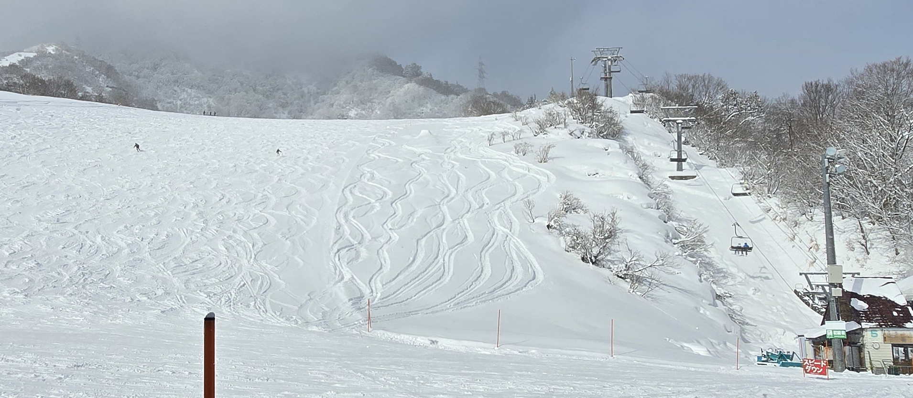
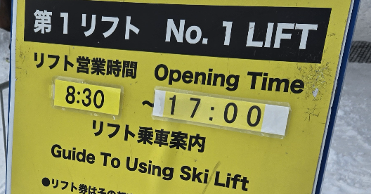

# [旅遊] 2026日本滑雪：Naspa雪場體驗心得分享

距離上一次來 Naspa 滑雪，已經過了一年。第一次來的記憶其實相當深刻，因為那是我第一次上雪地滑雙版。雖然有雪機經驗，當時就連最基礎的三角形轉彎，都做得又怪又醜，整個人非常不穩。

這一年之間，累積了幾次雪上經驗，兩年間多了六天雪上經驗，加上這次滑雪前不久參加了雪地課，跟著教練學習，很多原本錯誤的動作才慢慢被修正。再回到 Naspa 的時候，能力已經完全不同，甚至可以說是「脫胎換骨」的感覺。
<!--more-->

---

## 早上的雪況：從綠線到紅線的選擇

這天一早八點半一開放我就進場了，當時正好在下大雪，粉雪很多，地面的摩擦力也變得相當大。一開始我先去滑第一次來 Naspa 時熟悉的那些雪道，基本上是坡度不高、偏直線的路線。

雖然滑起來不困難，但因為坡度不足，加上粉雪帶來的阻力，常常滑到一半速度就掉下來，甚至快要停住，還得用雪杖一直搓地板，把自己往前推。滑了一陣子之後，我很快就意識到，這樣練下去實在太浪費時間。

剛好看到隔壁的紅線，其實也有不少人在滑，看起來沒有想像中那麼可怕。再加上粉雪的阻力，我判斷速度應該不至於太失控，於是決定嘗試紅線。

真正滑下去之後，發現紅線其實比預期中還能接受。因為我一直記得老師教的重點：**在進入彎之前，就要先開始壓腳、準備轉彎**。只要這件事情有做到，即使坡度接近四十五度，甚至感覺更陡，我也能順利通過，不至於在坡上摔倒，或因為害怕而不敢繼續往前。

---

## 技術上的關鍵轉變：從單腳壓到雙腳平行壓

接下來就是反覆練習紅線的過程。滑著滑著，一個老問題又出現了——單腳壓刃真的很累。這其實不是第一次遇到這個狀況，以前因為還沒學會在轉完彎、接近平緩區段時，用雙腳一起控制刃，幾乎都是靠單腳撐著。

有一次真的太累了，下意識把另一隻腳也放下來一起施力，結果反而像是找到了天堂。那感覺就像單腳站和雙腳站的差別，不管你怎麼左右腳輪流換，單腳站還是會累，但雙腳一起站，穩定度和持久度完全不同。

發現這件事之後，我開始刻意練習在雙腳平行時，同時施力壓刃。這個動作也許本來就是標準動作，只是沒有人明確教過我，但實際做起來真的輕鬆非常多。我也把這個發現先記在心裡，打算之後再跟教練確認是否理解正確。

後來再去挑戰其他紅線時，一開始雖然還是有點卡卡，但多滑幾趟之後，我慢慢抓到踩刃的感覺。對我來說，那個感覺很像左右腳是兩條鐵軌，不能開得太開，重心自然落在中間，但施力並不是完全五五分，外側腳會稍微多一點，這樣才能把平衡穩住。

當我維持這個雙腳平行、共同施力的狀態之後，腳的疲勞明顯減少了。不過很有趣的是，腳不痠了，新的問題卻出現了——腰開始變得痠。這大概又是姿勢跑掉的警訊，也提醒我還有很多細節需要再找教練調整。

---

## 下午的雪況：爛雪地的考驗

到了下午，雪況開始明顯變化。雪幾乎不再下，加上大量人潮反覆滑行，雪面開始融化、被切得亂七八糟。原本平整的雪道，變成到處都是小山丘，或是一顆一顆的冰塊球。

這樣的雪當然還是可以滑，只是會變得比較跳，有時候會突然彈一下、晃一下，偶爾也會短暫失控。不過整體來說，還是能把板子拉回來控制住。現在回頭想，應該是基礎動作有打得比較穩，所以即使遇到這種爛雪地，也不至於被弄得受傷，只是會有一種「無奈」的感覺，稍微調整一下就能繼續。

---

## 心理層面的轉變：不再只怕往下看

有一條讓我特別有感覺的紅線，其實和心理層面的轉變是連在一起的。以前單腳踩外側刃時，常常會覺得板子在往山下滑，後來才意識到，那可能不是刃的問題，而是重心沒有真的壓在刃上，而是偏向山上一點，反而變成在推雪。

現在雙腳平行一起壓刃之後，那種推雪的感覺幾乎消失了，取而代之的是一種很順的感覺，好像真的在山壁上畫出一道一道的軌道。那是雙板的刃確實刻進雪地裡，而不是在表面滑過。

即使陡坡直接往下看還是會覺得有點可怕，但我的注意力大多都放在左、右要去的方向，而不是盯著正下方。往下看通常只是一瞬間的事，很快就把視線拉回轉彎的位置，反而自然避開了恐懼。

---

## 結尾反思

這次在 Naspa 的滑雪經驗，讓我很清楚地感受到，一年的時間、幾次正確的學習，真的可以帶來非常大的差別。從一開始連基本轉彎都不穩，到現在能在紅線上反覆練習、在爛雪地中保持控制，最大的改變不只是技術，而是信心與理解。

當動作開始正確，身體會給你回饋，姿勢穩定，心理也會慢慢放鬆。這次滑完，我更清楚地知道自己還有哪些地方需要再調整、再精進。開始期待下次雪季了！

---

## 官方連結
https://www.naspa.co.jp/ski/gerende/#map

---

## 我的連結

- YouTube: https://www.youtube.com/@Daydream-Studio/videos
- Podcast: https://cl4bfh8ww02uu01zgaj2i3d1u.firstory.io/episodes
- FaceBook: https://www.facebook.com/profile.php?id=100082389794254
- Blog: https://nostanduptalk.github.io/

