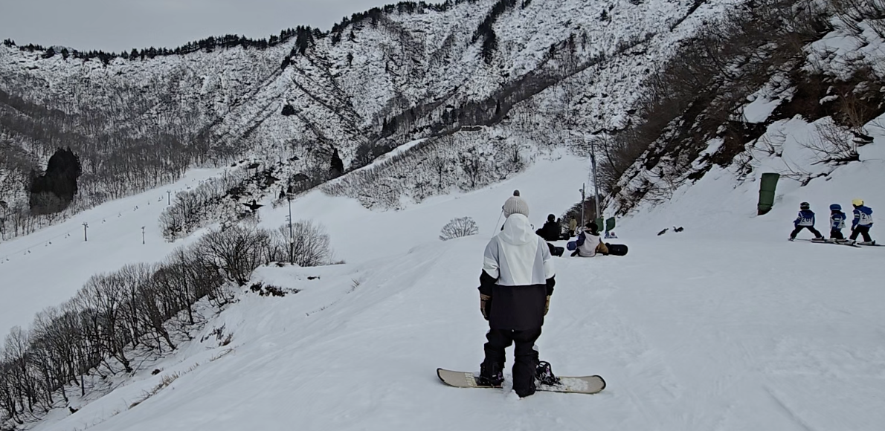
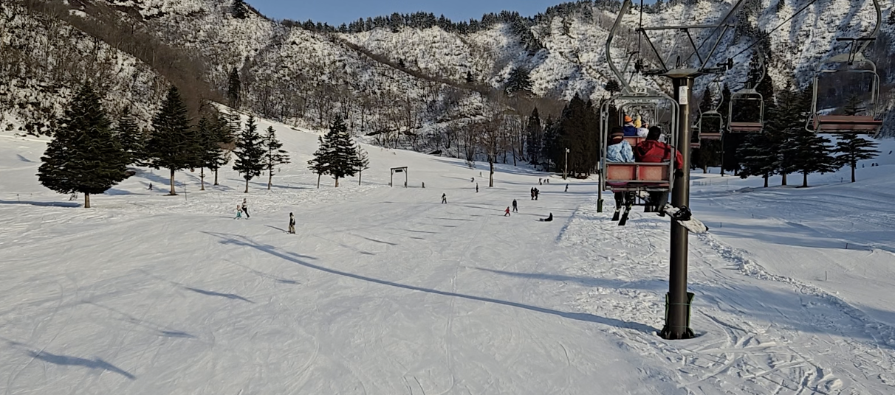
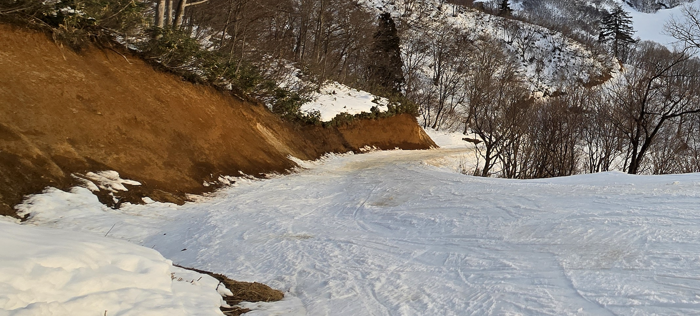
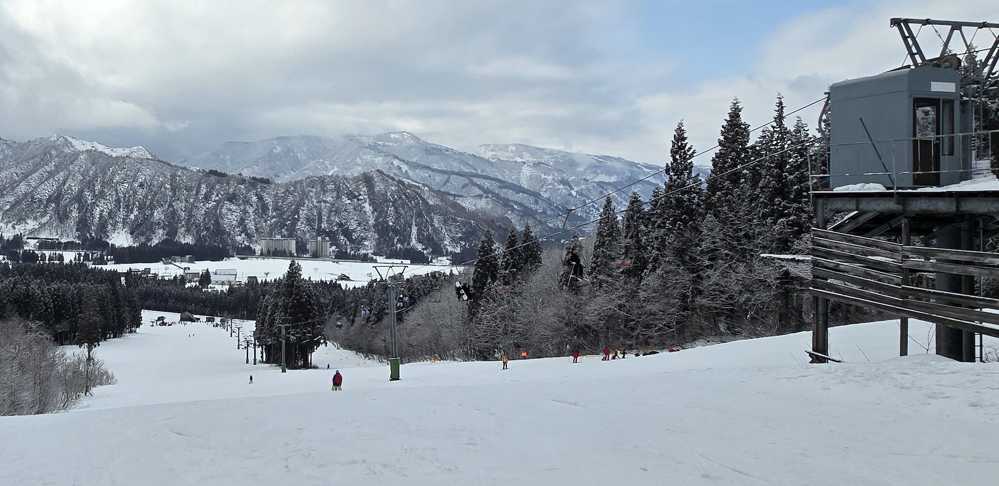
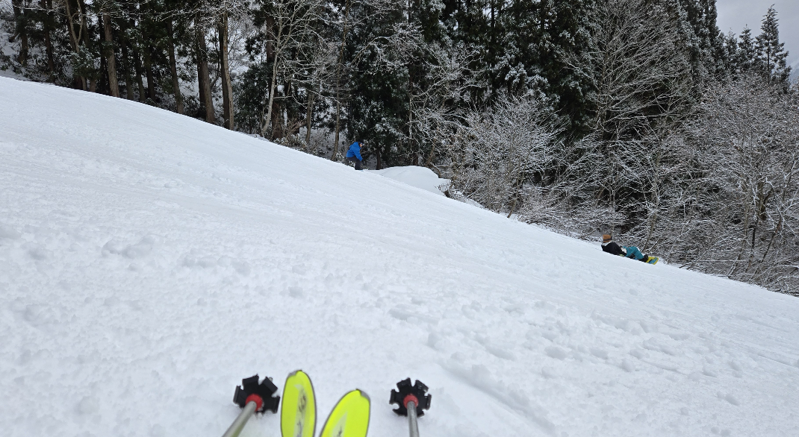
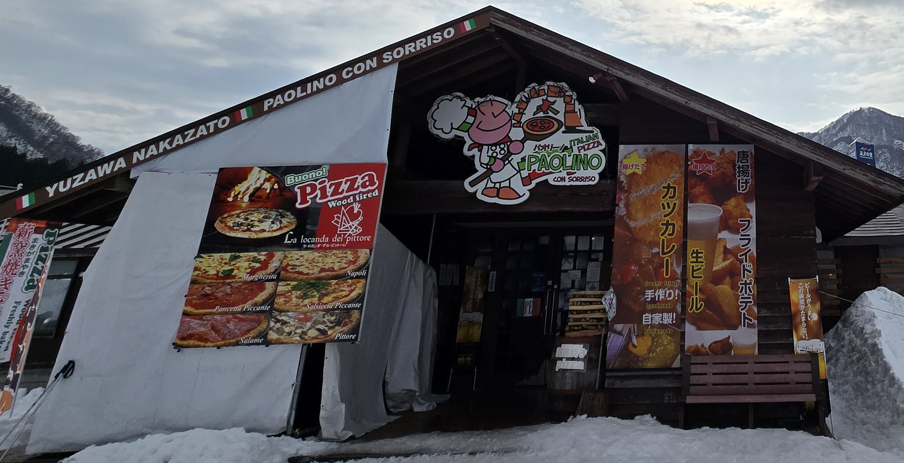
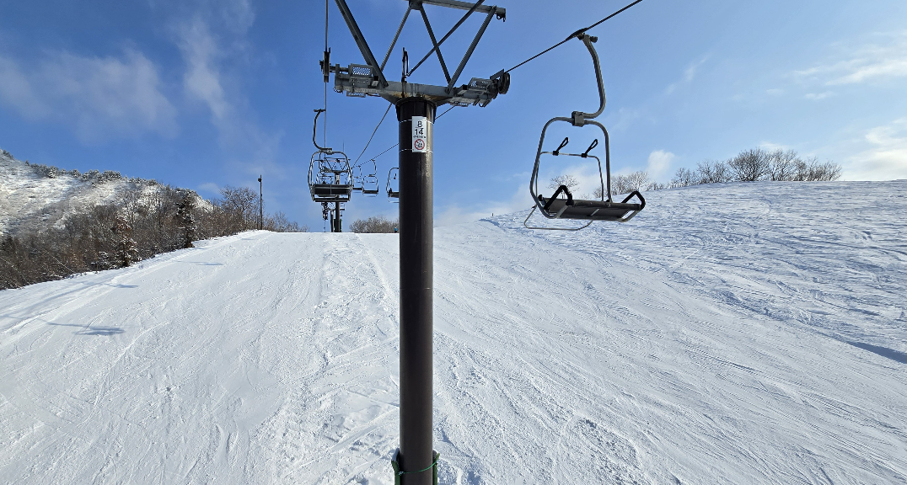

# [旅遊] 2026日本滑雪：湯澤中里yuzawa-nakazato雪場體驗心得分享

湯澤中里滑雪場是 JR 越後中里站直達的雪場，交通便利。這篇分享從 Ski Center 進場的纜車使用攻略、各號纜車的實際體驗，以及周邊餐廳推薦，幫助計畫前往的滑雪者做好準備。
<!--more-->

## 湯澤中里滑雪場心得筆記

### 一、交通與 Ski Center 起點

這次到湯澤中里滑雪場，我是從 **Ski Center** 這一側作為起點進場。

Ski Center 有一個蠻特別、也算少見的地方在於：**它本身其實就是一個 JR 車站（越後中里站）**。理論上可以直接搭 JR 前往其他車站，不過這次我沒有實際體驗，短期內也沒有特別打算嘗試，主要是因為 **班次其實不算多**。

不過從交通規劃來看，如果之後有機會，也可以考慮 **從越後湯澤站搭 JR 過來**，等於是用火車通勤雪場，這點在交通便利性上是非常加分的。當然，如果是改搭公車前往其他雪場，整體交通選項也是足夠的。

#### Ski Center 一樓設施

Ski Center 一樓有一個我覺得非常實用、而且 **CP 值很高的設施：100 日圓的置物櫃**。

重點是這個置物櫃的尺寸，**可以放得下 Muji 的後背包**。以這樣的容量只要 100 日圓來說，我個人覺得非常划算。

另外補充：
- **Ski Center 二樓據說也有餐廳**
- 但這次我沒有實際上去用餐，因此不做評論

---

### 二、纜車使用心得

#### 二號纜車｜進場用，一次就好

因為從 Ski Center 進場，一開始 **只能搭二號纜車**。

二號纜車下來後，會直接接上一段 **坡度滿大的斜坡**。我在這一段實際遇到過一個狀況：有一位看起來是幼稚園年紀的小朋友在這裡摔倒受傷，而且不知道為什麼 **脫離了老師，自己一個人在滑**，卡在坡邊很久。後來我是過去幫他把 **固定器解開**，他才比較能脫身。

整體來說，這一段坡度對新手或小朋友並不友善。**二號纜車基本上是進場用，當天大概只會搭一次，之後就不太會想再用。**

#### 三號纜車｜最常用、新手友善

我整天使用最多的，是 **三號纜車**。

這一區整體來說 **非常新手友善**，雖然滑行過程中有不少平緩路段，但還能雙版滑動（單板需要直板），很適合練習基本技巧與穩定度。

需要注意的是：
- **三號纜車出口的坡度其實也偏急**
- 但只要撐過出口那一小段，後面的雪道基本上都在可控範圍內

唯一的小缺點是：**搭乘時間偏長（長度也長），一次接近十分鐘**

#### 四號、五號纜車｜出口要特別小心

**四號與五號纜車** 的整體使用感受還不錯，

不過這兩條纜車有一個共通的問題：**出纜車口的坡度都偏急**

在剛下纜車後，平地後的坡地一定要保持注意力，否則很容易一開始就被坡度嚇到。

#### 六號纜車｜雪季第一天技術還承受不住

真正把我打敗的，是 **六號纜車**。

平地後的第一個不只是陡峭，而是 **非常長**，而且 **完全沒有任何餘裕可以讓人停下來調整**。我選擇倒在那邊，在雪地上側躺拍的照片看起來，目測坡度接近 **45 度角**，而且那一段 **又長又直**。

在這裡，「先滑下去，後面就會慢下來」這種心態 **完全不成立**。這部分也跟我自己的技術有關，這樣的坡度目前我還承受不住。

最後我選擇 **直接把板子拆掉，用走的下到比較平緩的地方**，再重新穿上繼續滑。

#### 纜車小結

| 纜車 | 評價 | 備註 |
|------|------|------|
| 二號 | 起點使用，一次即可 | 出口坡度大 |
| 三號 | 最好用、新手友善 | 搭乘時間長 |
| 四號、五號 | 可用 | 出口坡度要小心 |
| 六號 | 挑戰性高 | 技術門檻高 |

如果目標是 **安心練習與穩定滑行**，**三號纜車會是整天最常搭的一條。**

---

### 三、餐廳與用餐心得

#### 六號纜車下方｜只有休息空間

一開始原本以為 **六號纜車最下面** 會有餐廳，但實際到現場才發現，那裡 **只有廁所與室內休息空間**，並沒有餐廳。

#### 中段區域｜火車車廂用餐區

稍微往中間一點，有一個 **可以坐在火車車廂裡的用餐區**，旁邊也有餐廳。

這一區的優點是：
- ✅ 可以刷卡
- ✅ 可以使用 PayPay

但實際用餐體驗我不太喜歡：
- 座位數不足
- 餐點偏外帶形式
- 必須端著餐走到外面，再擠進車廂找位子
- 車廂幾乎一直是滿的，人很多

#### 最推薦｜Paolino パオリーノ

我自己最推薦的是 **最旁邊那一間餐廳：Paolino（パオリーノ）**。

這間餐廳的特色：
- 餐點選擇算豐富
- 使用 **自動販賣機點餐**
- ❗ **只能使用現金**

我當天點的是 **瑪格麗特披薩**，不論外觀或口味都表現不錯，實際吃起來也滿好吃的。

另外幾個加分點：
- 有免費提供水
- 用餐環境相對舒服、不擁擠
- 可以好好坐下來吃飯

---

## 整體小結

湯澤中里整體來說是一個：
- **交通便利**（JR 直達 Ski Center）
- **對新手相對友善**
- 但纜車出口坡度需要特別注意的雪場

在纜車使用上，選對路線差異很大；在用餐上，選對地點也會直接影響體驗。

如果是以 **練習為主、穩定滑行**，搭配 **三號纜車 + Paolino 用餐**，會是一個相對舒服的組合。

---
## 官方連結
https://www.yuzawa-nakazato.com/winter/gerende/course/

---
## 我的連結

- YouTube: https://www.youtube.com/@Daydream-Studio/videos
- Podcast: https://cl4bfh8ww02uu01zgaj2i3d1u.firstory.io/episodes
- FaceBook: https://www.facebook.com/profile.php?id=100082389794254
- Blog: https://nostanduptalk.github.io/

---
## 單人教練課後筆記：滑行姿勢與轉彎技巧

**滑行姿勢**：

- **壓鞋舌**：將重心往前壓在鞋舌上
- **下半身折疊**：膝蓋彎曲，但**屁股不能超過固定器**
- **雪仗位置**：握在肚臍前方，眼睛看向前方

### 轉彎的核心原則

轉彎時，目標是維持**最小的三角形**姿勢。需要重壓膝蓋時，頭會微微超過雪板，但上半身不需要往前傾，保持滑行姿勢即可。

---
## 下次想走五號纜車下的紅線

