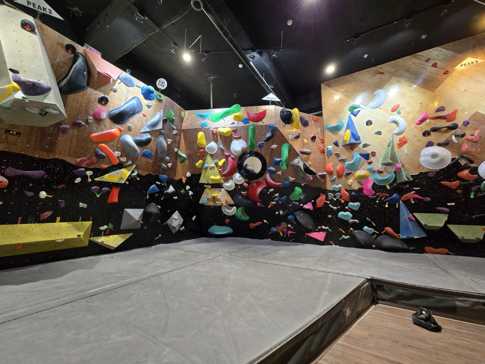

# [旅遊] 抱石初體驗

一開始其實沒有特別計畫要來體驗抱石，只是有人問，我就順勢跟著去了。對我來說，這項活動有點陌生，也不太確定到底是在做什麼，但直覺上應該會滿有趣的。

我們選的是最早的場次，所以現場人不多，整體空間感還不錯，不會擁擠。牆面上佈滿各種顏色的岩點，看起來有點複雜，但同時也會讓人產生一種「想試試看」的衝動。

<!--more-->

## 一開始的流程，比想像中完整

正式開始前，教練會先帶暖身，主要是做一些伸展，把身體慢慢拉開。對平常比較少伸展的人來說，其實這一段滿有感的，而且也不會要求做到極限，比較像是讓身體進入狀態。

接著是安全說明，包括先看影片，內容主要在教「怎麼正確落地」，例如跳下來要用彎曲、緩衝的方式，避免直接硬落造成受傷。

另外還需要簽一份安全說明書，整體感覺就是一種切結書——簡單講就是，如果發生意外，除非是場館本身有重大疏失，不然基本上要自行負責。

裝備部分也會先介紹，像是攀岩鞋，鞋頭比較尖、抓地力也比較好，如果踩錯位置其實很容易滑掉。同時也會教怎麼看路線，包含同一顏色一路往上的規則、起攀點、完攀點，以及難度分級（大概一到六級）。

## 上牆之後：其實就是在「爬」，但沒那麼簡單

第一次上牆的感覺其實滿直覺的——就是在爬東西。

一開始從比較簡單的路線（大概一、二級）開始，只要照著顏色去抓、去踩，基本上還算可以完成。不過路線設計其實滿有變化的，有些岩點距離會比較遠，或者角度比較刁鑽，抓起來或踩起來都會變困難。

牆面本身也有不同角度，不只是垂直的，還有向內凹或向外傾斜的設計。像是傾斜的牆面，有時候甚至可以整個人貼在牆上、雙手短暫放開，那種「貼牆」的感覺其實滿有趣的。

## 體力才是真正的關鍵

爬到後面最明顯的感覺就是——**手會非常痠**。

如果出力方式不太正確，很容易一直用手硬撐，結果就是很快沒力。當雙手撐不住的時候，其實就很難再繼續往上，只能下來休息。

有些路線卡關，其實也不一定是技巧問題，很多時候是因為岩點距離比較遠，或是當下已經沒力了，就會直接卡住。

不過只要休息一下，還是可以再繼續嘗試。

## 現場觀察：高手真的差很多

現場氣氛還滿有趣的，有些人是在認真練習，甚至會架手機錄影，回頭檢視自己的動作，有點像在做運動訓練。

而高手的差距也很明顯。有些人幾乎可以「隨便爬就上去」，甚至會做一些甩動、動態抓點的動作，看起來很流暢，像是在牆上移動一樣。

對比之下，就會發現攀岩其實不只是用力，還包含很多身體運用的技巧。

## 整體心得：值得一次，但不一定會再來

整體來說，我覺得這個體驗是**滿值得來試一次的**。

過程中確實有趣，也可以感受到不同路線帶來的挑戰。不過如果要真的玩得好，甚至持續進步，我會覺得需要一定的身體基礎，尤其是上半身的力量。

如果平常沒有在訓練，其實很容易在短時間內就耗盡體力。某種程度上，甚至會覺得應該先去健身，把基本能力練起來，再來體驗會更有感。

所以對我來說，這是一個「體驗一次就夠」的活動，不會特別想再回訪。但如果是想嘗鮮、找點不同活動的人，還是滿推薦可以來試試看。

## 小提醒

- 建議穿短袖  
- 褲子不要太鬆，也不要太緊（需要活動度）  
- 手會很痠，心理準備要有  
- 不用一開始就追求難度，先熟悉節奏比較重要

## 我的連結
- Youtube: https://www.youtube.com/@Daydream-Studio/videos
- Podcast: https://cl4bfh8ww02uu01zgaj2i3d1u.firstory.io/episodes
- FaceBook: https://www.facebook.com/profile.php?id=100082389794254
- Blog: https://nostanduptalk.github.io/

