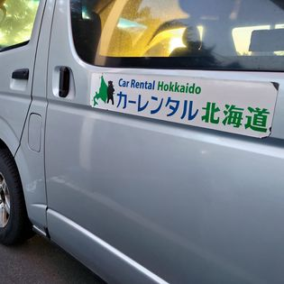
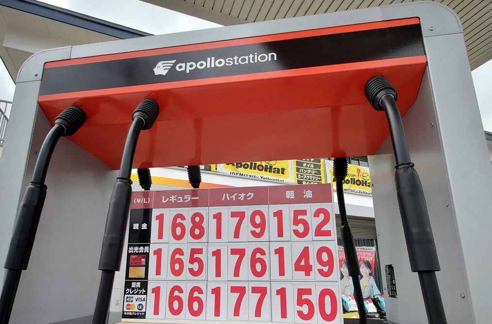
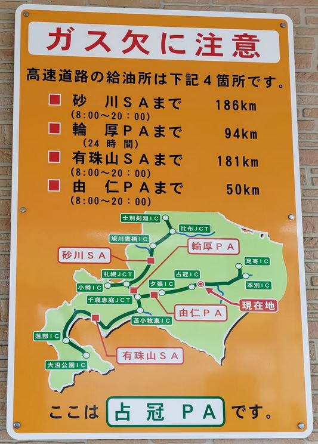

# [旅遊] 2023北海道自駕與輕自動車初體驗

這篇文章用來記錄我的北海道旅遊心得與筆記

<!--more-->

## 中文對應的環境，簡單許多
這次是租Car Rental Hokkaodo公司，有中文對應人員，用line 就可以溝通，有機場接送，非常方便，解說車子的時候也是用中文。

這次是使用，輕自動車，在日本是黃牌，好像只有日本有，因為人數不多，租金便宜之外，高速公路收費也比較便宜，但停車費都一樣。

## 加油的心得
輕自動車馬力沒有很強，油箱應該不超過20公升，但是很省油，這趟旅程總共1968.6公里，加油100.35公升，也就是一公升可以跑19.61公里，相當省油。

油價差距最多可以超過10日圓，如果想要便宜，有三個要素:
1. 距離札幌近
2. 自助加油
3. 多家加油站競爭的地方

用經濟學的概念去想不意外，在高速公路上就是會很貴，在市區用自助加油就會便宜。

另外我發現給店員加滿，會有跳停後硬加的行為，不知道要怎麼怎麼用日文請他不硬加😅。

自動車有**馬力不夠的問題**，爬坡與超車都會比較吃力，但是日本人很多都是慢慢開，只要靠邊就好。

## 自動熄火的功能，使我調整駕駛習慣
之前在日本路上，總會聽到引擎重新發動的聲音，當是就在想，駕駛怎麼這麼有閒，可以立刻熄火又重新發動，這次駕駛輕自動車才發現是車子自己決定的，**在某個條件之下，車子速度低於一個程度，駕駛有採煞車，車子就會關掉引擎**，等放開煞車的時候才會重新發動，這跟我的駕駛習慣不合。

我靠近紅燈的時候，有機會放開煞車讓車子繼續滑動，此時已經自動熄火的車子又會重新發動，接著我要完全停下來的時候，又會踩煞車，這時又觸發熄火條件，也就是短期重複熄火又發動，為了避免把車子動壞。

我調整成每次靠近紅燈就不要再放開煞車，如果距離前方太遠就太遠，反正都是紅燈。

## 國道收費
最後，輕自動車還有個特點，高速公路收費相較於一般車便宜，如果有機會再次到日本自駕，我還是要選擇輕自動車。

## 國道休息站
絕對要禮讓行人過馬路，看到**止まれ**就要停，平交道雖然沒有標示，但也要止まれ。高速公路的休息站叫PA，全名Parking Area，也有叫SA，全名Service Area，但不是每個休息站都有商店與加油站，大部分都只有廁所而已。

## 山路
山路過程只要沒有對向來車很久，就可以預期看到**鹿與狐狸在前方等你**，務必要小心駕駛。我看到大約3次吧，鹿的反應很快，很快就會奔跑離開馬路上。

## 車牌
忘記哪裡看到，車牌字頭是わ或れ就是租來的。
