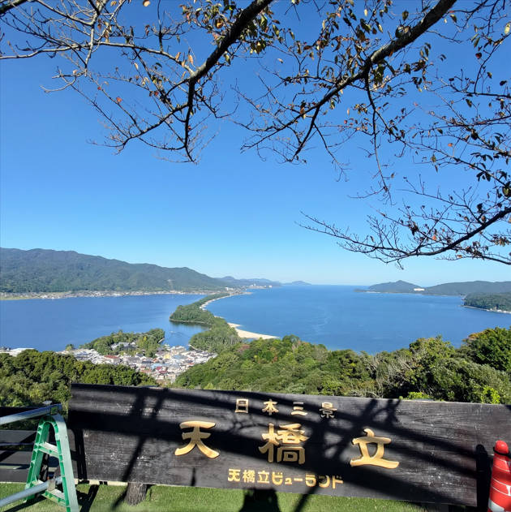
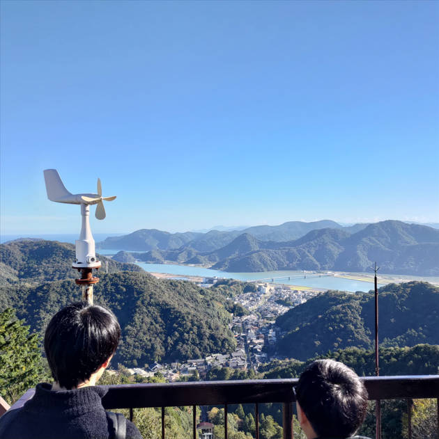
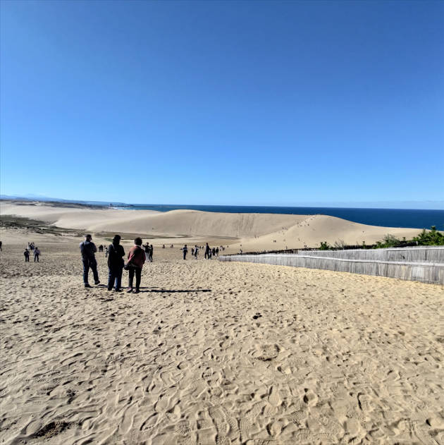
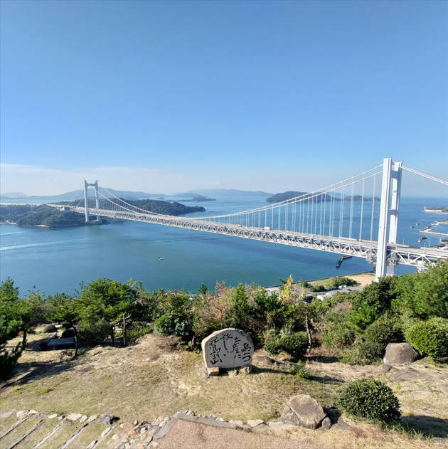
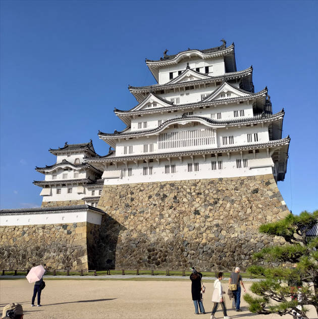
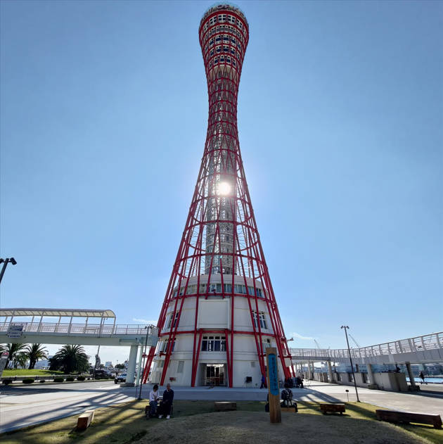
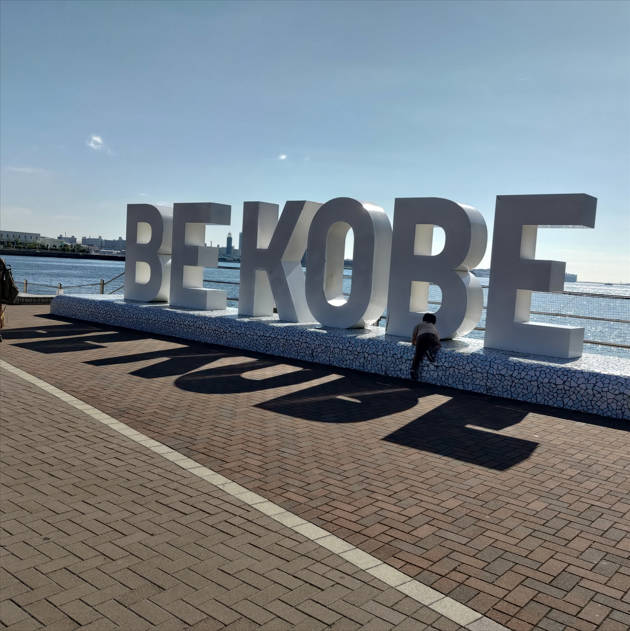

# [筆記] 七天玩遍關西！JR廣域周遊券省錢攻略：景點、交通全分享

想用不到2.4萬的預算玩遍關西嗎？這篇筆記將分享如何利用關西廣域鐵路周遊券，玩遍各大景點、搞定交通與住宿，讓你輕鬆省錢玩日本！

<!--more-->

## 低價日本自助旅遊7天，所有花費不到 2.4 萬元

這篇筆記將分享如何使用 [關西廣域鐵路周遊券](https://www.westjr.co.jp/global/tc/ticket/pass/kansai_wide/ "‌")，在七天內玩遍關西，並將所有花費控制在 2.4 萬元以內。

## 我在哪裡買5日 PASS

現場可能可以購買，原價12000日圓，KKDAY上的價格也差不多。

## 在哪裡換成實體票

帶護照，去JR機器就可以取票，**JR機器可以設定成中文**。

## 建議使用方式

我的旅行順序是：先找景點，再找車子，看班次，最後找住宿。

### 怎麼找電車班次串聯景點？

建議使用以下網站查詢，記得請AI留發音翻譯：

- [**乗換案内、時刻表、運行情報 - Yahoo!路線情報**](https://transit.yahoo.co.jp/ "‌") ([https://transit.yahoo.co.jp/](https://transit.yahoo.co.jp/))

### 怎麼取週遊券？

可以直接在JR機器上操作，過程簡單。

### 怎麼自己畫指定席？

- 可以仔細看位置（想一下太陽在哪）
- 我還是用到人工的方式

### 怎麼使用？

- **指定席**：每次都投入兩張票，出口的時候會收掉這段路線的那張。
- **自由席**：直接投入週遊券進去和出來。

## 我去到哪些景點

可以搭配JR官方路線圖：

### 天橋立(纜車)

### 城崎溫泉(纜車)

### 鳥取沙丘(纜車)(鳥取公車, 無IC卡服務，現金可找零)

### 鳥取砂丘砂之美術館

### 倉敷

### 岡山後樂園(岡山公車)

### 鷲羽山第二展望台(兒島公車)

### 姬路城(姬路公車)

### 六甲山夜景(纜車)(六甲山公車)

### 神戶三宮(公車一日券)

**注意**：有用到公車的部分 (`鳥取&兒島&六甲山`)，可能需要特別開一篇來說明？

## JR班次細節與總里程數

| 路線名稱與連結                                                                 | 時間       | 金額    | 公里    |
|------------------------------------------------------------------------------|----------|-------|-------|
| [関西空港(鉄道)→天橋立（ＪＲ特急はるか8号+ＪＲ特急はしだて3号）](https://yahoo.jp/59QJJe "‌") | 3小時34分 | 9,240円 | 223.1km |
| [天橋立→豊岡(兵庫県)（京都丹後鉄道特急はしだて5号）](https://yahoo.jp/tUrDwP "‌")           | 1小時2分  | 2,150円 | 54.5km  |
| [豊岡(兵庫県)→城崎温泉（ＪＲ山陰本線）](https://yahoo.jp/Ea2F-i "‌")                       | 12分      | 200円   | 9.6km   |
| [城崎温泉→鳥取（ＪＲ特急はまかぜ1号）](https://yahoo.jp/KTg7nT "‌")                        | 1小時18分 | 3,270円 | 72.3km  |
| [鳥取→岡山（ＪＲ特急スーパーいなば2号）](https://yahoo.jp/x2aACb "‌")                      | 1小時55分 | 5,600円 | 141.8km |
| [岡山→倉敷（ＪＲ伯備線，來回）](https://yahoo.jp/2JnaMc "‌")                              | 17分×2   | 660円   | 15.9km×2 |
| [岡山→児島（ＪＲ快速マリンライナー9号）](https://yahoo.jp/kfTmwp "‌")                      | 23分      | 510円   | 27.8km  |
| [児島→姫路（ＪＲ快速マリンライナー26号+ＪＲ新幹線さくら548号）](https://yahoo.jp/jFfArv "‌") | 41分      | 4,270円 | 116.4km |
| [姫路→三ノ宮（ＪＲ神戸線新快速8号）](https://yahoo.jp/kUPp7y "‌")                         | 40分      | 990円   | 57.3km  |
| [三ノ宮→六甲道（ＪＲ神戸線快速）](https://yahoo.jp/kW8W8Y "‌")                             | 3分       | 170円   | 4.7km   |
| [六甲道→大阪（ＪＲ神戸線快速）](https://yahoo.jp/Y7WYBT "‌")                               | 24分      | 420円   | 25.9km  |

## 原始花費12000円與省下的花費

加總結果：

- **總時間**：10小時46分（38760秒）
- **總金額**：27,480円
- **總公里**：765.2km
- 每公里平均費用：35.91日圓
- **節省金額**：15,480日圓
- **節省比例**：56.33%

## 要多抓時間

旅途中可能會遇到有趣的停駛狀況，需要直接換車。像我遇到的狀況是，前面的大叔嘆氣後立刻起身不等，直接換車。

## 需要擔心沒座位嗎？ JR路線要廢了嗎？

可以參考官方新聞稿：

- [JR官方新聞稿](https://www.westjr.co.jp/press/article/items/241029_press_senkubetsukeieizyoukyou.pdf "‌") (https://www.westjr.co.jp/press/article/items/241029%5C\_press%5C\_senkubetsukeieizyoukyou.pdf)

## 我的APP，可以用繁體中文

推薦使用的APP：

- [繁體中文APP](https://play.google.com/store/apps/details?id=com.anneitech.jptransit "‌") (https://play.google.com/store/apps/details?id=com.anneitech.jptransit)

**備註**：以下為部分景點的日文名稱發音，方便查詢：

- 京都 (Kyōto)
- 天橋立 (Amanohashidate)
- 豊岡 (Toyooka)

> 請幫我翻譯日本地名
>
> 回答格式 用空格分開
>
> 提供: 日文漢字 平假名 與羅馬拼音

ChatGPT 回答:
關西空港 関西空港 かんさいくうこう Kansai Kūkō

京都 京都 きょうと Kyōto

天橋立 天橋立 てんきょうだて Tenkyōdate

豐岡 豊岡 とよおか Toyooka

城崎温泉 城崎温泉 きのさきおんせん Kinosaki Onsen

鳥取 鳥取 とっとり Tottori

倉敷 倉敷 くらしき Kurashiki

鷲羽山 第二展望台 鷲羽山 第二展望台 わしゅうざん だいにてんぼうだい Washūzan Daini Tenbōdai

兒島 児島 こじま Kojima

岡山後樂園 岡山後楽園 おかやまこうらくえん Okayama Kōrakuen

姬路城 姫路城 ひめじじょう Himeji-jō

新大阪 新大阪 しんおおさか Shin-Ōsaka
