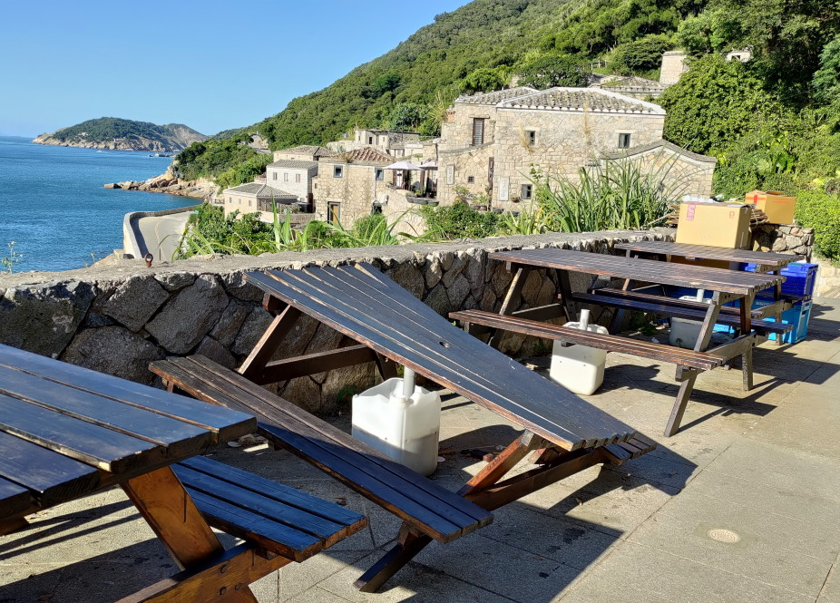

# [旅遊] 馬祖北竿南竿心得 2022年8月

台北松山機場出發，北竿1天與南竿1天企劃書

（本文沒有業配）

寫作目的：假設我可以在旅遊前看到這篇文章的規劃設計。
<!--more-->
# 北竿
## 第一天中午，吃過午餐
* 13：05抵達北竿機場
* 走路可以到［清雅民宿］（2600元）
* 放行李後借機車（500元含油）到隔天12點，約定隔天12時港口接送服務，約定隔天早上8點大坵船票（300元）

## 第一天下午
* ［戰爭和平紀念公園主題館］ - 吹冷氣
* ［06據點］
* ［壁山觀景臺］ - 看飛機
* ［馬祖播音站］
* ［芹壁村］ - 看夕陽
* [晚餐]［北竿青年雞排］ - 雞排鹹酥雞
 

## 第一天晚上
* 藍眼淚 (4月中到5月)

## 第二天早上
* 7點起床，寄放行李到一樓並退房
* [早餐]吃住宿送的餐券70元，到北竿鄉立圖書館對面的［鄉城早餐］ - 抓餅加蛋與馬祖漢堡
* 8點前抵達港口(地圖定位在星漾旅館)，
* 借身分證給海巡署登記
* 上船前買一把葉子（50元）給鹿吃
* 坐船10分鐘到「大坵」看梅花鹿
* 1.5小時的路線

* 10點回程(可以在碼頭旁的涼亭看有沒有同一艘船過來，可能可以提早走)
* [中餐]11：00吃［嚐客］的肉絲炒飯（100元）
* 還車前，可以到［北竿鄉立圖書館］看書(周一周二公休)
* 12：00還機車，民宿接送到［北竿白沙港］ 坐12：30船（160元）到南竿

# 南竿
## 第二天下午
* 12：45離開［南竿福澳港］，走路到［假期飯店］（2000元）暫放行李
* 租機車（500元含油），約定隔天15：30機場接送
* ［南竿遊客中心］（二樓整修時免費）&［北海坑道］&［大漢據點］ - 退潮時期才可以到北海坑道
* ［雲台山］ - 可以騎車上去，到南竿最高點
* ［梅石營區軍官/士兵特約茶室］ - 看歷史
* ［津沙沙灘］ - 路過看看建築
* ［秋桂亭］ - 路過看海
* ［藍眼淚生態館］（350元） - 如果不在當季的話，建議來看
* ［媽祖巨神像］ - 可以騎車上去，看夕陽
* [晚餐]［儷儐餐廳］- 水餃15顆 !要求不要加醬!（90元）

## 第二天晚上
* 藍眼淚 (4月中到5月)

## 第三天早上
* 7點起床
* [早餐]吃介壽市場的［陳阿伯蔥油餅］的蔥油餅加蛋（40元）與虫弟餅（點肉+蛋）（55元）
* 回飯店，寄放行李並退房，提到機場接送時間
* 09：00［勝利堡（馬祖戰地文化博物館） ］
* ［八八坑道］ - 聞酒味
* ［枕戈待旦紀念公園］ - 可以騎車上去，眺望港口
* ［馬祖民俗文物館］ - 可裝水
* 1130南竿機場接送
* 1230飛機往松山

## 遺珠
 南竿 - 萬家香二店 - 狗麵套餐(乾麵+餛飩湯 !要求不要加醋!)（110元）

 南竿 - 布拉格手工窯烤披薩炸雞 - 青醬燻雞披薩（200元）

 南竿 - 承鮮捷 - 南竿版全聯

