# [旅遊] 下次去新加坡與新山還想再吃的與再買東西的地方

## 評分標準
* 符合我的口味
* 價格不貴

<!--more-->

<iframe src="https://open.firstory.me/embed/story/clf58h33x040501vwhwude3jr" height="180" width="81%" frameborder="0" scrolling="no"></iframe>

## COFFEE QUEEN，Teh O，SGD1.5
Teh O ，只要1.5，我不加糖喝起來只有微苦，一周內喝了三次，在麥斯威爾熟食中心，天天海南雞飯也在附近。不太需要排隊。

## 冰淇淋三明治，SGD1.5
螺旋橋附近，我選餅乾&巧克力脆片，口感很棒，味道不錯，現場有排隊。

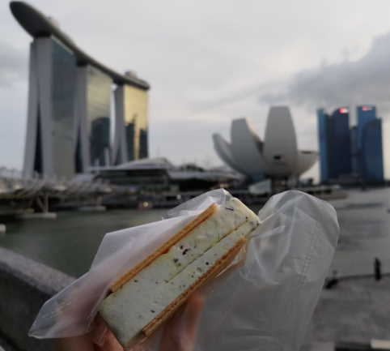

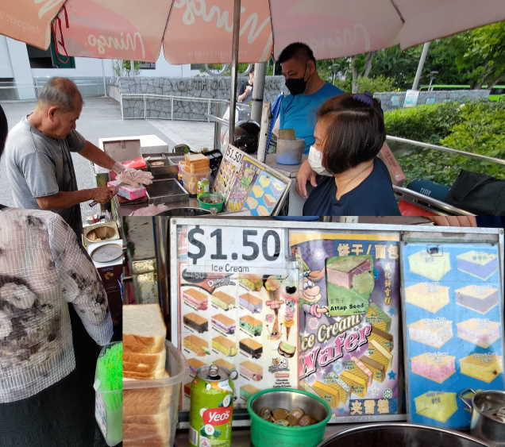

## 基記麵家
芳林巴剎與熟食中心，2樓，我點雞排麵，雞排很嫩，好吃，下次不要加醬。感覺店員不是工讀生，看到我在"過水"，會再拿一大碗湯給我，驚人的服務品質，難怪米其林(？)，需要排隊。[有貼A的店]

連結: [ Ji Ji Noodle House – Singapore - a MICHELIN Guide Restaurant](https://guide.michelin.com/en/singapore-region/singapore/restaurant/ji-ji-noodle-house)

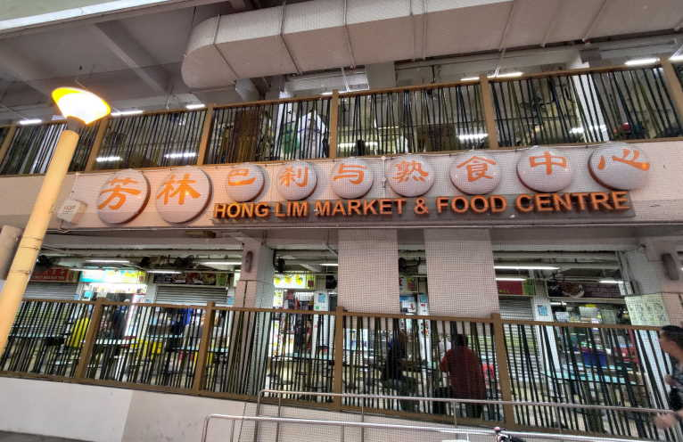

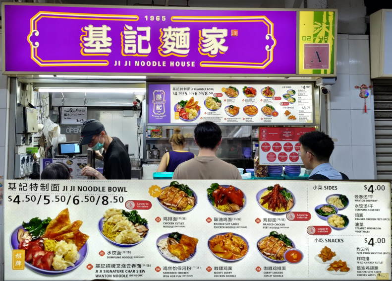

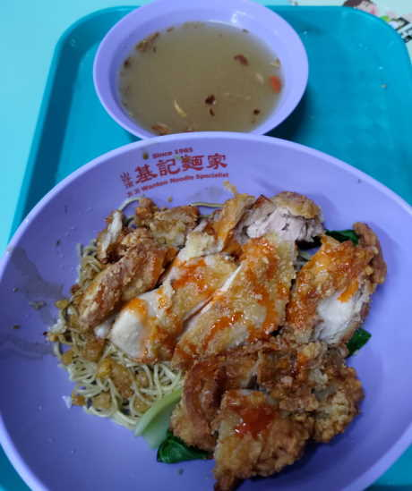

## 西瓜汁，SGD2
也是在芳林巴剎與熟食中心，1樓，難得遇到連同冰塊用果汁機一起打進去的店，喝起來口感超棒。[有貼A的店]

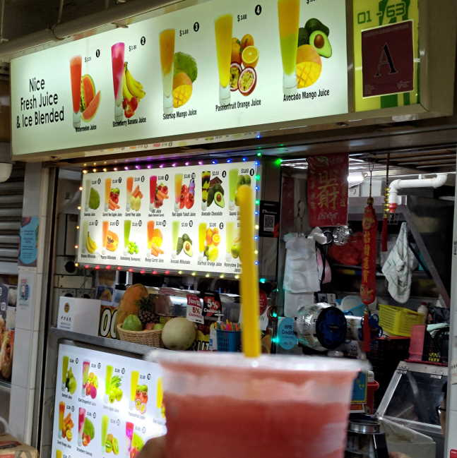

## 100PLUS，SGD1
特價SGD1，賣到有7-11店家斷貨，我看馬來西亞賣RM3.5，應該本來就是這個價格。簡單說是氣泡水的運動飲料。

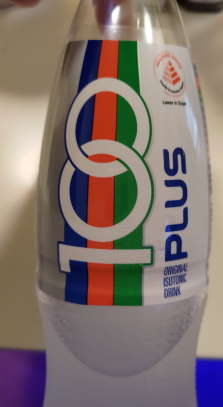

## (馬來西亞)華美，雞肉炒飯，RM9.9+稅
一開始很香，但最後感覺很油，1到2樓傳遞餐點的方式是人力與繩子，很有趣的老店。

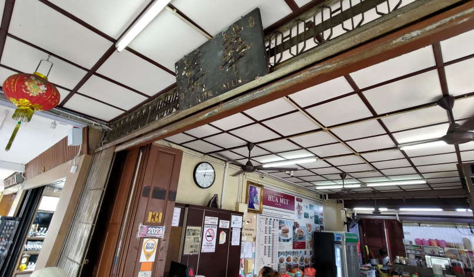

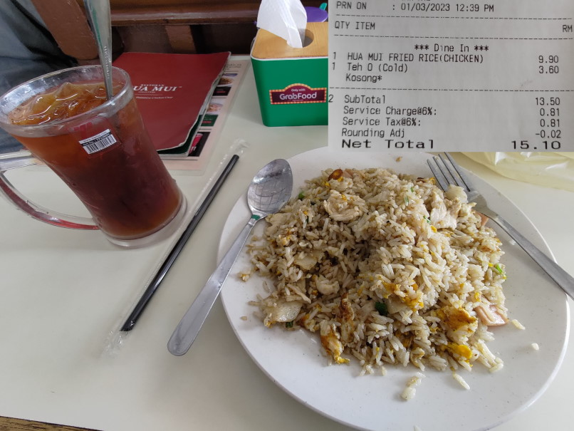

## (馬來西亞)協裕麵包，RM5，4個
香蕉蛋糕沒辦法吃下去，無法接受香蕉的味道在蛋糕上。麵包豆沙口味不錯，很有飽足感。

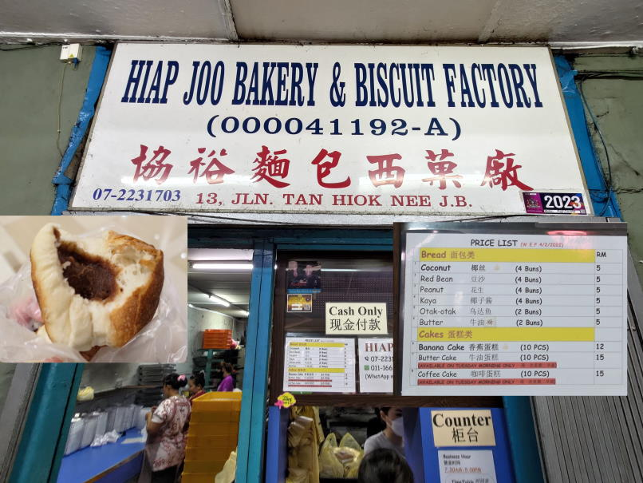

## (馬來西亞)全家便利商店，進口日本製茶，RM5.9
我之前在日本當地買了一瓶只要100日圓的產品，看起來運費幾乎等於產品的原價了。儘管如此，我還是非常想喝這個產品。

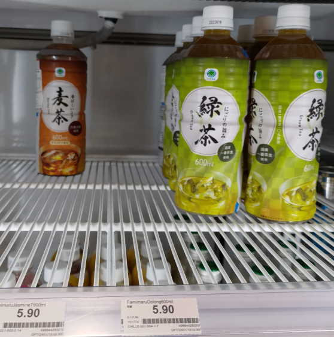

## [購物]MUSTAFA CENTRE
這家賣場超級大，應有盡有，幾乎所有生活必需品都能找到。樓層多，可直接詢問店員，能加速找到所需商品。若總價太低(ex.少於SGD2)，可能無法使用信用卡付款。進場前需要把背包封住，記得要先拿出錢包。我在這裡買到喜歡的拖鞋，價格約600多元台幣。附近也有換匯所，價格算是相當不錯的。
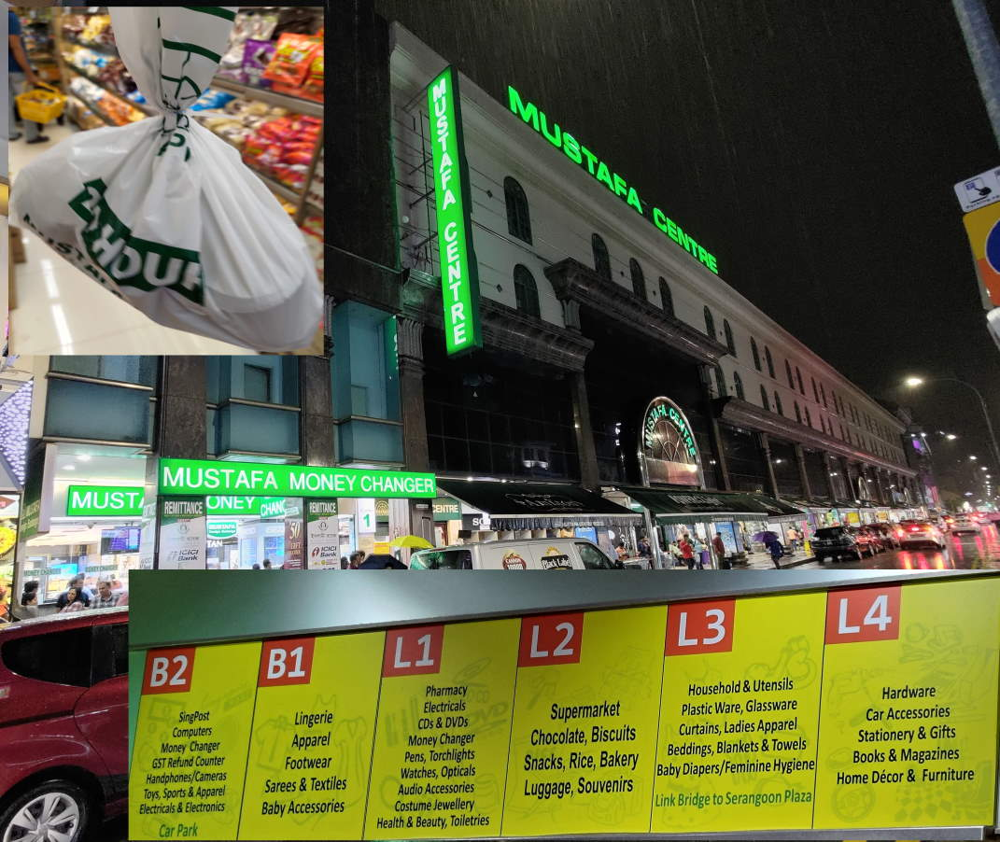

## [購物]小印度
路邊攤，傳輸線不到台幣100元，SGD3元竟然還讓我刷卡。

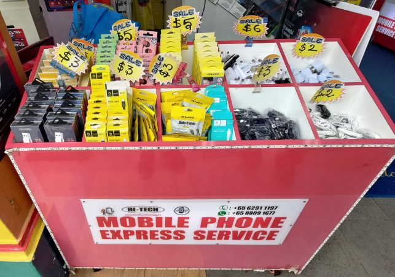

## [購物]fair price
新加坡的連鎖超市。

## 番外篇: 麥當勞
薯條沒有在台灣吃的感覺[普通]，雞塊有新的口味[不錯]，冰淇淋[不錯]

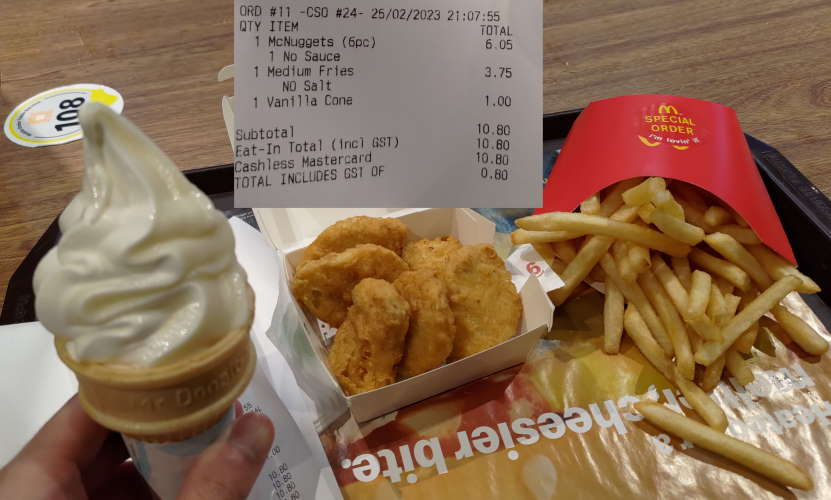
