# [旅遊] 去紐西蘭旅遊前要看的筆記

透過這篇筆記，你將了解前往紐西蘭旅遊所需的準備、注意事項、景點推薦，甚至一些在當地的特殊經驗，讓你的旅行更加順利與豐富。

<!--more-->

## 行前準備：確保旅途順暢

- **出發前必辦事項：**
  - 入境聲明：所有入境旅客需提前完成「紐西蘭旅行者聲明」（NZTD），透過APP辦理。
  - 電子旅行授權：持免簽證資格旅客，需申請「電子旅行授權」（NZeTA），透過APP辦理。
  - 3D驗證：Deer Park Heights Queenstown需3D驗證，若收不到簡訊，建議辦理電子郵件驗證再出發。
  - 加油PIN碼：加油需刷卡PIN碼（通常為預借現金密碼），請事先辦理。
  - 現金準備：僅需少量現金，大眾運輸、路邊停車、商店多可刷卡（VISA、Master）或感應支付。
  - 刷卡手續費：連鎖店外，多數店家刷卡有1-3%手續費（規則不明），洗衣、烘衣機（4-6紐元/次）需現金，可多備2元硬幣。

  - 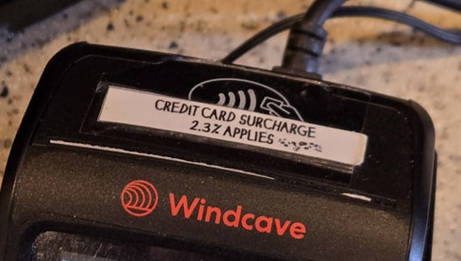
  - 

  - 食物申報：所有食物皆於當地採買，避免申報。
- **個人物品清單：**
  - 駕照正本與國際駕照正本
  - 220V吹風機
  - 拖鞋
  - 沐浴乳、牙刷、牙膏
  - 車用手機架、太陽眼鏡
  - 保溫杯、茶包
  - 耳塞（木造房隔音差）
  - 腳架（星空攝影）
  - SIM卡要可以用ChatGPT
- **租車注意事項：**
  - 機場接送：要當地電話?
  - 路況：路程顛簸多碎石，建議租全險車輛。
  - 交通規則：右駕、熟悉圓環讓路、狹橋、Give Way、工地隱藏隊伍等規則。
  - 駕駛安全：下坡高速小心打滑，注意避讓大型車輛。
- **其他準備：**
  - 航班選位：[boeing-777](https://www.airnewzealand.tw/seat-map-boeing-777-300) 飛機選位建議。
  - 極光預測：下載[極光APP](https://play.google.com/store/apps/details?id=com.jrustonapps.myauroraforecast)。

## 旅途中的發現與建議

### **推薦行程：**
  - 觀星導覽：蒂卡波湖，Dark Sky Project參加中文導覽觀星，選農曆月初減少光害。
   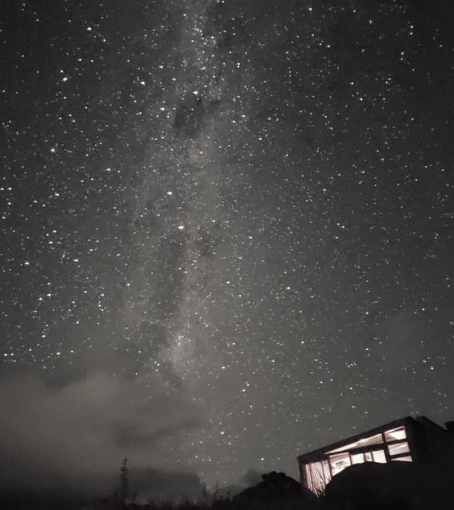  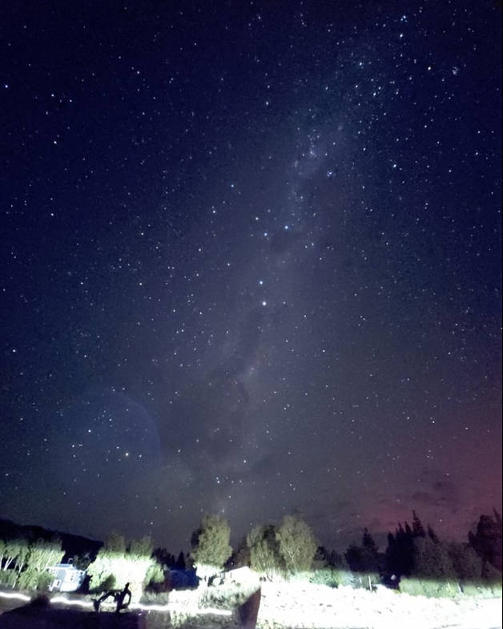
  - 冰川健行：Fox Glacier，3小時冰川健行，價格高昂，建議年輕力壯時前往。
  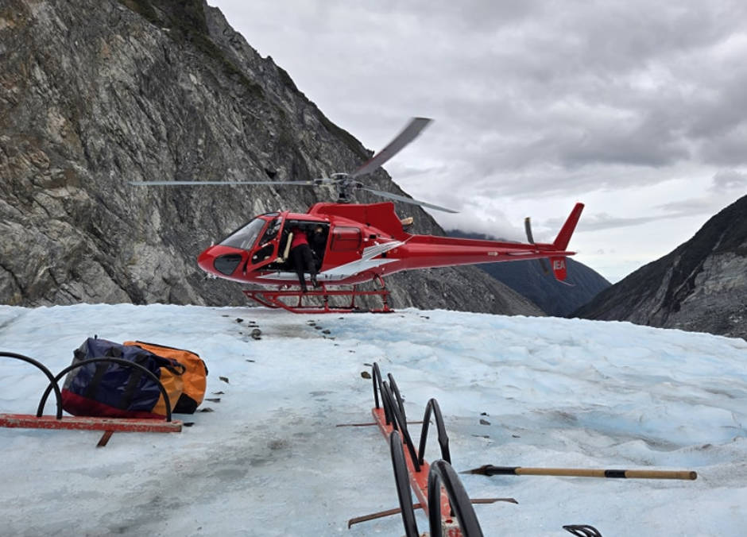  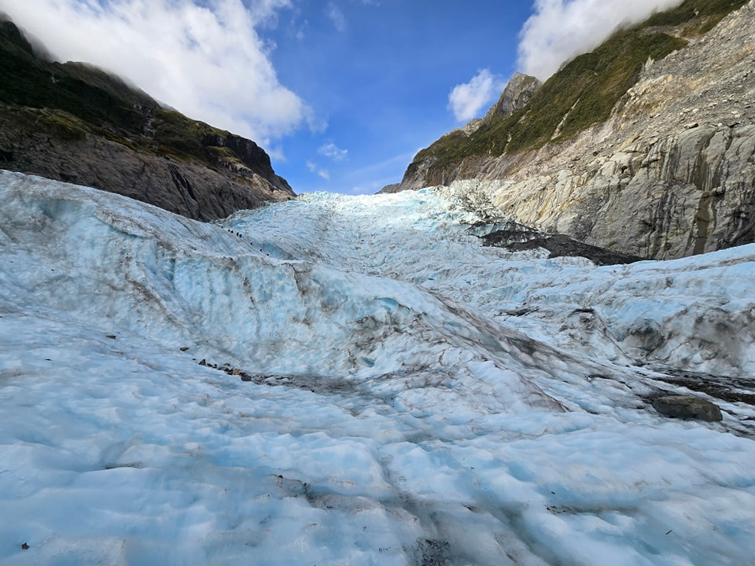   
  - 觀賞海獅：卡提奇燈塔Katiki Point Lighthouse附近。
   
  - 餵食動物：Alpine Alpacas Fairlie。
  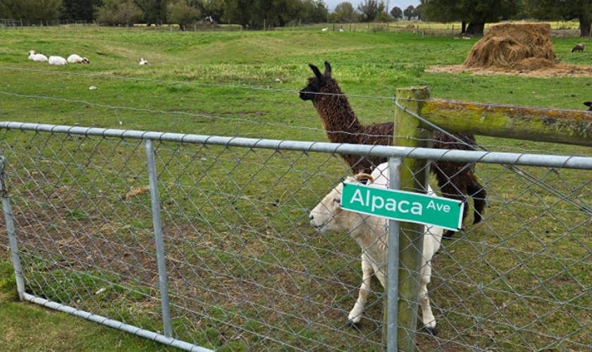 

### **美食推薦：**
  - The White Lady(奧克蘭)

    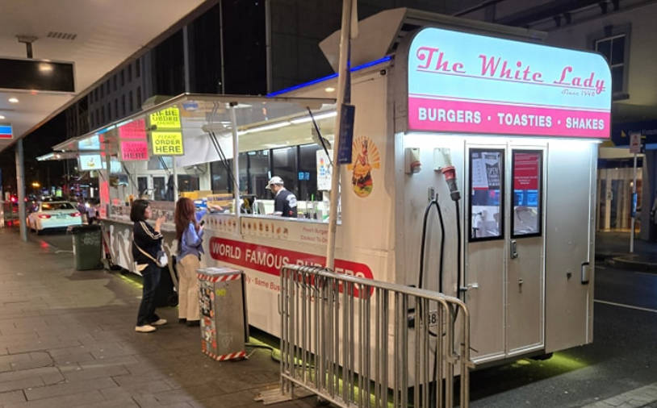 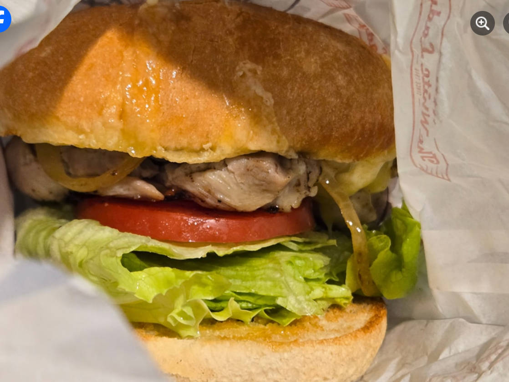 

  - Cookie Time餅乾
  - 自炊：住處多提供廚具，可自煮省錢。
<iframe src="https://www.facebook.com/plugins/post.php?href=https%3A%2F%2Fwww.facebook.com%2Fphoto.php%3Ffbid%3D122105929904821717%26set%3Da.122094033632821717%26type%3D3&show_text=false&width=500" width="500" height="615" style="border:none;overflow:hidden" scrolling="no" frameborder="0" allowfullscreen="true" allow="autoplay; clipboard-write; encrypted-media; picture-in-picture; web-share"></iframe>

### **自然景觀：**
  - 壯麗風光：大山大湖草原、羊牛馬鹿、星空（近極光）。
  - Otira Viaduct Lookout大鳥。

         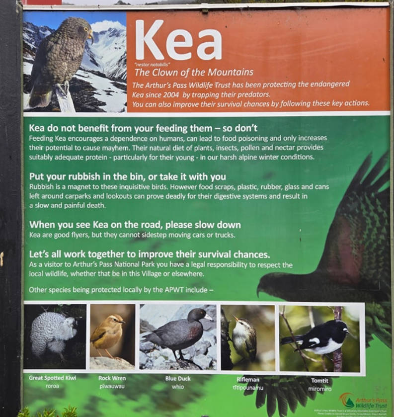 
  - 海獅生態。

### **住宿建議：**
  - 蒂阿瑙住宿：建議住一晚，或從皇后鎮出發。

### **交通觀察：**
  - 加油技巧：不能插到底，聽聲音判斷油滿，避免跳停後溢出。

     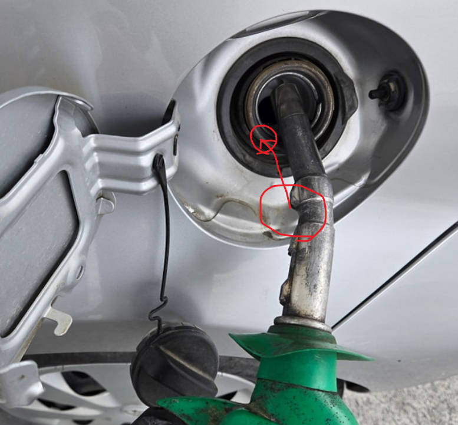 

  - 機場到市中心：[Sky Drive](https://www.skydrive.co.nz/)可刷卡，國內線接機後至國際線，不塞車30分鐘，每人20 紐元。不急的話，下次考慮使用火車與公車，每人不到10紐，可能要一小時。
  - 奧克蘭公車與火車：可以用google map找到路線，上下車都要**感應**信用卡，看起來不收現金。
  - 路邊攔車：南島路邊攔車比讚三次。
  - 基督城奧克蘭交通：車輛多，聽到喇叭聲。
  - 路邊停車：沒有$的符號就是免費但限時。付費方式只能預付，可以刷卡，可能要把收據放車上。

     
    
    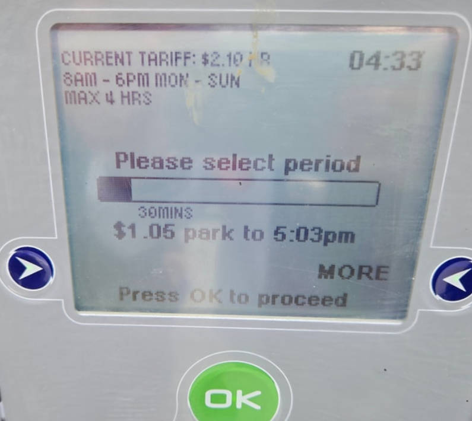  

### **廁所類型：**
  - 單孔廁所

     
  - 設施完善廁所（有水有電）
  - 麥當勞廁所

### **購物指南：**
  - New World超市：要自己說是旅客，可以享用會員價。Tourist Club

   

### **麥當勞遊樂區：**

   

### **人行道路面跟韓國一樣：**

   

### **其他：**
  - 雨天備案：基督城The Palms Shopping Centre有遮雨停車位。
  - 咖啡加價：冰咖啡需額外加1紐元。
  - 麥當勞活動：Minecraft活動及早餐時段是11點結束，早餐薯餅可換薯條。

   

### **當時氣象：**
  - 最後幾天遇到低氣壓(順時針的!)，下雨好久，還好已經看完星空與冰川。
  <iframe src="https://www.facebook.com/plugins/video.php?height=476&href=https%3A%2F%2Fwww.facebook.com%2FMetService%2Fvideos%2F1006140101487744%2F&show_text=false&width=380&t=0" width="380" height="476" style="border:none;overflow:hidden" scrolling="no" frameborder="0" allowfullscreen="true" allow="autoplay; clipboard-write; encrypted-media; picture-in-picture; web-share" allowFullScreen="true"></iframe>

### **鋪路：**
  <iframe src="https://www.facebook.com/plugins/video.php?height=314&href=https%3A%2F%2Fwww.facebook.com%2F61574651512994%2Fvideos%2F1429483654910084%2F&show_text=false&width=560&t=0" width="560" height="314" style="border:none;overflow:hidden" scrolling="no" frameborder="0" allowfullscreen="true" allow="autoplay; clipboard-write; encrypted-media; picture-in-picture; web-share" allowFullScreen="true"></iframe>

### **米佛峽灣Milford Sound：**

   
