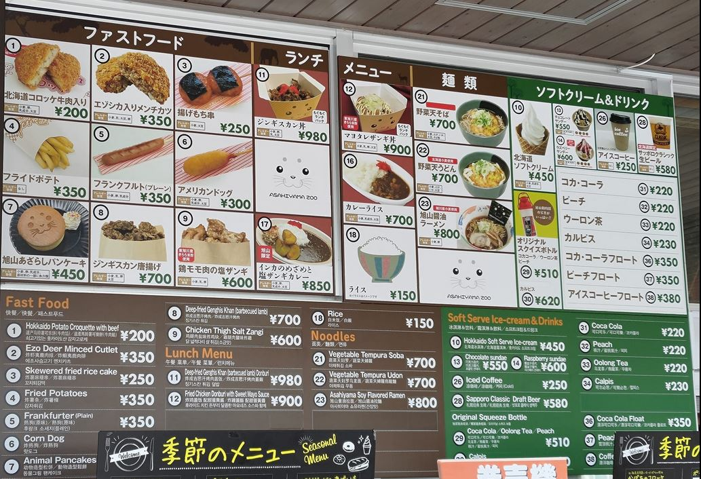
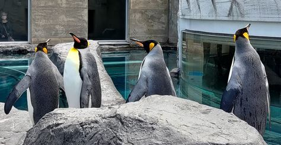
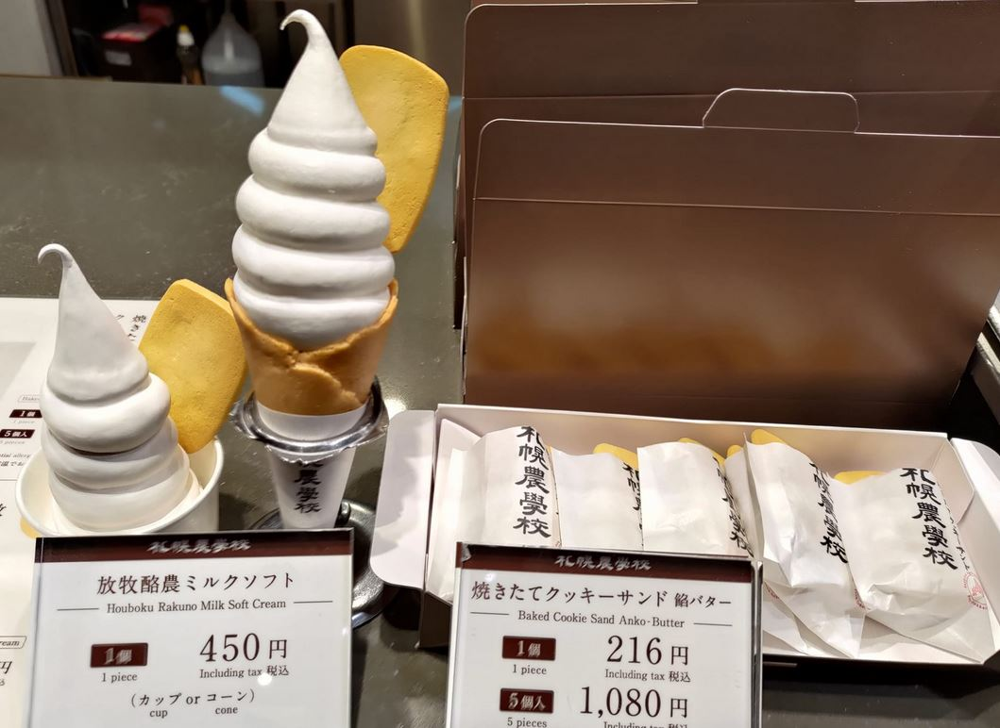

# [旅遊] 2023北海道旅遊中的發現

除了開車之外，都記錄在這邊。

<!--more-->

<iframe src="https://open.firstory.me/embed/story/clj1m489b0db401vm0q0delk2" height="180" width="99%" frameborder="0" scrolling="no"></iframe>

## 本次旅遊的第一名景點，旭川動物園
這次的路線是往道東，主要是以旭川與北見當作中心，向外尋找景點，最讓我覺得不錯的是旭川動物園，只用1000日圓就可以看到企鵝與北極熊非常划算，館內設施維持的不錯，餐廳食物也沒有說到超級貴。

## 食物也有分店差異，餃子王將
餃子王將是我一直去日本都首選，這次也不例外，旭川吃到的時候非常棒，炒飯餃子唐揚雞都很好吃，但之後到北見吃的時候就沒有同樣的感覺，口味還是會因為分店有差異，回到札幌再吃一次的時候，炒飯的口感就回來了。

## 北海道特色，seicomart 便利商店
看起來只有日本北海道有，但店家分佈非常廣，還有自有品牌的飲料，如果有標記hot chef ，就會有熟食部分，炸馬鈴薯的部分我不行，飯糰的話還不錯，有趣的是他們還有線上填問卷調查後的折價卷，非紅茶的飲料可以折20日圓，比例相當高，但我比較想要喝他們自有牌的奶茶，所以最後都只有用在綠茶上。

## 北海道發現的新店家，かつや
只外帶一次過唐揚雞便當，沒想到冷掉之後也非常好吃，有機會還要再去吃！

## 連鎖餐飲名單再加一個，なか卯
吃過雞丼飯，只覺得豬排洞飯可以回購。我看日本人有點他們的うどん麺，之後再去試試。

## 好吃的冰淇淋店，札幌農學校
路程中，很多賣冰的地方，有兩家超級讚，？與？，原本以為這是最高級的了，吃到札幌農學校的冰後，直接奪冠，從冰到多付的餅乾再到cone 餅乾，都有很棒的味道，這是連鎖店，我在JR札幌車站買到的，不是到學校裡買。

## 一望無際的機場展望台，新千歲機場
展望台在國內線四樓，要走比較遠，但國際線也是在這側起飛降落，所以可以看到很多飛機，這邊沒有太多的阻礙物，距離加速起點很近，聽過引擎全開的聲音後，我才知道為什麼有機場晚上不能起降了。

## 如果可以重來要怎麼修正
大部分規劃的有留足夠的餘裕，都在預料之中，比較後悔的是沒有早一點訂住宿，四月預定6/10札幌住宿的時候，價格已經翻一倍了，原因是遇到？，日本全國各地共100多支隊伍聚集到札幌，當天到處都是表演者。下次要避開當地大型活動。

## 雜記
百元商店不只大創，還有can do (還沒去)與Seria，三百元商店也很特別。 外面超過100日圓的商品可以用100買的超級划算，現在匯率約0.22，加上10%消費稅後，一件台幣只要24元，比台灣大創一件49元好多了！

# 連結
https://www.youtube.com/watch?v=xGGaN5-1UA8
