# [旅遊] 在韓國濟州島的觀察

## 韓國連鎖咖啡
首推`theVenti`
<!--more-->

基於口味與CP值，最後一排不會回購。
注意: 濟州島外帶杯可能會多收300韓元保證金，但外國人可能不容易退款。

可以考慮帶環保杯。

## 去過韓國的通用攻略
- 韓元要在當地換(可用新台幣)，會比台灣的銀行現金換匯划算
- 信用卡可以多帶幾張不同公司的(JCB、MASTER、VISA)，記得選國外交易回饋超過1.5%，才能抵銷國際刷卡服務費。
- 大部分店家都可以刷卡，不用準備太多現金。
- SIM卡如果要漫遊，可能是來自香港IP，沒辦法用ChatGPT。
- SIM卡選吃到飽，避免流量焦慮。
- 夏季日照很長，可以玩久一點。冬季就相反。

### 手機翻譯App

翻譯軟體都有圖像翻譯功能，開鏡頭就可以直接把韓文變中文，據說PAPAGO比google 翻譯好用(但不是每次)。不在香港IP的時候，也可以用ChatGPT4o。

### 手機導航App

Google map可以用來看地點、看空照圖找停車場，要使用**導航功能**的話，只能使用當地的NAVER MAP。NAVER MAP有整合測速照相資訊，介面可以改成中文，用英文發音，很容易使用。經過加油站的時候也會顯示價格。

## 濟州島的攻略

- 要記得換國際駕照(有期限!)，汽車、機車一起換，價格一樣
- 外帶杯要多收保證金300韓元，不方便外國人退款，想買咖啡可以自帶環保杯
- 戶外活動要記得帶防曬
- 海風很強要保暖
- 可以到當地大賣場準備隨車零食

## 濟州島景點

我只挑我覺得有意思的

自然景觀收費都不高，2000韓元大概台幣47元，也幾乎不用停車費，可能是為了節省成本，收據下方，就是入場檢查的條碼。

### 濟州島旅遊官方網站(中文)

[https://m.visitjeju.net/cn/tourInfo/inquiry](https://m.visitjeju.net/cn/tourInfo/inquiry "‌")

### 濟州島登山

`汉拏山(한라산)`: 路線很多，下次找一個簡單的，要準備登山杖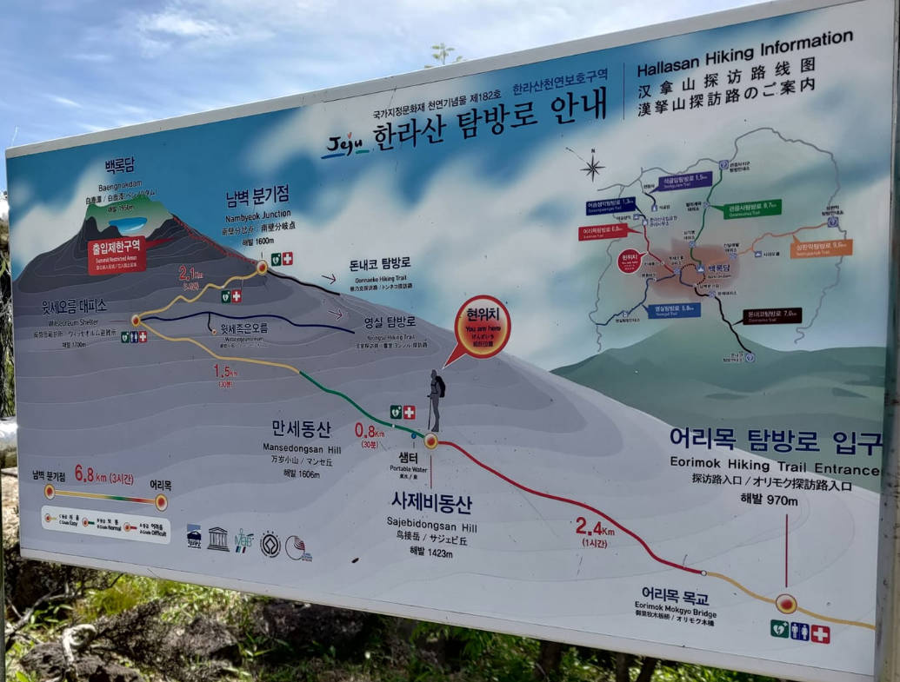

`城山日出峰`: 這次在免費區看就很壯觀，下次想去付費區爬。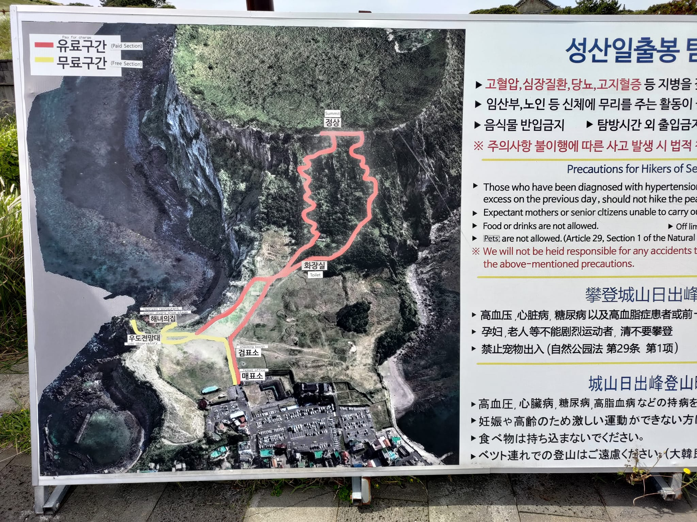

### 濟州島看瀑布

天地渊瀑布(천지연폭포): 非常平坦，輪椅可達

天帝渊瀑布(천제연폭포): 腹地很大，要走很久，最多有三個瀑布。

### 濟州島看樹林

`榧子林`: 幾乎算平地，很好走

### 濟州島看飛機
`DoDuBong Peak (道頭峰公園)`: 爬15分鐘就可以看飛機起降，濟州島機場航班又很多，所以不用等很久就可以看到。

7號位置

紅色點是停車處

### 濟州島海女博物館
可以了解海女文化歷史。

我在當地只有在牛島才看到海女。

### 史努比館

室內室外都有展區，可以看很久。

### 電視劇拍攝地

[Google map: 歡迎回到三達里（趙三達](https://maps.app.goo.gl/zRN7SxmH1VemGihHA "‌")

還有住人，但歡迎進去拍照，不要往室內拍就可以。

### 濟州島的外島 - 牛島
要坐船過去，島上有一種蘭嶼的感覺，騎著有擋風的電動車比較舒服。
環島一圈，吃個飯，三小時就結束了。

<a href="牛島地圖.jpg" target="_blank">
        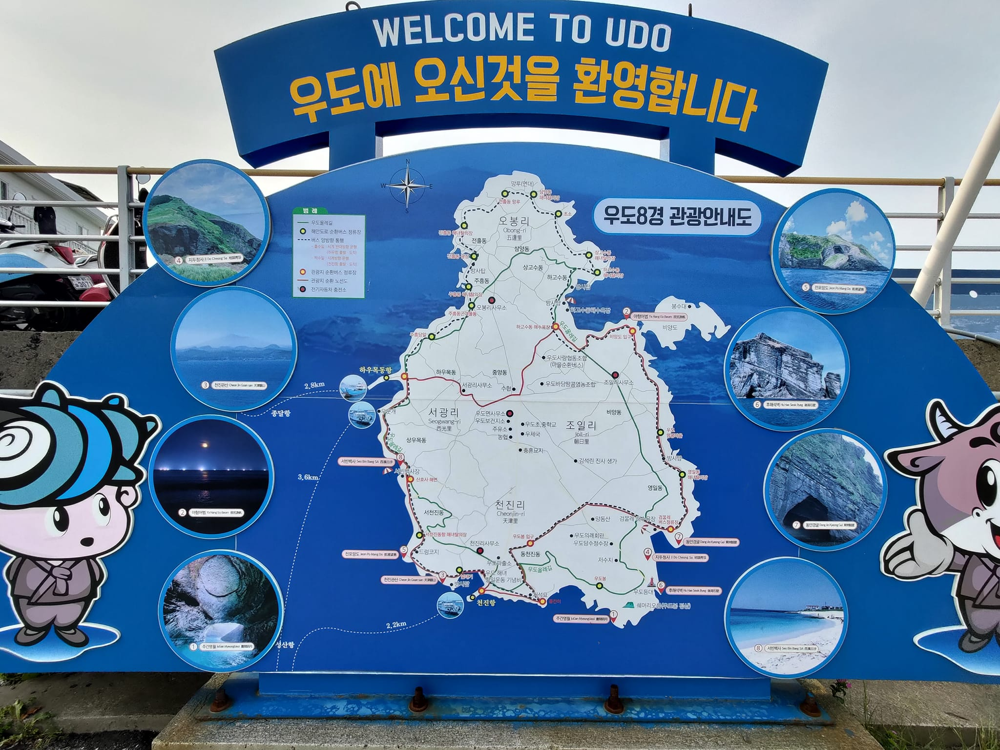
</a>

細節寫在下方的`交通`如下

## 交通

**國際駕照** 可以同時辦機車與汽車的，價格一樣。

### 租車

上網跟[樂天租車](https://www.lotterentacar.net/hp/eng/login/login.do)預定車款，好像要2~3個月前才開放預訂

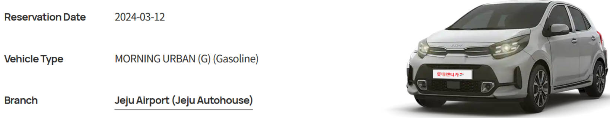

可以租電動車但我怕找不到充電，我這次選最小車款，一天不到1000台幣(含保險)，還有**倒車顯影**，建議自己帶**手機支架**。車型很像台灣KIA Picanto。要去搭接駁車，班次很多，路徑可以看網路上有影片。

[樂天租車介紹](https://www.youtube.com/watch?v=IpjmG354PD4)

[韓國開車注意事項](https://www.youtube.com/watch?v=iBcJ0bvAHG8)

我自己的心得是`測速照相很多`，但導航軟體都會提醒。比較麻煩的是要在學區或是長者區降速到時速30公里。
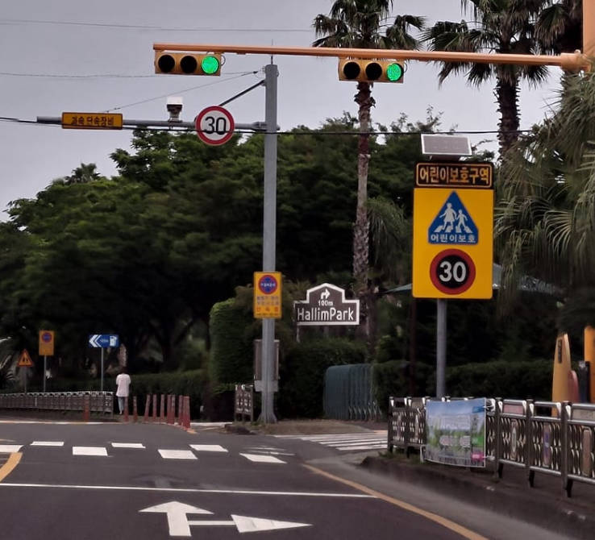

小車好處: 有些地方小型車可以停車費半價！

### 坐船去牛島

要帶**護照**，每小時一班，去程的時候會請你一起買回程票。

牛島好像有兩個港口，但都是在這邊上船。
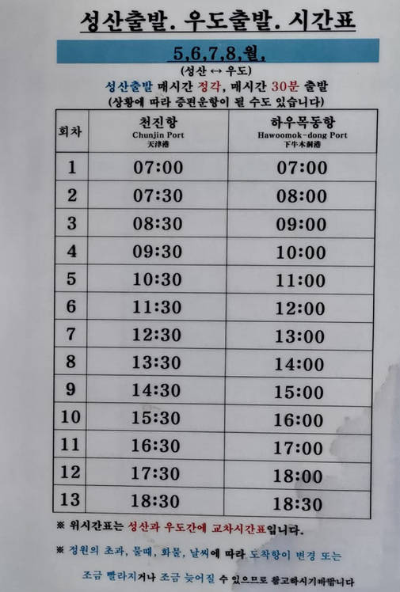

### 在牛島騎車

有**機車國際駕照**可以騎三輪電動車，有擋風玻璃才不會被海風吹到太冷，三小時三萬韓元，可以兩位大人共乘。

‌

## 住宿
只推薦牛島附近的 Hu An Stay Hotel(휴안스테이호텔)
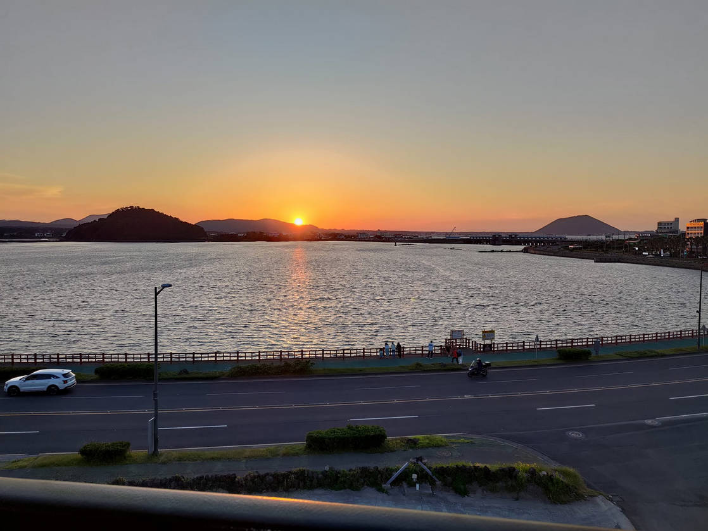

價格不高，‌好停車，走路可達的商店很多，可以選海景看夕陽。

有附毛巾`在洗手台鏡子櫃裡面`。

## 吃的推薦

### 韓國連鎖速食店

店名：Lotteria 롯데리아 (樂天漢堡))

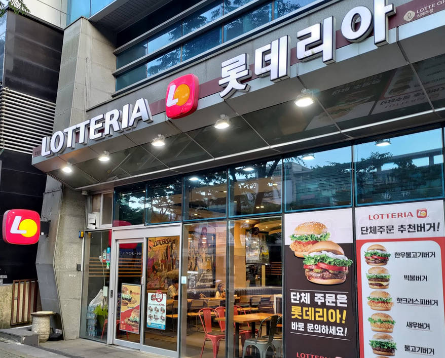

很多家分店，都是用點餐機，直接看英文點餐，再刷卡結帳。

### 海邊在地小店

店名：갯땅샌 평대바당 국수 (Pork Noodles Soup)
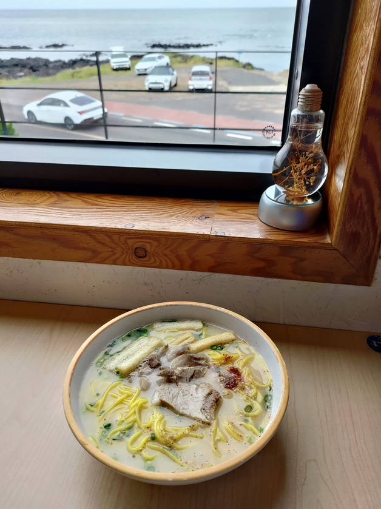
好停車，可以看海景，可刷卡。

### 市區中餐館

店名：송림반점 (中華料理중화요리)
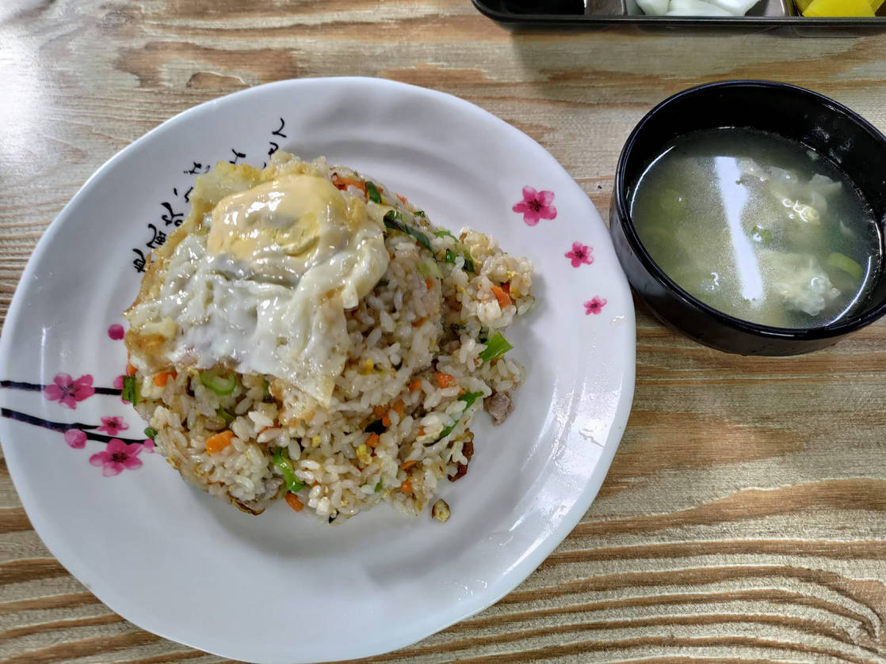

不容易免費停車，味道不錯，可刷卡，有WIFI。

## 隨車食物推薦

大賣場買的隨車食物

‌下面那個有點像旺旺仙貝

## 購物

韓國也有DAISO (大創)，最便宜的商品1000韓元的商品只要台幣23~24元，跟日本大創110日圓差不多，都比台灣大創49元便宜。

買了一籃才300多元台幣。
‌
## 其他觀察與發現

### 被蚊子吵的心得

半夜被蚊子叫醒，想說給它咬身體，不要到我耳邊就好，結果還是一樣。開燈之後抓到5隻，但一直抓不完，天還沒亮就醒了，直接出門跑行程。

這是我第一次旅行睡覺時候被蚊子打擾。明明窗戶都有關，睡前也都沒發現。

含個人房間衛浴，房價一晚不到600元台幣不是沒有原因的。我的要求是可以睡覺可以洗澡上廁所而已。

### 回收裝置
杯子的保證金300韓元，但又不會退，所以就被多收了。
<a href="回收.jpg" target="_blank">
        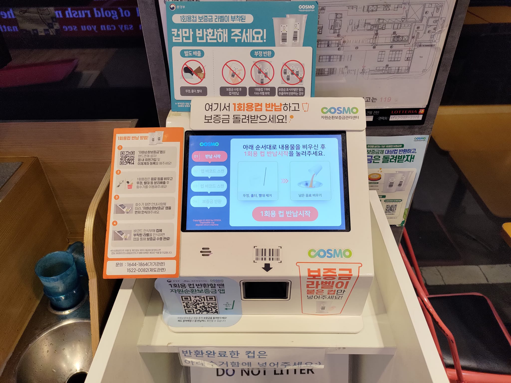
</a>

### 韓國駕駛心得
- 測速照相很多，還要因為學區、長者區，降速到30公里，導航會提前提醒。
- 圓環的設計不錯。

### 韓國刷卡心得
98%消費都可以刷卡，被要求的地方：牛島冰店但其他家餐飲可以。地方大超市，但連鎖的可以。私營停車費，但如果有閘門的都可以刷

遇到mart不能夠刷卡可能是因為是因為jcb不接受然後我給他master卡就可以用了所以到時候如果被開一看就拒絕那可能直接換上卡因為電源可能也不會說你不可以用

### 飲水機的連續出水方法
拉的，可以固定

### 電動車車牌好像是藍底

車子的顏色大部分是白黑，走到停車場拍照會有一個特別的感覺!

### 棋盤上，不太一樣

### 垃圾都這樣收集?
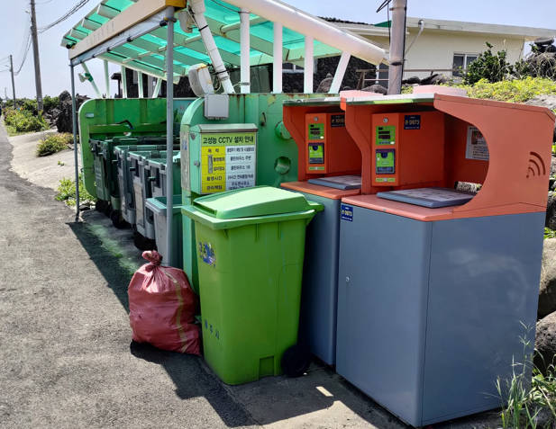

## 下次記得
- sim 卡IP
- 自帶杯
- 刷卡失敗可以換張卡
- 帶零食讚
- 防曬帽子
- 入境卡的資訊
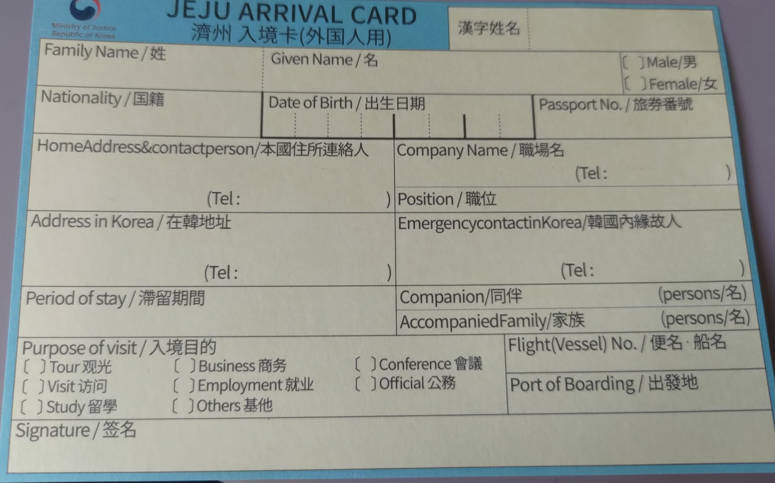
