# [旅遊] 從新加坡去馬來西亞新山JB(Johor Bahru)一日遊

## 重點摘要
出去前，先填好新加坡的ICA，準備兩邊的車錢，不能找零，只有visa可以刷，最好sim卡有兩地網路比較好求救。馬來西亞購物便宜，觀光區食物物價大約跟台灣一樣。
<!--more-->

<iframe src="https://open.firstory.me/embed/story/cletodx7u025l01vwe1nz6ahg" height="180" width="81%" frameborder="0" scrolling="no"></iframe>

## [過邊境交通] 去程
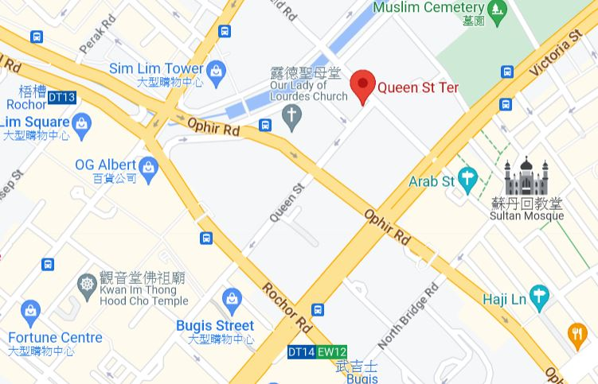

在queen street找巴士cw2的隊伍，並準備SGD 4.8元，上車才跟司機買票，不會找零，在新加坡出發可以使用NETS，也可以用visa的樣子，但不能用 Mastercard，付錢後拿到的票根要保存到最後，不然會需要再付錢一次。

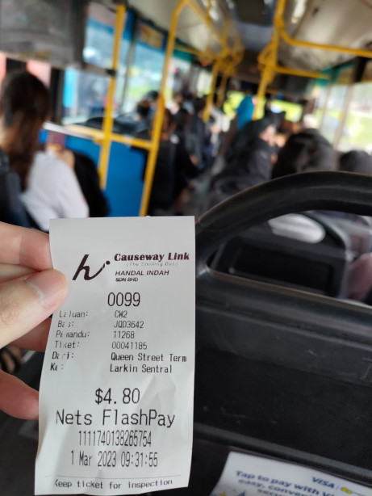

基本上不會塞車，班次很多，就算有排隊人潮也不用怕等太久，大眾運輸有自己的海關通道，不用跟自用車排隊塞車。

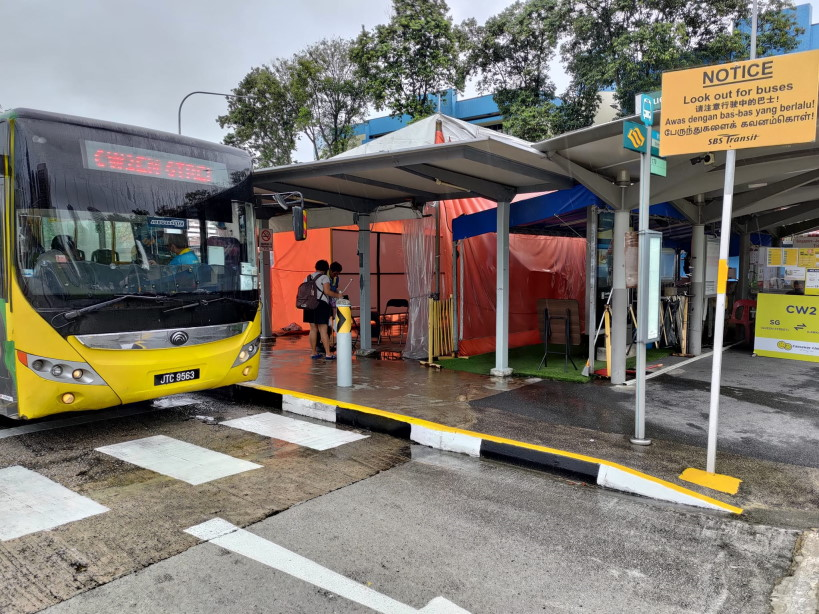

會先在 **兀蘭檢查站(Woodlands Checkpoint)** 下車，新加坡公民有專用出境通道，其他人也有自動通過，不太花時間，出境之後，再重新上公車，原來的車子當然已經開走，只要出示票根，選同公司的都會到馬來西亞的 **新山檢查站(Johor Bahru Checkpoint)** 。

過河之後就是馬來西亞了，入境的時候，我可能因為沒有新加坡的蓋章，被問到很多問題，有些問題沒聽懂，我的回答主要是說我當天就會回去新加坡，最後還是讓我過了，結果這趟旅程護照上只有馬來西亞的章。

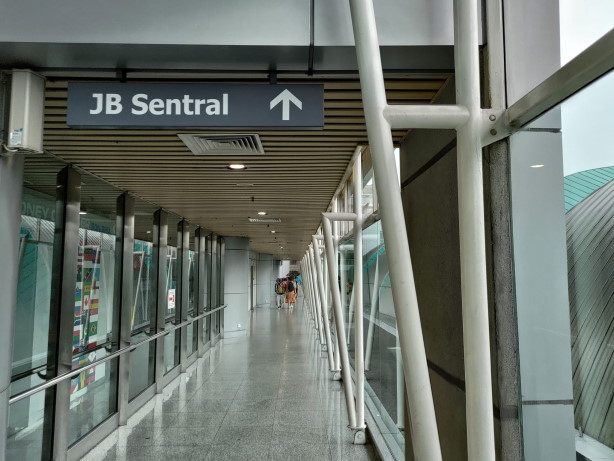

離開海關之後，先走過**新山中央車站(JB Sentral)**，再到 City Square 就可以開始逛街，或是走路前往景點，我原本想要嘗試當地公車，但無法透過google map 達成，就放棄了。

## [購物] City Square
* 有全家便利商店，在新加坡找不到的食物可以看看，我買了從日本全家進口的飲料。

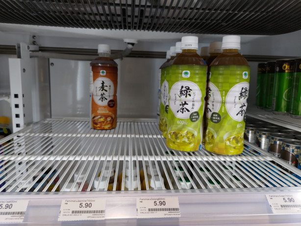

* 有鼎泰豐，價格似乎比台灣便宜，沒去吃不知道如何。
* 有 POPULAR City Square (書店)，大部分是中文書。
* 有H&M與UNIQLO，同時會寫兩國價格，套上匯率就知道，馬來西亞價格會比新加坡便宜

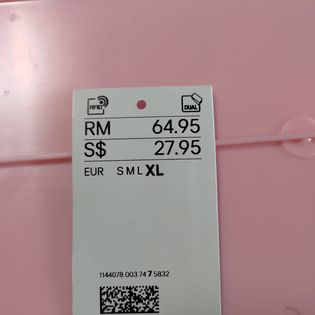

##  [景點] 柔佛古廟 
我只有到門口拍照

##  [景點] 玻璃廟，Arulmigu Sri Rajakaliamman Glass Temple 
看起來不錯的景點，我*翻山越嶺*走過去，結果沒開門，附近都是工地。
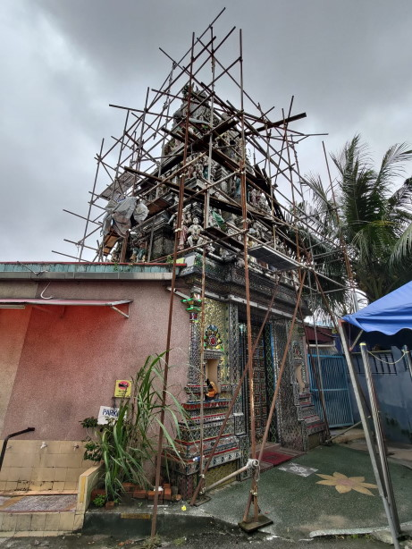

##  [食物] 華美茶餐室
中午要排隊，點餐還是用手寫，不方便刷卡的樣子，要準備現金。

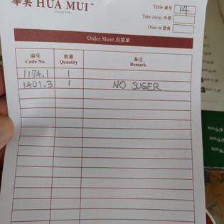

炒飯味道不錯，吃到最後油膩感偏多。

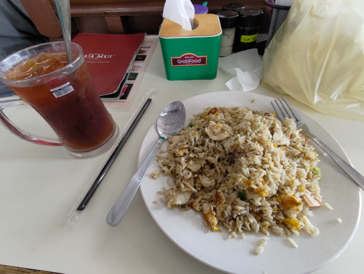

##  [食物] 協裕麵包西菓廠 Hiap Joo Bakery & Biscuit Factory
豆沙麵包不錯，很有飽足感。香蕉口味的蛋糕，我沒辦法吃完。

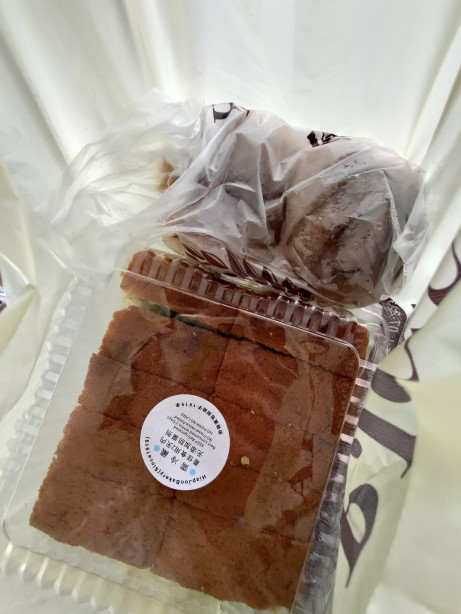

## [過邊境交通] 回程
還不用買票，先過 **新山檢查站(Johor Bahru Checkpoint)** 海關，因為是離開的關係吧，人工查核直接就過了。

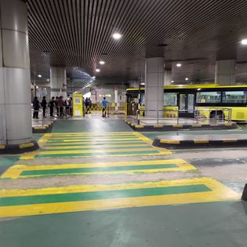

下樓後，有便利商店可以換錢，CW車隊在對面，要準備好visa，或是RM4.8現金，司機不找零，一開始不用挑路線，我是在CW5上跟司機說要去queen street，他也可以賣票給我但會寫CW5，有買到就可以。

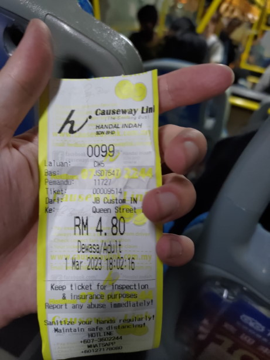

接著到（新加坡） **兀蘭檢查站(Woodlands Checkpoint)** 要下車，如果不是禮遇國家，要排隊走人工通道，如果沒有填ICA一定會被拒絕，當地網路不好，一定要事前準備。

人工查核後，就可以去找自己的路線了，這時才要確定是CW2路線。

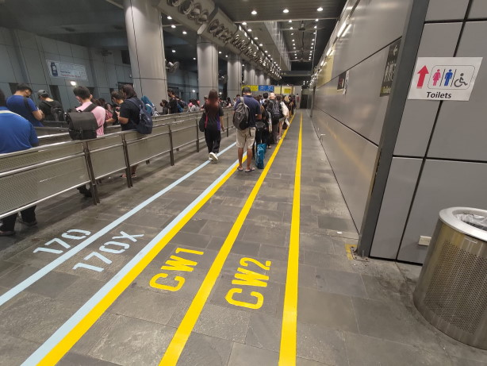

題外話，新加坡檢查站的廁所比較能使用。

# 連結
[2023新加坡與新山-馬來西亞 FB粉絲專頁 紀錄流水帳](https://www.facebook.com/profile.php?id=100090658718483)

# 備註
旅遊日期是2023/3/1，但為了方便整理發布時間，所以改成2023/2/26。
