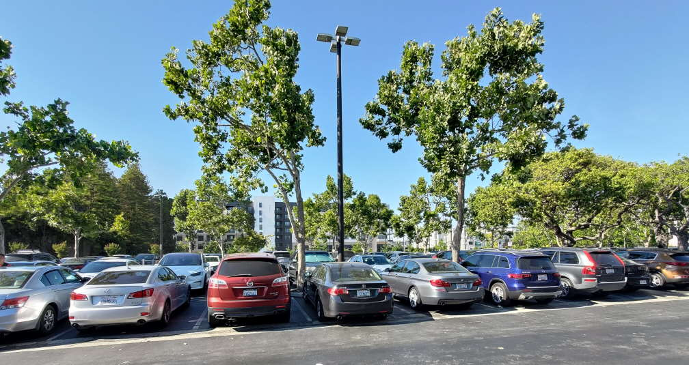
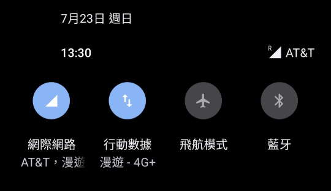
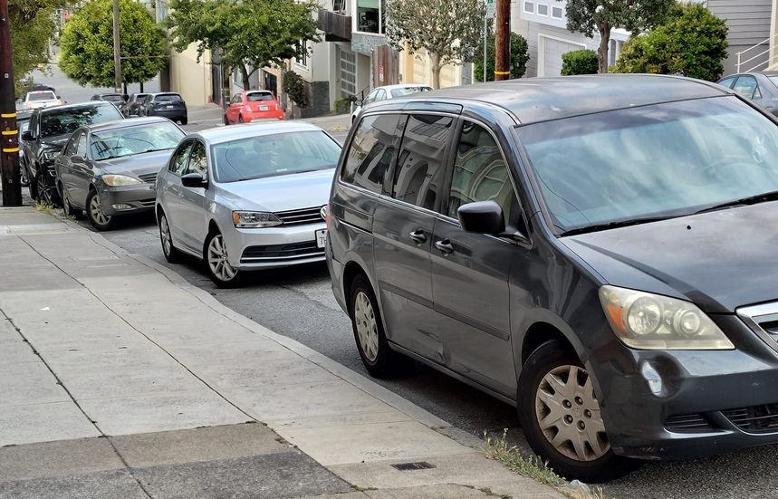
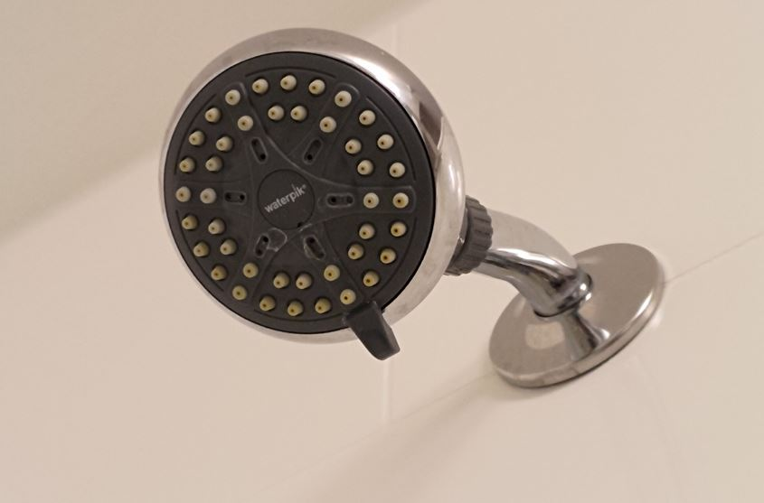
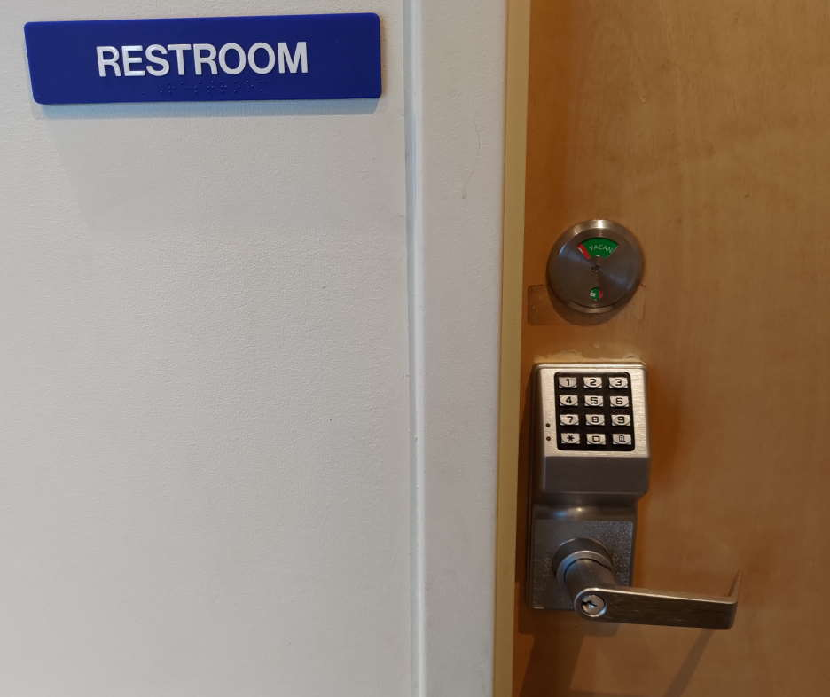
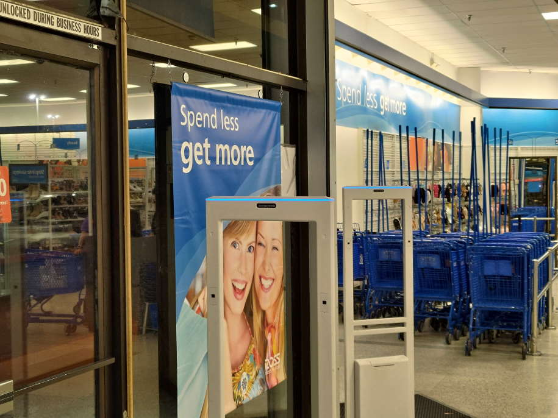

# [旅遊] 在美國(舊金山)的觀察與發現

<!--more-->
<iframe src="https://open.firstory.me/embed/story/clkzisd6v00pb01sw9csrglfi" height="180" width="99%" frameborder="0" scrolling="no"></iframe>

## 單位

汽油單位: 加侖

里程單位: mile

溫度單位: F

速度單位: MPH

高速公路限速65MPH，大約是104KM/H

REGULAR 汽油，每加侖5 美元，約40元台幣一公升

## 稅與小費

到餐廳都要給小費15~20%，給18%還算OK，都是先刷一筆含稅的，再手寫一次，填要給多少小費。

稅率不知道是多少，好像食物跟物品不一樣稅率?但應該都是9%左右

## 交通

國道不額外收費，除非走最內側。
過橋"金門大橋"現場不收費了，如果沒有事前登記，事後也可以補登記信用卡。

美國人似乎沒有倒車入庫的習慣，比較習慣車頭朝內，所以退出停車格的時候都是車尾出來，感覺沒有很順，不知道為什麼大家都這樣。

‌

有些洲的前車牌好像不用掛。

優勝美地 網路不好，我用T mobile SIM 卡會漫遊到AT&T，靠近商店的的時候網路就好了，可能是為了方便大家刷卡，畢竟不接受現金。

‌

閘道管制燈號變化很好笑，因為閘道不只一個車道，所以會交替放行，看起來就是在亂閃。

坡道停車，前輪會固定轉一個方向(如圖)

‌

## 長途飛機

通常是起飛後不久，就會吃第一餐，降落前三小時會吃第二餐，如果中間有醒著，還會有其他隱藏版食物。

往東會有太陽，所以空服員會要求關遮陽板，讓機艙內保持黑暗。
凌晨一點往西飛，12小時都是晚上，沒有這樣要求。

長程飛機，靠走道位置比較好，方便上廁所或起身活動，反正大部分時候都沒有景可以看。

## 商店觀察

飯店固定蓮蓬頭

‌

Merced的麥當勞與星巴克上廁所"要問店員密碼"，可能是怕遊民使用

‌

ROSS 商店的手推車，為了要避免被推出門外，有一個很高的桿子在車上，但好像有人沒注意到，想要推出去就卡在門上。

‌

## 連結
https://www.youtube.com/watch?v=p8to8nPTQB8

<iframe width="560" height="315" src="https://www.youtube.com/embed/pJTRoeOqNsY" title="YouTube video player" frameborder="0" allow="accelerometer; autoplay; clipboard-write; encrypted-media; gyroscope; picture-in-picture; web-share" allowfullscreen></iframe>
