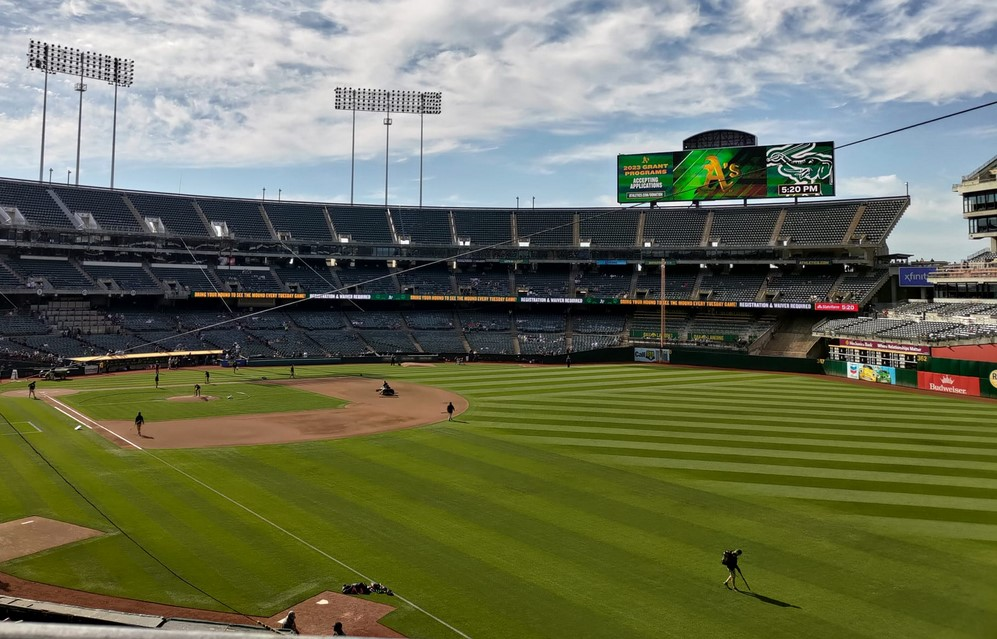
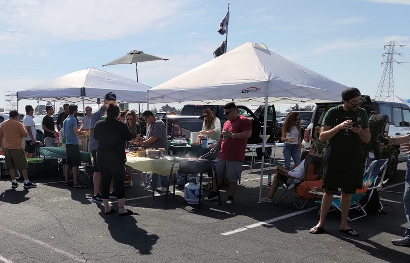

# [旅遊] 第一次看棒球，就在美國

2023/07/22現場參觀 Oakland Athletics (主場)對上 Astros的比賽

結果”累計戰績較差"的Athletics (主場)拿下勝利

<!--more-->

[https://www.mlb.com/gameday/astros-vs-athletics/2023/07/22/717295/final/box](https://www.mlb.com/gameday/astros-vs-athletics/2023/07/22/717295/final/box "smartCard-inline")

‌

<iframe src="https://open.firstory.me/embed/story/clkzijk2g00ze01w57t2yhxij" height="180" width="99%" frameborder="0" scrolling="no"></iframe>

## 現場與電視上看的差異

以前都是在電視上看，這是我第一次到現場看棒球賽，轉播的時候會有各種角度鏡頭重播，或是拉近畫面，並附上解說。現場沒這些，但可以同時看到整個球場所有球員的動態，也不會進廣告，但就沒有聽到解說。比較麻煩的是，有幾次擊出，我都看不到球的飛行路徑，不知道是不是觀眾席角度問題，還是球真的太快。

## 特別觀察

1. 應該是美國人的特有文化，在外圍停車場就看到一區一區的人在停車格烤肉
2. 看台底下一圈都是商店街
3. 還沒開始，大家很認真整理場地
4. 因為是主場的關係，所以會刻意多介紹一點主場球隊
5. 提出裁判爭議好像每隊只有一次，雖然有重播畫面佐證，但還是可能維持原判決
6. 現場畫面有帶到，很多很小的年紀就被帶來現場替主場球隊加油
7. 美國啦啦隊是布偶吉祥物
8. 主場都是後攻
9. 似乎只有美國，每次出球都有限時(約20 秒)，換場的時候也是(2分鐘)，比賽大約3小時結束。

## 價格

1. 門票與平均後的停車費用約39美元。
2. 想說大家都有準備應援周邊，剛好我的衣櫃還沒有帽子，就買了一頂帽子41美元。
3. 現場食物當然較貴，接近20美元。但份量很多。

## 後記

仔細想想，投手非常厲害，不只要和捕手溝通，避免被安打，還要小心盜壘，面對兩好三壞的時候，壓力應該很大。工作的時候應該也是一樣，獨當一面去面對客戶的時候就是如此，只能憑自己的經驗做事，若經驗或能力還不夠的時候，就會很辛苦。

## 連結
https://www.youtube.com/watch?v=lrRZEyPhUDk

<iframe width="560" height="315" src="https://www.youtube.com/embed/pJTRoeOqNsY" title="YouTube video player" frameborder="0" allow="accelerometer; autoplay; clipboard-write; encrypted-media; gyroscope; picture-in-picture; web-share" allowfullscreen></iframe>
