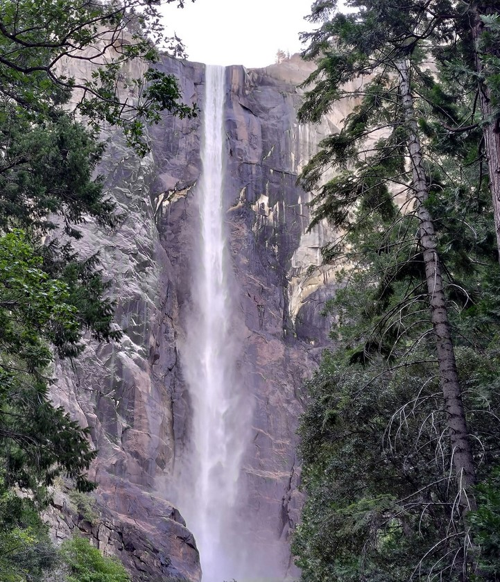
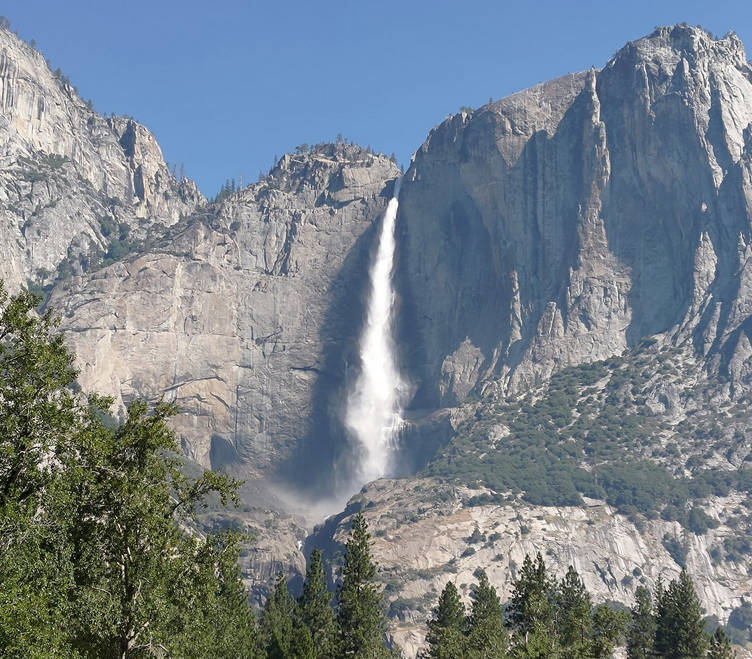
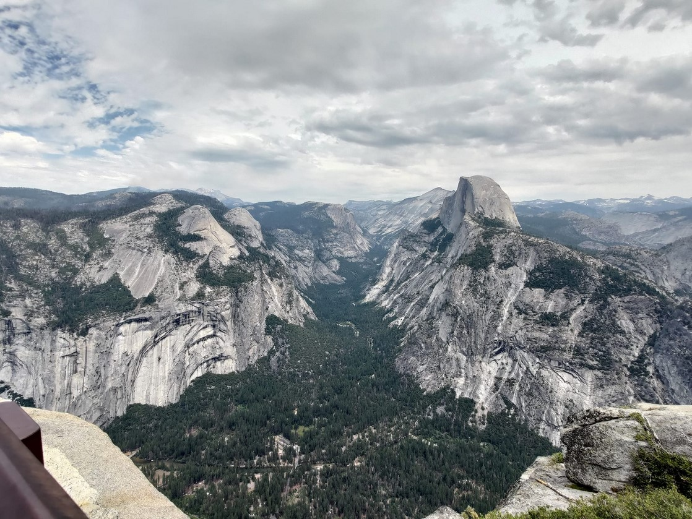
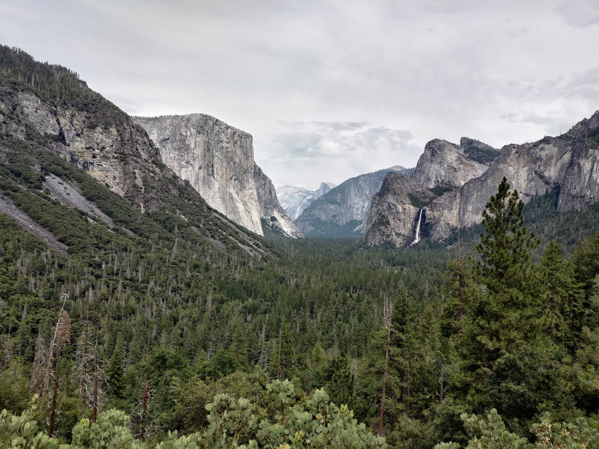
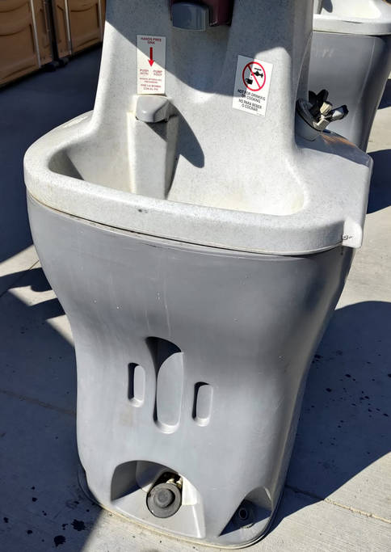

# [旅遊] 優勝美地國家公園

單程要開車4小時，早上天還沒亮，4點就出門，要輪流睡覺，兩小時後到Merced吃麥當勞早餐。

<!--more-->

<iframe src="https://open.firstory.me/embed/story/clkzixpn500pd01sw7g39dnlg" height="180" width="99%" frameborder="0" scrolling="no"></iframe>

## 路線

網路上有提到兩種路線上山，路線120比較崎嶇，我們選擇路線140相對平緩。

所以中繼城市選擇Merced，加油站很多，吃的也很多，有星巴克，

園區內網路訊號好不好，需要先下載離線地圖

官方有app可以看簡介

## 景點順序(都是開車)

1. Tunnel View(早上版)
2. Bridalveil Fall

‌

3. Yosemite falls

‌

4. Glacier point

‌

5. Tunnel View(下午版)

‌

找車位不容易，運氣要很好

## 園區內設施

1. 廁所不好找，流動廁所外的洗手台是腳踩給水

‌

2. 有垃圾桶
3. 收費的附近訊號還不錯(方便刷信用卡？)
4. 賣店不收現金

## 後記

很累，輪流開車很重要。

上面沒有食物要自備零食

水也是！

## 連結
https://www.youtube.com/watch?v=hizepBqECtg

<iframe width="560" height="315" src="https://www.youtube.com/embed/pJTRoeOqNsY" title="YouTube video player" frameborder="0" allow="accelerometer; autoplay; clipboard-write; encrypted-media; gyroscope; picture-in-picture; web-share" allowfullscreen></iframe>
