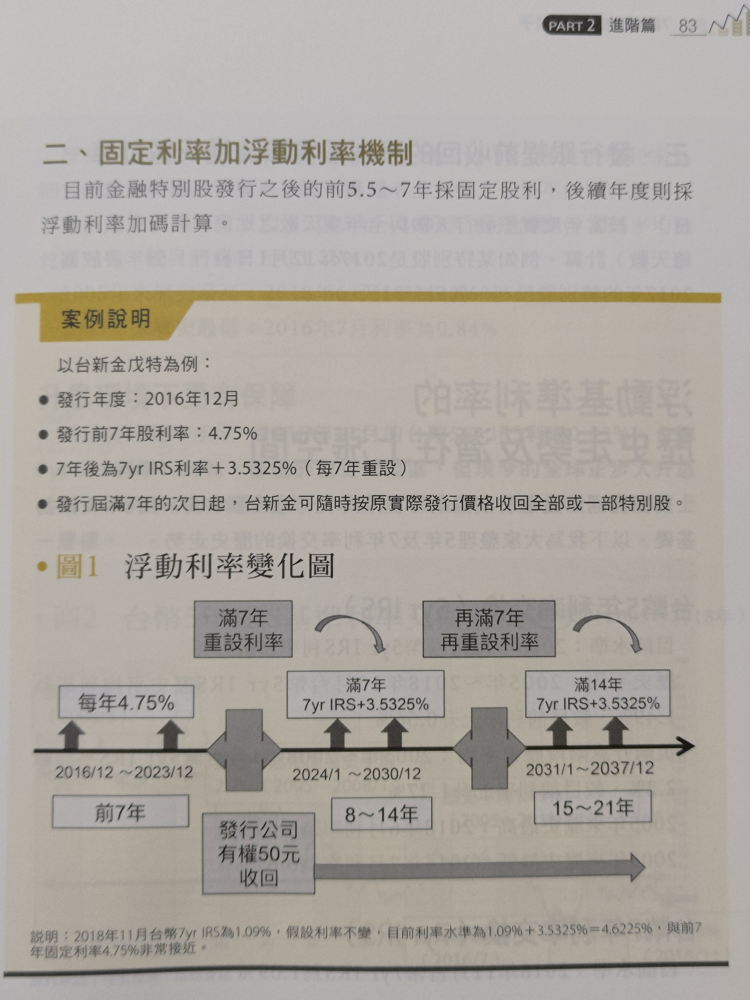

# [筆記] 7檔特別股養我一輩子

很多上市公司發行特別股，但定義與形式都還是有些差異，還是要看各家規定。

## 發放股利順位: 特別股優先，普通股之後
若公司有盈餘，扣除法定保留項目後，優先發給特別股股東股利
[心得] 如果是專門領股利的散戶，是不是有特別股就不要選普通股呢?

<!--more-->
<iframe src="https://open.firstory.me/embed/story/cl5fi74pm00r701s0bauh00n9" height="180" width="81%" frameborder="0" scrolling="no"></iframe>

## 公司清算順序
1. 政府: 欠稅、罰鍰、規費。
2. 員工: 薪資、各項福利。
3. 債權人: 先還有擔保品的
4. 特別股
5. 普通股
[心得] 雖然投資一家公司不是為了等他清算，但還是可以看一下，當股東的地位其實很低。

## 特別股的特殊條件
* 累積: 累積，表示若當年度沒有足夠盈餘，會累計到次年補發。大部分特別股都是不累積。
* 參加: 不參加，表示不參加剩餘經營結果(指普通股股利)，所以特別股利率等於約定利率。大部分都是不參加。
* 提前收回: 約定在未來年度後，以發行價或約定價格，回收股票(交易手續費由該公司支付)。大部分都是7年後，可以執行回收股票，但也可以繼續發行。
* 轉換: 轉換成為普通股。大部分都是不可轉換。

[心得] 常態的條件是: 不累積、不參加，發行7年後***可以***提前收回、不轉換，這樣其實可以當作是7年以上的*不定期*債券，公司會按照合約配發股利，但有機會因為當年度營運不佳，那一年就沒有利息。

對於公司來說，與其發債券，不如發特別股還比較有優勢。換句話說，對於投資人而言，有辦法買債券就買債券吧。

書本標題提到「養我一輩子」也是很不符合實際的狀況，大部分都是有機會被收回的。

## 壽險公司買很多金融特別股
[心得]用儲蓄險的2.x%去賺3.x~4.x%的特別股股利，算是穩定1%以上利差獲利，但儲蓄險不會強制收回，特別股會，這樣保險公司之後會怎麼處理呢?

## 金融特別股發行5.5年~7年採用固定利率，之後採用浮動利率，通常每7年調整一次約定利率。
如附圖。
> 
>
> [7檔特別股養我一輩子，第83頁。](https://www.books.com.tw/products/0010809435)

[心得] 也就是說，如果升息，特別股股利也會增加，反之，降息的話特別股股利就會減少。

## 年年配息的報酬率計算
運用Excel 的XIRR公式計算年報酬率
如附圖。
> 
>

# 後記
* 所有投資商品，都有其預期報酬與相應風險，特別股明顯風險小於普通股。
* 如果需要現金流的存股族，感覺很適合特別股，但普通股會有機會配發5%以上，目前看到的數字，特別股前7年都少於5%，所以沒有壓倒性優勢。
* 因為特別股會用發行價收回，所以只要放到最後一刻，就不存在"配息只是左手換右手"的說法。
* 特別股流動性很差，如果要大量買賣一定會滑價，最佳的買入時間應該就是申購與跌破發行價的時候，但還是要小心公司盈餘不夠發股利的情況。
* 既然都知道儲蓄險的背後有一部份是特別股，那是不是就不要給保險公司賺利差? 可是這樣就不可能在需要錢的時候一大筆解約(流動性差)。

* 就我現在的狀態，我還不需要特別股，等我進入需要股票給我現金流的年紀後，再來關注特別股也不遲(特別股可能被提前收回)。
 
# 連結
 [7檔特別股養我一輩子](https://www.books.com.tw/products/0010809435)

 <iframe allow="autoplay *; encrypted-media *; fullscreen *; clipboard-write" frameborder="0" height="450" style="width:100%;max-width:660px;overflow:hidden;background:transparent;" sandbox="allow-forms allow-popups allow-same-origin allow-scripts allow-storage-access-by-user-activation allow-top-navigation-by-user-activation" src="https://embed.podcasts.apple.com/tw/podcast/missq%E5%AD%B8%E6%8A%95%E8%B3%87/id1546536485"></iframe>

 不知道為什麼連結都失效了(消失?)

 [臉書（Facebook）粉絲專頁：MissQ 退休理財園地](https://www.facebook.com/bondquote/)

[網站 https://moneynmall.moneybar.com.tw/missQ/](https://moneynmall.moneybar.com.tw/missQ/)
