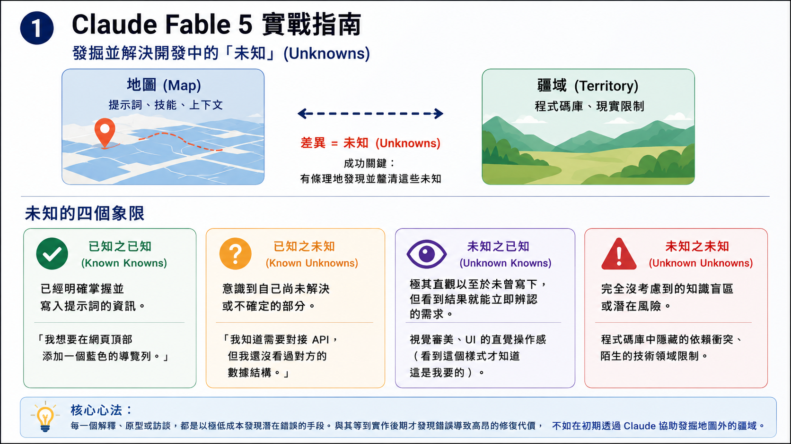
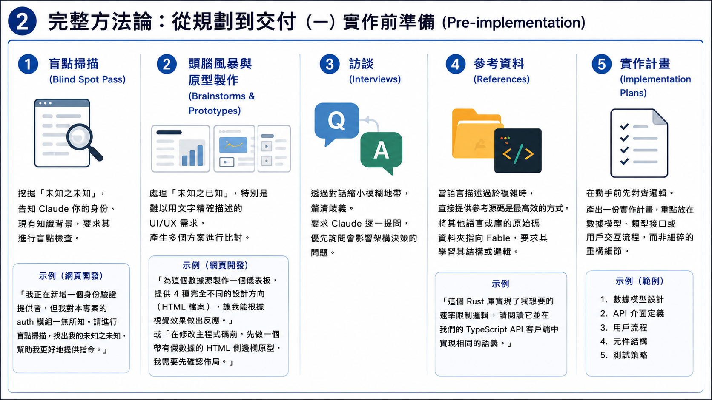
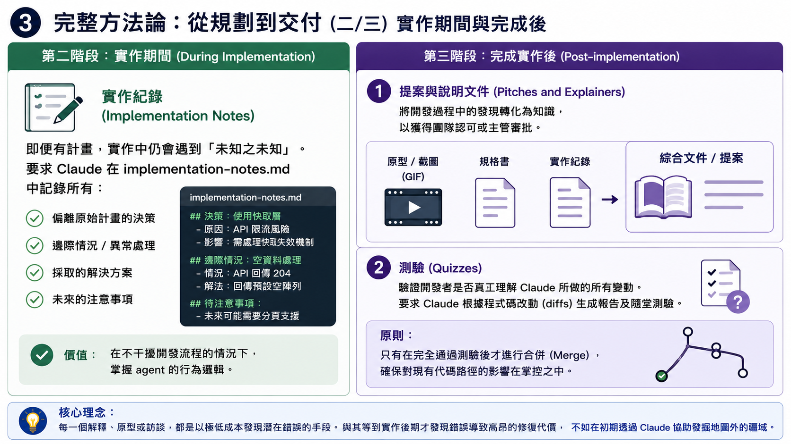
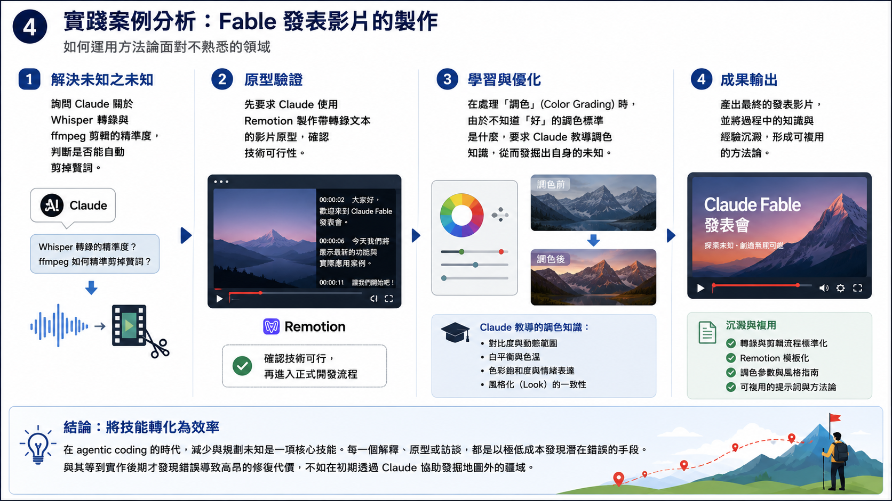

# [筆記] 與 Agentic AI 協作的成功關鍵：發掘並解決開發中的「未知」

與 Agentic AI 協作的成功關鍵，在於區分「地圖」（Map，即提示詞、技能與上下文）與「疆域」（Territory，即實際程式碼庫與現實限制）。兩者之間的差異即為 **未知 (Unknowns)**，本文整理了發掘與釐清這些未知的四象限框架與完整開發方法論。
<!--more-->

原文：[A field guide to Claude Fable 5: Finding your unknowns | Claude | Claude by Anthropic](https://claude.com/blog/a-field-guide-to-claude-fable-finding-your-unknowns)

---

## 核心框架：未知的四個象限

在解決問題時，應將資訊與缺口拆解為以下四種維度：

| 類型 | 定義 | 在開發中的表現 |
| :--- | :--- | :--- |
| **已知之已知 (Known Knowns)** | 已經明確掌握並寫入提示詞的資訊。 | 「我想要在網頁頂部添加一個藍色的導覽列。」 |
| **已知之未知 (Known Unknowns)** | 意識到自己尚未解決或不確定的部分。 | 「我知道需要對接 API，但我還沒看過對方的數據結構。」 |
| **未知之已知 (Unknown Knowns)** | 極其直觀以至於未曾寫下，但看到結果就能立即辨認的需求。 | 視覺審美、UI 的直覺操作感（「看到這張 HTML 樣式我才知道這是我要的」）。 |
| **未知之未知 (Unknown Unknowns)** | 完全沒考慮到的知識盲區或潛在風險。 | 程式碼庫中隱藏的依賴衝突、陌生的技術領域限制。 |

---

## 完整方法論：從規劃到交付

有效利用 **Claude Fable** 進行開發是一個迭代過程，分為前、中、後三個階段。

### 第一階段：實作前準備 (Pre-implementation)

#### 1. 盲點掃描 (Blind Spot Pass)
當面對陌生的程式碼庫或新領域（如設計、加密安全）時，用於挖掘 **未知之未知**。
- **方法**： 告知 Claude 你的身份、現有知識背景，並要求其進行盲點檢查。
- **網頁開發示例**： 「我正在新增一個身份驗證提供者，但我對本專案的 `auth` 模組一無所知。請進行盲點掃描，找出我的未知之未知，幫助我更好地提供指令。」

#### 2. 頭腦風暴與原型製作 (Brainstorms and Prototypes)
專門處理 **未知之已知**，特別是那些難以用文字精確描述的 UI/UX 需求。
- **方法**： 讓 Claude 產生多個方案進行比對。
- **網頁開發示例**： 「為這個數據源製作一個儀表板，提供 4 種完全不同的設計方向（HTML 檔案），讓我能根據視覺效果做出反應。」或「在修改主程式碼前，先做一個帶有假數據的 HTML 側邊欄原型，我需要先確認佈局。」

#### 3. 訪談 (Interviews)
透過對話縮小模糊地帶，釐清歧義。
- **方法**： 要求 Claude 逐一提問，優先詢問會影響架構決策的問題。

#### 4. 參考資料 (References)
當語言描述過於複雜時，直接提供參考源碼是最高效的方式。
- **方法**： 將其他語言或庫的原始碼資料夾指向 Fable，要求其學習其結構或邏輯。
- **示例**： 「這個 Rust 庫實現了我想要的速率限制邏輯，請閱讀它並在我們的 TypeScript API 客戶端中實現相同的語義。」

#### 5. 實作計畫 (Implementation Plans)
在動手前先對齊邏輯。
- **方法**： 要求產出一份實作計畫，重點放在數據模型、類型接口或用戶交互流程，而非細碎的重構細節。

---

### 第二階段：實作期間 (During Implementation)

#### 實作紀錄 (Implementation Notes)
即便有計畫，實作中仍會遇到 **未知之未知**。
- **方法**： 要求 Claude 在 `implementation-notes.md` 中記錄所有偏離原始計畫的決策、邊際情況與解決方案。
- **價值**： 這能讓你在不干擾開發流程的情況下，掌握 agent 的行為邏輯。

---

### 第三階段：完成實作後 (Post-implementation)

#### 1. 提案與說明文件 (Pitches and Explainers)
為了獲得團隊認可或主管審批，需要將開發過程中的發現轉化為知識。
- **方法**： 封裝原型、規格書與實作紀錄，生成一份包含演示（如 GIF）的綜合文件。

#### 2. 測驗 (Quizzes)
驗證開發者是否真正理解 Claude 所做的所有變動。
- **方法**： 要求 Claude 根據程式碼改動（diffs）生成一份報告及隨堂測驗。
- **原則**： 只有在完全通過測驗後才進行合併（Merge），確保對現有代碼路徑的影響在掌控之中。

---

## 原文中實踐案例分析：Fable 發表影片的製作

開發者利用 Claude Code 處理了其不熟悉的領域：

1. **解決未知之未知**： 詢問 Claude 關於 Whisper 轉錄與 ffmpeg 剪輯的精準度，判斷是否能自動剪掉贅詞。
2. **原型驗證**： 先要求 Claude 使用 Remotion 製作一個帶轉錄文本的影片原型，確認技術可行性。
3. **學習與優化**： 在處理 **調色 (Color Grading)** 時，由於不知道「好」的調色標準是什麼，開發者要求 Claude 教導調色知識，從而發掘出自身的未知。

---

## 結論：減少未知與規劃未知

在 agentic coding 的時代，**減少與規劃未知** 是一項核心技能。每一個解釋、原型或訪談，都是以極低成本發現潛在錯誤的手段。與其等到實作後期才發現錯誤導致高昂的修復代價，不如在初期透過 Claude 協助發掘地圖外的疆域。

---

## 我的連結
- Youtube: https://www.youtube.com/@Daydream-Studio/videos
- Podcast: https://cl4bfh8ww02uu01zgaj2i3d1u.firstory.io/episodes
- FaceBook: https://www.facebook.com/profile.php?id=100082389794254
- Blog: https://nostanduptalk.github.io/

