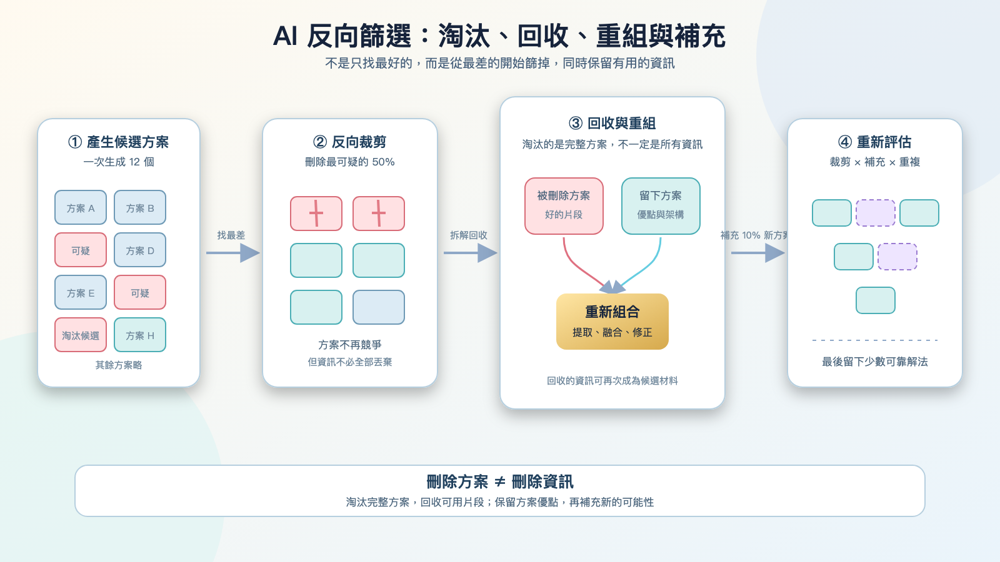

# [筆記] 從《萬能鑑定士Q：蒙娜麗莎之瞳》想到 AI 的反向篩選

看完《萬能鑑定士Q：蒙娜麗莎之瞳》後，片中對真偽鑑定的訓練過程令人印象深刻。從最差的選項開始，一路篩選、回收與重組，或許會成為一種很有價值的 AI 決策方法。

<!--more-->

## 電影中的鑑定訓練

看完電影《萬能鑑定士Q：蒙娜麗莎之瞳》後，我對片中的鑑定訓練留下很深的印象。

在訓練過程中，並不是直接從十二張作品裡挑出最像真跡的項目，而是先找出其中兩張 **最可能是假畫** 的作品，再由第二個人從這兩張裡挑出一張予以淘汰。

接著，對剩下的作品重複相同的比較與排除流程。經過一次又一次的比較與淘汰，最可疑的作品逐漸被篩掉，最後留下來的才是真正的作品。

這是一種從 **錯誤端開始** 的反向篩選機制。

---

## 從最差的方案開始

這個方法的特點在於：從 **最差、最可疑** 的方案開始一路篩選、淘汰，直到最後留下最有可能正確或可行的候選者。

因此在設計 AI Agent 決策流程時，與其直接問「哪個方案最好」，不如先問以下幾個反向問題：

- 哪個方案最可能失敗？
- 哪個方案最不符合既定條件？
- 哪個方案的風險最高？
- 哪個方案應該最先被淘汰？

---

## 被刪除方案中仍有價值

在篩選過程中，被淘汰的方案不一定完全沒有價值。

一個方案可能整體表現很差，因此應該被刪除；但其中部分有價值的想法或組件仍可保留下來，並判斷哪些內容值得與其他方案進行合併。

這讓整個決策流程不只是單純的 **刪除**，而更像是一種 **拆解與回收**。

---

## 裁剪、整理與重新生成

重新生成的方案可以來自三個方向：

1. **整理保留方案**：從目前留下來的方案中重新整理，保留優點並修正缺點。
2. **回收被刪方案**：從被刪除的方案中提取仍然有用的資訊，再和其他內容重新組合。
3. **探索全新方案**：完全重新生成少量的新方案，讓 AI 不會只在原本的思路裡打轉。

這三種方式可以同時進行：留下來的方案提供 **穩定的基礎**，被刪除方案提供 **不同的想法**，而全新的方案則帶來 **未知的可能性**。

因此，AI Agent 的工作不只是「留下」或「刪除」，也包括 **「拆解」**、**「回收」**、**「重組」** 與 **「再創造」**。

---

## 裁剪與補充

這個流程可以稱為 **「裁剪與補充」**，也可以理解成 **「淘汰、回收與探索」**。

- **刪除**：代表 **收斂**，讓候選答案越來越集中。
- **重新整理與提取舊資訊**：代表 **保留** 原本方案中的可用部分。
- **新增少量新方案**：代表 **探索**，避免 AI 只在既有答案裡反覆選擇。

例如，每一輪刪除 50%，再新增 10% 的方案，候選數量就會變成原本的 60%。如果一開始有一百個方案，經過幾輪之後，數量可能會逐步變化：

> 100 → 60 → 36 → 22 → 13 → 8 → 5 → 3 → 2 → 1

如果每一輪刪除 70%、新增 10%，候選數量就會變成原本的 40%，收斂速度會更快：

> 100 → 40 → 16 → 6 → 2 → 1

不過，這些數字只代表仍在競爭的完整方案數量。被刪除的方案雖然不再繼續競爭，但其中有用的資訊仍然可以被保留，並在後續重新組合。

---

## AI 的動態候選池

這種反向篩選可以套用在 AI Agent 的工作流程中。

首先，讓 AI 一次產生一批候選方案。接著，讓一個 Agent 找出其中最差或最可疑的部分，再由另一個 Agent 進行比較，決定哪一個應該被刪除。

但這個流程不一定只能刪除，也可以在刪除之後重新新增少量方案。

也就是說，AI 手上不只是固定的一副牌，而是一個會 **持續變動的候選池**：

1. **產生大量方案**
2. **找出最差的方案**
3. **刪除其中一部分**
4. **整理留下來的方案**
5. **從被刪除的方案中提取仍然有用的內容**
6. **重新組合出新的方案**
7. **另外生成少量不同方向的方案**
8. **再次進行評估與裁剪**

這樣一來，AI 就不只是從原本的選項中挑選，而是能夠一邊淘汰，一邊產生新的可能性。

---

## 這種方法的風險

反向篩選雖然有用，但也不是完全沒有風險與問題：

1. **早期誤判風險**：如果前面的判斷發生錯誤，真正好的方案可能會太早被淘汰。因此刪除時最好不要把整個方案的所有內容都視為無用，而是保留它的理由、特色與可取之處。
2. **同質化與錯誤放大**：如果所有 Agent 都使用相同的錯誤標準，反覆評估只會把同一個錯誤不斷放大。
3. **過早收斂**：候選池不能太早縮小，否則可能只剩下相似的思路。

**因此這個想法在實際落地時，仍需仔細設計保護機制。**

---

## 🎬 附錄：《萬能鑑定士Q：蒙娜麗莎之瞳》作品資料整理

### 作品基本資訊

- **片名**：《萬能鑑定士Q：蒙娜麗莎之瞳》（All-Round Appraiser Q: The Eyes of Mona Lisa / 万能鑑定士Q -モナ・リザの瞳-）
- **原著小說**：松岡圭祐《萬能鑑定士Q的事件簿 IX》（角川文庫）
- **導演**：佐藤信介（代表作：《今際之國的闖關者》、《王者天下》、《圖書館戰爭》）
- **配樂**：羽深由理
- **片長**：約 119 分鐘

### 故事劇情大綱

擁有驚人瞬間記憶力與超凡觀察力的「萬能鑑定士Q」店長 **凜田莉子**，受到法國羅浮宮博物館的委託，前往巴黎參加世界名畫《蒙娜麗莎》赴日展出的防盜與安全鑑定訓練。

訓練過程中，莉子與另一位鑑定師流泉寺美沙一同接受嚴格考驗。然而隨著訓練進行，莉子發現自己開始出現強烈的頭痛，記憶與觀察力竟逐漸衰退，甚至面臨失去「鑑定能力」的危機。

同時，一直默默關注莉子的週刊《Weekly Kadokawa》記者 **小笠原悠斗**，在追查《蒙娜麗莎》背後歷史詛咒的過程中，意外發現這場來日展覽背後隱藏著針對名畫的巨大陰謀……失去能力的莉子該如何解開這幅傳世名畫背後的神秘謎團？

### 主要角色與演員陣容

| 角色名稱 | 演員 | 角色簡介 |
|---|---|---|
| **凜田莉子** | 綾瀨遙 | 「萬能鑑定士Q」店長，具備極強的邏輯推理與鑑定直覺。 |
| **小笠原悠斗** | 松坂桃李 | 週刊記者，熱血但有時稍嫌冒失，始終支持並協助莉子。 |
| **流泉寺美沙** | 初音映莉子 | 獲選參與《蒙娜麗莎》特展鑑定的同伴鑑定師。 |
| **朝比奈尚幸** | 村上弘明 | 羅浮宮展覽的日方負責人與策展總指揮。 |
| **理察·埃爾南德斯** | 皮耶·德隆尚 (Pierre Deladonchamps) | 羅浮宮《蒙娜麗莎》館藏負責人。 |

### 本片四大核心看點

- **首例獲准進入「羅浮宮」實景拍攝**：
  本片為日本電影史上首次獲准進入法國巴黎羅浮宮博物館內部進行實景拍攝的作品，包含《蒙娜麗莎》展廳等關鍵場景皆為實地取景，畫面極具質感與臨場感。
- **暢銷推理小說影視化**：
  改編自日本作家松岡圭祐累積銷售突破數百萬冊的《萬能鑑定士Q》系列，將日常鑑定、歷史考證與懸疑推理完美結合。
- **綾瀨遙 × 松坂桃李 雙主角對戲**：
  綾瀨遙完美詮釋從自信聰慧到陷入能力危機的莉子；松坂桃李則將忠誠且執著的記者小笠原演繹得相當討喜，兩人之間的默契與互動也是全片亮點之一。
- **藝術歷史與科學解謎**：
  劇情深入探討了《蒙娜麗莎》畫作製作年代的畫材、複製技術、達文西的密碼以及人類腦科學對視覺感知的影響，兼具知識性與娛樂性。

---

## 我的連結
- Youtube: https://www.youtube.com/@Daydream-Studio/videos
- Podcast: https://cl4bfh8ww02uu01zgaj2i3d1u.firstory.io/episodes
- FaceBook: https://www.facebook.com/profile.php?id=100082389794254
- Blog: https://nostanduptalk.github.io/

