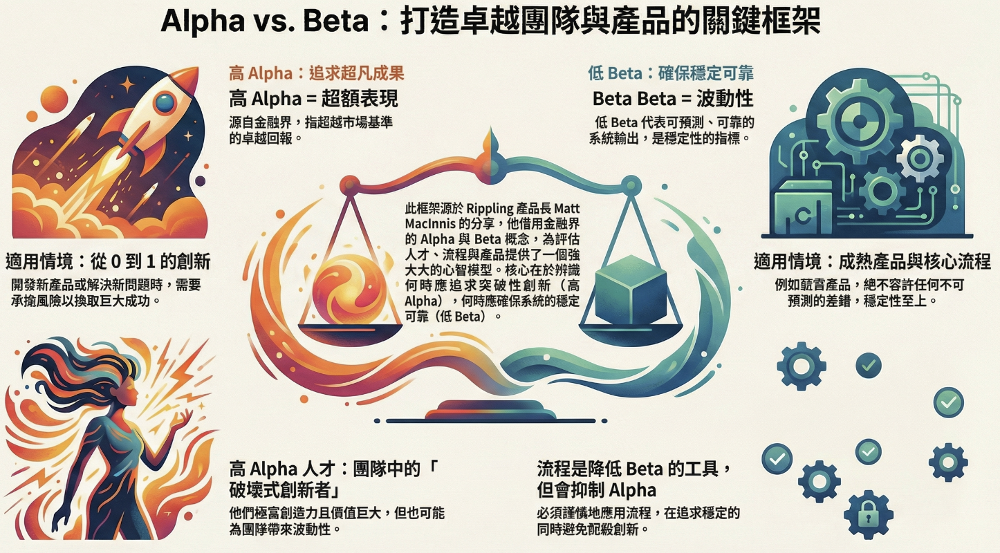

# [筆記] 團隊管理的 Alpha 與 Beta：在創新與穩定間取得平衡

領導者時常面臨兩難：如何鼓勵團隊大膽創新（Alpha），同時確保產出穩定可靠（Beta）？透過 Matt MacInnis 的管理框架，我們可以更清晰地診斷問題並優化人才配置。
<!--more-->

在團隊管理的戰場上，領導者時常面臨一個棘手的兩難：我們該如何鼓勵團隊大膽創新、追求突破性的成果，同時又確保產出的品質穩定、分毫不差？這兩種看似矛盾的目標——「創新突破」與「穩定可靠」——往往讓管理者陷入困境。

為了解決這個難題，Rippling 前任長期營運長（COO）、現任產品長（CPO）的 Matt MacInnis，提出了一個身經百戰的診斷工具：**Alpha 與 Beta 框架**。這不是什麼學術理論，而是他在一家高速成長的獨角獸公司，用來解決真實問題、協助收拾殘局的實戰心法。

---

## 1. 核心概念：什麼是 Alpha 與 Beta？

Alpha ($\alpha$) 與 Beta ($\beta$) 這兩個希臘字母，最初是用來評估金融資產表現的關鍵指標。

| 概念 | 金融界定義 | 團隊管理應用 |
| :--- | :--- | :--- |
| **Alpha ($\alpha$) / 超額表現** | 代表一項投資相對於市場基準的超額報酬。高 Alpha 意味著超越市場。 | 象徵能帶來**巨大價值、突破性創意與非凡成果**的特質。它是從 90 分邁向 99 分的關鍵。 |
| **Beta ($\beta$) / 波動性** | 代表一項資產相對於市場整體的波動性或風險。 | 象徵團隊產出的**不確定性或不可預測性**。追求「低 Beta」意味著追求穩定、可靠、可預測，確保每次都能達到 85 分。 |

在理想世界中，我們追求的目標是 **「高 Alpha，低 Beta」**。然而現實中，這兩者往往是相關的 (correlated)。卓越的領導者必須學會在兩者之間做出明智的權衡 (Trade-off)。

---

## 2. 人才應用學：如何評估團隊中的人才？

這是一個極其實用的人才評估工具，幫助領導者將成員放在最能發揮價值的位置。

### 2.1. 識別「高 Alpha」人才：團隊的突破點
「高 Alpha」人才是團隊的創新引擎。他們可能不是最循規蹈矩的員工，但卻能帶來驚人的超額回報。這類人才的價值在於他們**不按牌理出牌的思維**，是帶領團隊殺出重圍的關鍵。

### 2.2. 識別「低 Beta」人才：組織的穩定器
「低 Beta」人才是組織穩定運行的基石。以薪資產品 (Payroll Product) 為例，其核心價值在於 **「零失誤」與「可預測性」** 。在這種情境下，穩定可靠（低 Beta）的價值遠遠大於驚喜。

### 2.3. 實戰心法：關鍵在於「適才適所」
Alpha 與 Beta 並非定義人才好壞的標籤，而是一個關於 **「匹配度 (Fit)」** 的框架。

*   **追求 Alpha 的情境**：產品需要從 0 到 1 尋找突破口時，需要願意承擔風險的先鋒。
*   **追求低 Beta 的情境**：產品進入成熟期或負責核心穩定功能（如資安、維運）時，需要追求完美的衛士。

---

## 3. 流程設計學：打造兼顧創新與穩定的流程

Matt MacInnis 認為：`「流程存在的唯一目的，就是為了降低 Beta（波動性）。」`

### 3.1. 案例研究：Rippling 的 「Pickle」 品質清單
Rippling 內部有一個名為 **「Pickle」** 的產品品質清單 (PQL)。它是一個絕佳案例，展示如何在不扼殺創新的前提下降低風險。

這個清單是根據團隊犯過的錯誤持續迭代。例如，針對曾發生的功能開關 (feature flag) 失誤，團隊在清單中加入了一條極端但明確的規則：
`「產品發佈時，只允許存在一個掌管整個產品的功能開關。」`

這體現了一個好流程的特點：**從錯誤中學習，並透過輕量級規則系統性地降低未來的 Beta**。

### 3.2. 實戰心法：設計流程前的兩個關鍵提問
1. 這個流程是否真的能有效降低 Beta？
2. 這個流程是否會過度抑制 Alpha？

---

## 4. 總結：成為駕馭 Alpha 與 Beta 的智慧領導者

1.  **平衡點**：領導者的核心任務是在追求創新突破與確保穩定可靠之間找到平衡。
2.  **適才適所**：將「高 Alpha」放在開創位置，「低 Beta」放在維護位置。
3.  **輕量流程**：流程是為了降低 Beta，但要警惕它扼殺團隊的活力與創造力。

將 Alpha 與 Beta 內化為你的思考工具，你將能更游盈地應對各種管理挑戰，打造出一個既能持續創新、又能穩定交付的卓越團隊。

---

## 參考連結
- [“I deliberately understaff every project” | Leadership lessons from Rippling’s $16B journey - YouTube](https://www.youtube.com/watch?v=O_W76LR77Vw)

---

## 我的連結
- Youtube: https://www.youtube.com/@Daydream-Studio/videos
- Podcast: https://cl4bfh8ww02uu01zgaj2i3d1u.firstory.io/episodes
- FaceBook: https://www.facebook.com/profile.php?id=100082389794254
- Blog: https://nostanduptalk.github.io/
