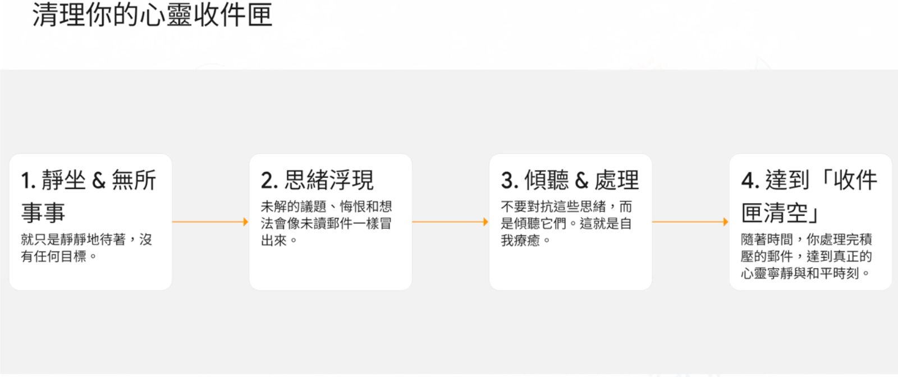

# [筆記] 獨處30分鐘：環境越安靜，內心越吵雜

> 哲學家帕斯卡曾說：「人類所有的問題，都源於他無法獨自一人在房間裡安靜地待上30分鐘。」

我們時常誤解，以為解決了所有外部問題就能獲得快樂，但真正的平靜，其實源於內心的轉變。
<!--more-->

本文參考自兩則Youtube，連結放在文章最後。

### 我們對快樂的普遍誤解

七屆 F1 世界冠軍 **Lewis Hamilton** 在事業頂峰時感到空虛，坦言感覺「缺少了某些東西」(`something missing`)；而矽谷思想家 **Naval Ravikant** 則向世人拋出一個尖銳提問：「如果你這麼聰明，為什麼你不快樂？」(`if you're so smart how come you aren't happy?`)。這兩位身處不同領域的頂尖人物，不約而同地指向了一個深刻的真相：我們對快樂的普遍理解，從根本上就存在誤區。

——**真正的快樂與平靜，並非來自於解決永無止境的外部問題，而是源於內心的轉變與自我接納。**

## 1. 陷阱：為何外在成就無法滿足我們？

許多人將一生奉獻給追求事業、財富或名聲上的成功，相信這些目標達成之時，就是快樂降臨之日。然而，Lewis Hamilton 的親身經歷揭示了這個模式的根本缺陷。

### 1.1. 快樂的短暫性

Hamilton 形容，贏得冠軍後的快樂是「**非常短暫的**」(`so shortlived`)。一個極度緊張的比賽週末過後，隨之而來的往往是巨大的失落感 (`a huge come down`)。這種劇烈起伏形成了一種「情緒的雲霄飛車」(`emotional roller coaster`)，讓人難以獲得穩定的內在狀態。這或許也是你在達成某個重要目標後，內心感到一絲失落的原因。

**核心洞見：** 依賴外在成就所獲得的快樂，其本質是短暫且不穩定的。它像是一劑短效的興奮劑，藥效過後，空虛感便會重新襲來。

### 1.2. 永無止境的外部問題

我們普遍認為，「獲得平靜的方式是解決所有外部問題」(`the way we think you get peace is by resolving all your external problems`)。Naval Ravikant 指出，這是一個根本性的錯誤，因為「**外部問題是無限的**」(`there's unlimited external problems`)。

試圖透過解決所有外部問題來尋求內心平靜，就像在玩一場永無止境的「打地鼠遊戲」。每當你解決一個問題，新的問題又會從別處冒出來。這是一條永遠走不通的路。

### 1.3. 尋求認可的驅動力

許多人追求成功的深層動機，並非完全來自內在的熱情。Hamilton 回憶自己的童年，他努力比賽是為了「看到父親臉上的笑容」，為了「**被接納**」(`be accepted`) 和「**被欣賞**」(`be appreciated`)。

當我們的驅動力建立在他人反應之上時，我們的價值感就變得極不穩固。這種對外部認可的渴望，使我們將定義自身價值的權力交到了別人手中。

> 反思一下，你目前追求的目標，有多少是為了內在的滿足，又有多少是為了尋求他人的認可？

Lewis Hamilton 的親身經歷，完美印證了 Naval Ravikant 的核心觀點：**向外追尋是一條死胡同**。那麼，真正的出路在哪裡？答案就在我們的內心。

## 2. 轉向內在：平靜的真正源頭

當外部世界無法提供持久的滿足感時，唯一的出路便是向內探索。這並非逃避現實，而是從問題的根源著手。

### 2.1. 唯一的解決之道：由內而外的轉變

Naval Ravikant 提出了一個顛覆性的結論：「真正獲得平靜的唯一途徑是在內心，透過**放棄『問題』這個概念**」(`the only way to actually get peace is on the inside by giving up this idea of problems`)。

這意味著，與其耗費心力去改變無窮無盡的外部世界，不如專注於改變我們自己。正如他所說：「**改變自己比改變世界更容易**」(`it's easier to change yourself than to change the world`)。

**真正的力量來自於改變我們看待和回應世界的方式，而非改變世界本身。**

### 2.2. 重新定義快樂與平靜

為了更好地向內探索，我們需要重新理解「快樂」與「平靜」的關係。Naval 提供了一個極具洞見的定義：

> 對我來說，**平靜是靜止的快樂，而快樂是運動中的平靜** (peace is happiness at rest and happiness is kind of Peace in motion)。

這個定義揭示了兩者之間的層次關係：

-   **平靜 (Peace)：** 是一種更根本、更持久的內在狀態。它是我們大部分時間裡真正渴望的。
-   **快樂 (Happiness)：** 是平靜狀態在特定活動中的展現。

這意味著，我們的首要目標應該是追求「平靜」。當你內心平靜時，你可以隨時將它轉換為快樂的體驗；但如果內心充滿焦慮，任何外在的快樂都將是短暫的。因此，**追求平靜應是我們的基礎工程，而快樂則是這座堅固建築上自然綻放的美景**。

既然我們理解了內在平靜的重要性，接下來將探討幾種能夠幫助我們達成這個目標的具體實踐方法。

## 3. 如何培養內在平靜：三種實踐方法

培養內在平靜並非一蹴可幾，它需要刻意練習。

### 3.1. 方法一：學會獨處的力量

哲學家帕斯卡曾說：「人類所有的問題，都源於他無法獨自一人在房間裡安靜地待上30分鐘。」

Naval 將「學會獨處並享受它」視為一種現代人可以獲得的「**超能力**」(`a superpower`)。在智慧型手機普及的時代，我們幾乎失去了獨處和感受無聊的能力。然而，正是在這些不受干擾的時刻，我們才能：

-   **深入思考：** 真正理解自己相信什麼、不相信什麼。
-   **自我對話：** 聆聽內心的聲音，而不是被外界的噪音淹沒。

### 3.2. 方法二：冥想——「無所事事的藝術」

Naval 將冥想的核心定義為「**無所事事的藝術**」(`the Art of Doing Nothing`)。其本質極其簡單：「坐下，閉上眼睛，無論發生什麼都順其自然。」

如果你曾嘗試冥想卻因思緒紛亂而放棄，Naval 的這個比喻或許能讓你豁然開朗。他用一個生動的「電子郵件收件匣」比喻來解釋冥想的過程：

#### 初始階段
剛開始靜坐時，過去未處理的問題、遺憾和念頭會像未讀郵件一樣不斷湧現。這會讓人感到困難和害怕，許多人因此放棄。

#### 處理過程
這其實是一種**自我療癒** (`self therapy`)。你需要做的不是壓抑這些念頭，而是靜靜地傾聽自己，逐一「處理」這些郵件。

#### 最終目標
最終，你會達到「**收件匣清空**」(`inbox zero`) 的狀態。內心的喋喋不休會逐漸減弱，你將能體驗到真正的寧靜時刻。

## 對我最大的啟發

自從開始使用藍牙耳機與追蹤多個 podcast 之後，移動的時候、排隊等餐的時候都在聽，誇張一點連刷牙都在聽。看完以上論述，讓我開始學習在房間內關掉聲音，就如同他所說的，內心的聲音開始「溢出」，**環境越安靜，內心的聲音就越明顯**。一開始很難受，稍微忍耐後漸漸適應，開始逐一「開啟」這些壓在內心深處的「未讀信件」，只是，我還不一定有辦法處理。

## 連結

<iframe width="100%" height="480" src="https://www.youtube.com/embed/5JAHYyo1Fjc" title="【納瓦爾寶典】終於知道為什麼大多數的人都不快樂 - Naval Ravikant 納瓦爾" frameborder="0" allow="accelerometer; autoplay; clipboard-write; encrypted-media; gyroscope; picture-in-picture; web-share" referrerpolicy="strict-origin-when-cross-origin" allowfullscreen></iframe>

<iframe width="100%" height="480" src="https://www.youtube.com/embed/7uCFSkLFR4U" title="我們一直被欺騙成功會讓我們一直快樂 - Lewis Hamilton 漢米爾頓 | F1賽車世界冠軍" frameborder="0" allow="accelerometer; autoplay; clipboard-write; encrypted-media; gyroscope; picture-in-picture; web-share" referrerpolicy="strict-origin-when-cross-origin" allowfullscreen></iframe>
