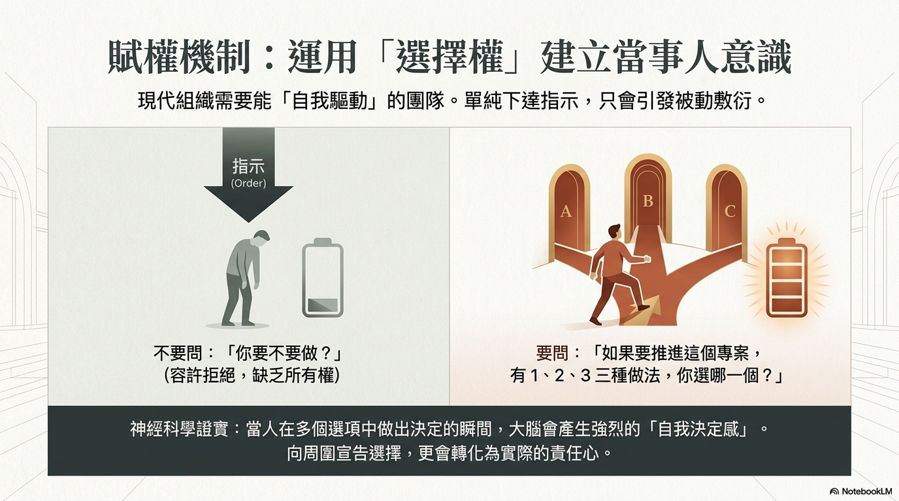

# [筆記] 職涯發展洞察：從偶然相遇到自主成長的行動指南

職涯中 **80%** 的發展來自偶然的相遇——但這種偶然，需要主動去創造。

<!--more-->
本文整理 CrossRiver 代表 **越川慎司** 的職場洞察，涵蓋人際拓展、管理思維升級、自主職涯建立，以及在 AI 時代凸顯人類獨特價值的具體行動策略。

## 原文連結
https://youtu.be/31aK8aBTSBg

<iframe width="560" height="315" src="https://www.youtube.com/embed/31aK8aBTSBg?si=Go3hAcDqM_u1LMMS" title="YouTube video player" frameborder="0" allow="accelerometer; autoplay; clipboard-write; encrypted-media; gyroscope; picture-in-picture; web-share" referrerpolicy="strict-origin-when-cross-origin" allowfullscreen></iframe>

## 1. 職涯發展的「偶然性」與移動價值

根據心理學家的研究與實務觀察，職涯中高達 **80% 的發展是由偶然的相遇所決定的**。這種偶然並非消極的等待，而是一種積極的「探索」過程。

- **從「久坐」轉向「徘徊」**：偶然的機會不會降臨在僅僅坐在辦公桌前的人身上。那些被寄予厚望的優秀人才，往往會主動在公司內「徘徊」，與不同部門的人建立聯繫。
- **創造非正式的接觸**：
  - 在非所屬部門打招呼，留下積極印象。
  - 下班時順道繞去其他部門交流。
  - 主動公開自己的空檔時間（如在 Google 日曆標註「午餐時間」），展現開放溝通的姿態，降低他人接觸的門檻。

## 2. 建立「淺而廣」的人際關係

在構建職場網絡時，並不一定要追求深厚的情誼，「淺而廣」的連結往往能帶來更多潛在機會。

| 策略行為 | 核心目的與效益 |
|---|---|
| **擔任活動攝影師** | 透過拍照與傳送照片，自然地與跨部門人員建立聯繫，在對方心中留下具體的面孔與好感。 |
| **參與內部聚會** | 視聚會為「機會場域」。與其回家玩遊戲，不如參與公司聚會，與能提供機會的人接觸。 |
| **跨部門午餐計畫** | 避免總是與熟悉的同事用餐。設定每週一次（如週三）與不同部門的人共進午餐，透過「遊戲化」的方式拓展人際邊界。 |

## 3. 管理新思維：認可行為而非僅是結果

優秀的主管不應只關注最終產出，更應學會「認可過程與行為」。

1. **運用「第三方認可」產生動力**：比起直接稱讚「謝謝你的努力」，引用第三方的正面回饋更具威力。例如：「人事部的山田先生非常感謝你上週的協助。」這種做法能讓員工感受到自己的付出被廣泛看見，同時提升對主管觀察力的信任。
2. **避免「面談化」的溝通**：許多主管在 1-on-1 時習慣說「請多指教」，這會讓氣氛變得嚴肅且具壓力。建議在溝通前花 2 分鐘思考對方的具體行為，以「謝謝你昨天的幫忙」作為開場，能有效緩解緊張感並建立心理安全感。
3. **對「負面報告」表達感謝**：鼓勵部屬在問題處於「冒煙」階段而非「大火」階段就主動通報。主管應先對「願意報告壞消息」的行為表示感謝，這能節省後續處理危機的大量時間（通常早 2 小時發現，可節省 3 倍以上的處理時間）。

## 4. 運用「選擇權」建立當事人意識

在下達指令時，傳統的命令式管理已不再適用於追求 **自走型** 的團隊。

- **提供選項**：不要直接說「去做這件事」，而是提供數個選項（如選項 1、2、3），並詢問「你會選哪一個？」。
- **心理效應**：當成員行使「自己決定」的權利時，會產生更強的責任感與當事人意識。一旦在眾人面前做出選擇，為了不讓自己蒙羞，成員會更積極地投入執行。

## 5. 從「公司軸」轉向「自己軸」的職涯觀

隨著人類壽命長於公司壽命的時代來臨，個人必須建立以自己為主體的職涯觀。

- **挖掘「擅長」而非僅是「喜歡」**：「喜歡」是自我中心的，而「擅長」則是能幫助他人、具備市場價值的利器。主管的責任之一是挖掘部屬連自己都未察覺的潛在優勢。
- **多樣化的社群參與**：積極參與社群外的活動、研討會或進修課程。透過與公司外部的人士交流，能獲得新的刺激，並發現公司內部習以為常的「常識」可能存在的盲點。

## 6. 人類的優勢：0 到 1 的創造力

在 AI 技術日益普及的背景下，邏輯性與規律性的工作將被取代。人類的核心優勢在於： **0 到 1 的創造力、感官經驗以及肉體存在。**

- **數位斷食與留白**：為了激發靈感，必須有意識地脫離工作模式。發散思緒的時刻（如在公園散步、發呆）往往是產生創新想法的黃金時段。
- **移動時間的價值**：優秀人才不會將移動時間（如新幹線、飛機）視為單純的休息，而會將其視為工作時間的一部分。他們會提前確保充足睡眠，以便在移動過程中專注於深度思考或閱讀。

## 結語：行動實驗的啟示

職涯的進化不需要一步到位。建議從眾多策略中挑選「 **一個** 」最感興趣的項目進行 **行動實驗**。若效果良好則持續，若無效則調整，透過這種反覆的過程，逐步從被動的被雇傭者轉變為掌握職涯主導權的專業人士。

---

## 我的連結
- Youtube: https://www.youtube.com/@Daydream-Studio/videos
- Podcast: https://cl4bfh8ww02uu01zgaj2i3d1u.firstory.io/episodes
- FaceBook: https://www.facebook.com/profile.php?id=100082389794254
- Blog: https://nostanduptalk.github.io/

