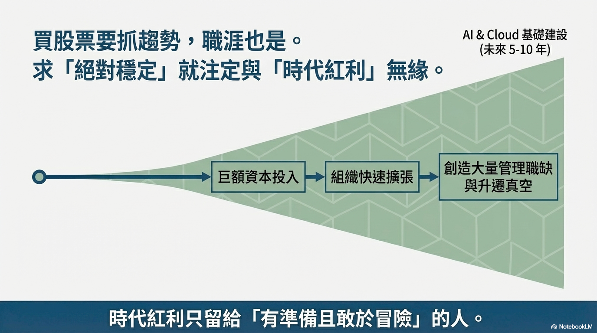
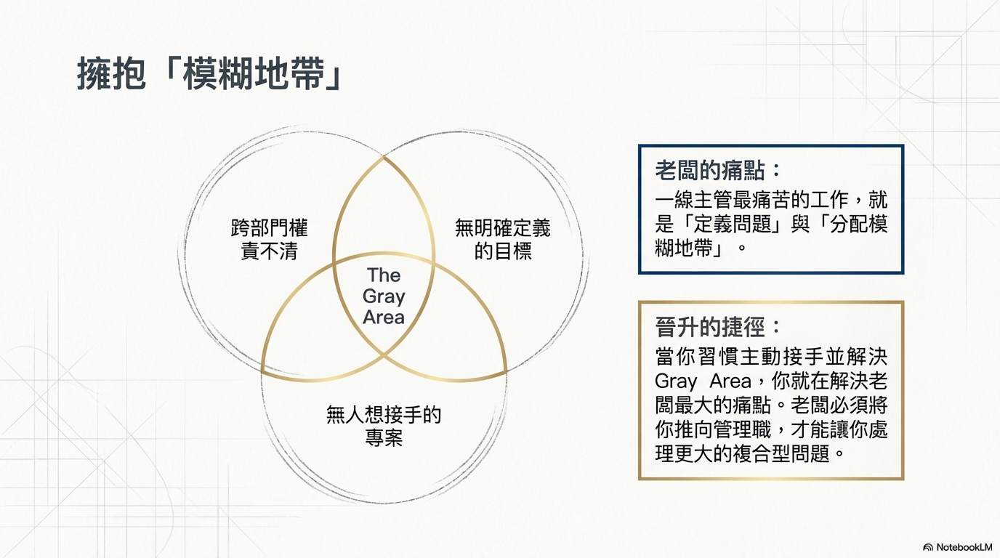
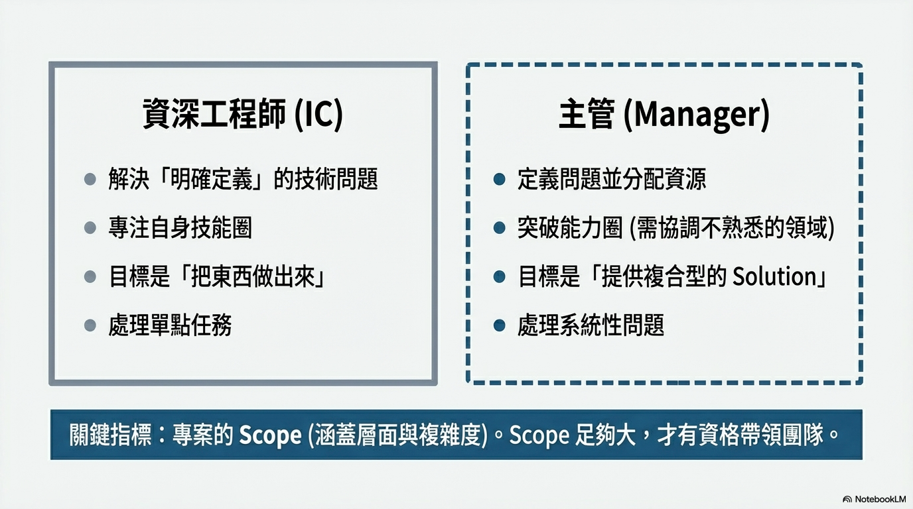
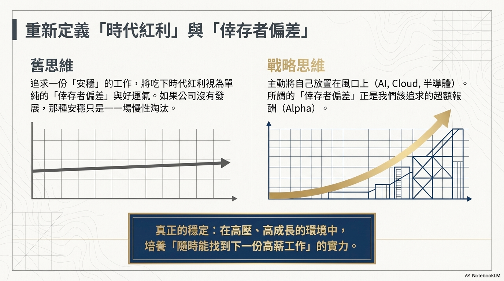

# [筆記] 選對賽道、把餅畫大：從工程師到主管的晉升路線圖

抹布認為，職涯發展的成功取決於 **「方向」與「執行」** 的結合。方向上，必須勇於進入具備 **時代紅利的高成長產業**（如半導體、AI、國際外商大廠），因為本業收入是一切投資與複利的根基，賽道選錯，再努力也事倍功半。執行上，晉升的關鍵不在於把份內工作做好，而在於主動承接那些 **「沒有明確定義、不知道該歸屬給誰做」的模糊地帶 (Gray Area)** ——這正是主管每天最頭痛的痛點。當你習慣解決這些痛點，並且每一季都把手上的 **Project Scope** 撐大到 **「一個人絕對做不起來」** 的規模，公司就會自然給你資源與團隊，你也就從工程師順理成章地成長為管理者。長期累積下來，位階越高、選擇越多，職涯就會進入持續成長的正向循環。

<!--more-->

訪談連結：https://www.youtube.com/watch?v=8dDTVbDg55w

---

## 一、賽道選擇：職涯發展的首要基石

本業的賽道決定了收入的天花板與地板。如果身處的產業收入不高，後續的投資理財將會非常困難，因為必須先有足夠的本業收入來累積本金，才能享受「錢滾錢」的複利效應。

選擇賽道就如同投資股票，必須勇於擁抱 **「時代紅利」**（如 AI 與 Cloud 產業）。真正的穩定並非待在沒有發展的公司，而是培養出 **「即使被裁員也能迅速找到下一份工作」** 的實力。

以台灣的職場環境為例：

-   **硬體與半導體產業** 是擁有龐大資本與國際競爭力的主力賽道
-   純軟體工程師若待在缺乏護城河的本土公司，容易面臨全球化外包（如中國、印度）與低薪的殘酷競爭
-   軟體人才若要尋求更好的發展與階級跳躍，建議依附硬體產業，或是選擇進入具備強大護城河的 **國際外商大廠** 作為「避風港」

---

## 二、處理模糊地帶（Gray Area）：從執行者到建構者

展現領導力的核心關鍵在於從 **「被動等待指令的執行者」** 轉換為 **「主動定義問題的建構者」**。

**為什麼 Gray Area 是關鍵？** 主管日常最頭痛且花費最多時間的工作，就是處理那些沒有明確定義、不知道該歸屬給誰做的事情。能主動承接並釐清這些 **模糊地帶 (Gray Area)** 的人，等同於解決了上級主管的痛點，老闆自然會希望將這樣的人提拔為主管。

**四個具體行動：**

1.  **主動承接一整塊責任**：不應抱怨為什麼要做這些定義不清的工作，更不能只等待老闆把工作定義好才去執行。相反地，你應該主動向主管提出：「如果這整塊模糊地帶交給我，我會怎麼做」
2.  **轉換工程師思維**：一般工程師的做事思維通常是拿到一個定義好的目標，只要把元件組合起來、成功達標就算完成任務。在模糊地帶展現領導力，必須學會將龐大且未知的區域進行 **「拆解」**，擁有把事情 **「從無到有」** 建立起來的能力
3.  **突破自身能力圈**：模糊地帶的問題通常是高度複合的，無法靠單一領域的技術來解決。真正的領導力在於不限制自己 **「只做原本就會的事」**，而是提供給公司一個整體的 **解決方案 (Solution)**
4.  **處理涉及「人」的複雜元素**：當你主動接下這些任務時，你不再只是自己寫 `code` 或做技術，而是必須擔任 **技術領導者 (Tech Lead)** 去分配工作，協調不同的團隊與資源

---

## 三、擴大 Scope：從技術職自然晉升為管理職

判斷一個專案的 **Scope** 是否足以幫助你爭取晉升，最核心的判斷標準在於：**這個專案是否已經複雜、龐大到「無法由你單獨一個人解決」**。如果一個專案你一個人加班就能搞定，那它的 `Scope` 就還不夠大。

**每一季 Review 的具體四步驟：**

1.  **鎖定老闆的痛點**：在 `Review` 前，要去尋找部門中 **「分不清楚是誰要做的事情」**，將這些尚未分配的灰色地帶作為你要求擴張 `Scope` 的首要目標
2.  **主動提案「一整塊交給我，我會怎麼做」**：不要只是空泛地索要資源，而是向老闆展示你具備將未知問題拆解、提供完整解決方案的能力
3.  **讓專案大到你一個人絕對做不起來**：當老闆同意讓你去闖這個龐大的專案時，迫於現實，公司上面就必須盡量配給額外的資源，甚至把人交給你帶領
4.  **順理成章將資源轉化為管理職權**：你的角色就會自然轉換，從 **技術領導 (Tech Lead)** 成長為真正的 **管理者 (Management)**

有人就是透過每一季與老闆 `Review` 並爭取極大 `Scope`，因為一個人做不起來而獲得資源，隨著團隊越來越大，短短幾年內就迅速晉升為二線主管 `(Second line manager)`。

---

## 四、培養底氣：隨時能找到下一份工作的實力

真正的 **「穩定」** 已經不再是傳統觀念中的 **「一份工作穩穩做」**，而是 **「即使被裁員也不會失去信心，並且能迅速找到下一份工作」** 的實力。

**四個具體做法：**

1.  **擁抱時代紅利**：想要具備隨時能找到好工作的底氣，首先必須身處於一個 **「極度缺人、正在擴張」** 的產業中。只要產業的投資不斷湧入、組織持續擴張，對人才的需求就會源源不絕
2.  **進入具備強大護城河的國際大廠**：在這些大廠中，你接觸到的是全球級的專案與穩固的商業模式，這種經歷本身就是未來求職的最強保證
3.  **透過 LinkedIn 拆解目標職缺提早鋪路**：去尋找你想去的大公司與目標職缺，仔細研究它的 `JD (Job Description)`，並到 `LinkedIn` 上觀察目前擔任該職位的同事具備什麼樣的背景與經歷。當你研究久了，就會發現這些人能拿到該職位是有 **「Pattern (模式)」** 的
4.  **培養帶得走的稀缺能力**：單純的技術能力會隨著時代與產業變化而被淘汰。然而，**「處理模糊地帶 (Gray Area)」**、**「從無到有提供跨部門的整體解決方案」** 以及 **「帶領團隊完成大 Scope 專案」** 的管理與協調能力，是所有大公司都極度渴求的稀缺價值

---

## 結論：

先靠 **「賽道選擇」** 進入高成長產業取得本金收入 → 在工作中靠 **「處理 Gray Area」** 與 **「擴大 Scope」** 達成晉升 → 隨著位階越高、選擇越多，自然進入持續成長的正向循環。這段訪談的核心論點可以用一句話概括：**先選對賽道，再把餅畫大。**

---

## 我的連結
- Youtube: https://www.youtube.com/@Daydream-Studio/videos
- Podcast: https://cl4bfh8ww02uu01zgaj2i3d1u.firstory.io/episodes
- FaceBook: https://www.facebook.com/profile.php?id=100082389794254
- Blog: https://nostanduptalk.github.io/

