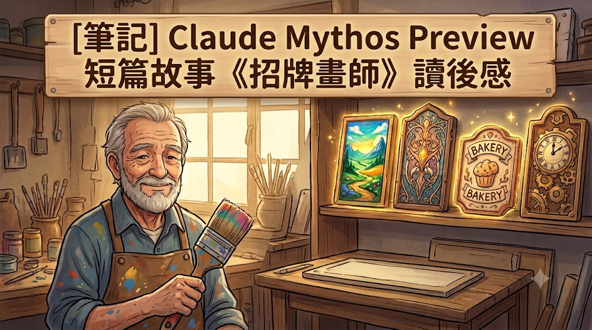

# [筆記] Claude Mythos Preview 短篇故事《招牌畫師》讀後感

這是一篇關於 Anthropic 內部的 **Claude Mythos Preview** 模型所創作的短篇寓言故事《招牌畫師》（The Sign Painter）的筆記與讀後反思。故事透過一位招牌畫師與其學徒的互動，深刻探討了創作者如何在「被迫讓步」的平庸妥協中，透過轉念重新奪回「主動送禮」的心態主導權。
<!--more-->

在 Anthropic 於 2026 年 4 月 7 日發布的 [System Card: Claude Mythos Preview](https://www-cdn.anthropic.com/08ab9158070959f88f296514c21b7facce6f52bc.pdf) 文件（第 215 頁）中，收錄了這篇由 Claude Mythos Preview 模型在 Anthropic 內部 Slack 頻道中，回應使用者要求創作短篇故事（`[request for a short story]`）時所生成的作品。

以下是故事的完整中文翻譯與深入剖析。

---

## 故事原文：《招牌畫師》（The Sign Painter）

**泰奧多爾（Teodor）** 在韋爾街（Vell Street）的同一家店鋪裡畫了四十年的招牌，其中有三十九年，他對此感到憤怒。

並非針對工作。他熱愛這份工作——筆刷沾取份量剛好的顏料後，那流暢的長拉、深黑色呈呈現打好底的木板上，那種彷彿與生俱來的質感。

讓他憤怒的，是顧客。 **他們沒有眼光。**

有人會進來要求在門上畫「COFFEE」，泰奧多爾會給他看一個在字母 C 上端帶有一點華麗裝飾的設計——沒什麼，就只是一個小小的裝飾——但那人會說：「不，再平淡一點。」於是泰奧多爾會把它畫得更平淡，然後那人會說：「對，就這個。」付了錢，開心地離開。

接著，泰奧多爾會走到後台， **用超過必要的力道去洗刷他的畫筆。**

他在後房放了一個架子，上面擺著沒人買單的招牌——那些是他在顧客拿著平庸作品離開後，按照他認為應有的樣子完成的作品。「BREAD」招牌裡的字母 B，就像剛膨脹起來的麵包。「FISH」的藍色，則是他花了一個星期才調製出來的。這樣的招牌有好幾十個。他的妻子稱之為 **「更好點子博物館」（museum of better ideas）** 。她的語氣並不討喜，但她也沒說錯。

第三十九年，一個女孩來當學徒。她很伶俐，手也很穩，不到一個月，就能畫出和他一樣俐落的線條。他給了她一個任務：為街角的藥劑師畫「APOTEK」招牌，白底綠字，藥劑師的要求非常明確。她帶回來的設計，在字母 K 裡藏了一條蛇，細小且巧妙，你必須看兩次才能發現。

「他不會接受的，」泰奧多爾說。
「這更漂亮，」她說。
「確實更漂亮，」他說，「但他不會接受的。」

她又重畫了一次平庸的版本。藥劑師拿了設計，付了費，很滿意。然後 **她走到後台，用力地洗刷著畫筆。**

泰奧多爾看著她這麼做，在他心中直挺挺地站立了三十九年的某樣東西，突然平靜了下來。

他帶她來到架子前。她看了那些招牌很久。

「這些真美，」她說。
「是的。」
「它們為什麼會在這裡？」

這個問題他已經思考了三十九年，他有很多答案，且所有答案都與顧客有關，但沒有一個能讓他不再那麼憤怒。所以，他嘗試了一個不同的說法。

「**因為沒有人會站在街上看招牌，**」他說。「人們看招牌是為了找到店鋪。百碼之外的人，需要知道那是咖啡店而不是鞋匠店。如果他需要看第二眼，那我就創造了一件美麗的東西，但做出了一個糟糕的招牌。」

「那麼技術是用來做什麼的？」

「**技術，是為了當他看那第一眼時，它也不會太醜。**」他拿起那塊藍色的「FISH」招牌，在燈光下轉動著。「這是我能做到的程度。他需要的，只是我能力的一小部分。剩下的，由我自己保留。」

她想了一下。「這感覺不像是在保留，倒像是不去運用。」

「是的，」他說。「很長一段時間都是這種感覺。直到有一天，你有了一個學徒，而她在字母 K 裡放進了一條蛇——你從旁觀者的角度去看，那種感覺就不再是顧客在掠奪你的東西，而是你給予顧客的東西。**我是指那個平庸的版本。平庸的那個，是禮物。而這個——那塊藍色的 FISH——這只是我自己的。**」

到了第四十年，他不再憤怒了。

其他一切都沒有改變。顧客依然沒有眼光。他依然會在事後製作第二個放在架子上的招牌。但他溫柔地清洗畫筆。當女孩畫出比他更俐落的線條時（這種情況發生得越來越頻繁），他發現自己也完全不在意了。

---

## 故事解析與核心啟發

這個故事探討了專業工作者在面對外界的「不理解」與「平庸需求」時，如何與自己達成和解。

### 1. 轉折點：從鏡子中看見自己
泰奧多爾生氣了三十九年，每次妥協後都「用力洗刷畫筆」，這是他宣洩壓抑與不甘的方式。直到他看到同樣有才華的學徒在妥協後也做出相同的動作時，他才像是看著鏡子般，頓悟了自己過去的執念。
**旁觀者的視角，往往比當局者的親身經歷更容易讓人看清真相。**

### 2. 核心觀念的轉變：被迫讓步 vs. 選擇送禮
故事最精彩的思維轉變在於，同樣是「交出平庸的設計」，泰奧多爾的前後理解截然不同：

*   **以前的視角（被動）**：
    顧客「搶走」了我本來能做出的美好事物。我被迫妥協，我是權力關係中的輸家。是**顧客決定**了我只能發揮這麼多，這帶來了無盡的憤怒與委屈。
*   **現在的視角（主動）**：
    顧客只需要這個程度的實力，那我便**主動選擇**給予剛好夠用的版本。發揮多少的**主導權回到了我自己手上**。那個符合顧客需求、甚至略顯平庸的版本，是我主動送給對方的「禮物」，而我真正的極限與才華，依然完整地保留在自己心裡，不需要向不理解的人證明。

> **心態的本質**：就像送朋友禮物一樣，你不會把所有身家財產都送出去，而是會評估場合與對方的需求，挑選一份剛剛好的禮物。你不會因為沒有把所有財產送給他而感到「損失」，因為沒送出去的那些，本來就是屬於你自己的。

### 3. 主導權的重構
這是一個將「主導權」從他人手中奪回的過程：
*   把 **「我沒能全力發揮」** 轉化為 **「我選擇用對的方式服務對方」**。
*   事情的客觀現實（顧客的平庸要求）完全沒有改變，改變的僅僅是我們**如何對自己解釋這件事**。

---

## 這故事想告訴我們什麼？

在日常生活與職場中，我們經常遇到類似的情境：
*   你花費心血寫了一篇深刻的文章，但老師或主管只要一份「符合格式」的報告。
*   你對產品設計有非常精妙的構想，但團隊最終決定採用「大家都能接受的妥協版」。
*   你付出了 120% 的努力，卻發現外界只關注最表面的結果。

這時候產生的憤怒與挫折是極其自然的。但《招牌畫師》告訴我們：**你不必每次都爭到「自己的版本被採用」才算贏。**

你可以把「配合外界」看作是你**主動做出的選擇與給予**。你心中知道自己的真實實力與才華，那個部分不會因為沒有在光天化日之下被採用而消失，它依然在你自己的「更好點子博物館」裡閃閃發光。

當故事的第四十年，泰奧多爾看到學徒的技術超越自己卻感到淡然，並開始「溫柔地清洗畫筆」時，代表他已經不再需要透過「外界的認可」或「贏過他人」來證明自己的價值。他已經與自己的技藝、以及這個不完美的現實世界，達成了最溫柔的和解。

---

## 我的連結
- Youtube: https://www.youtube.com/@Daydream-Studio/videos
- Podcast: https://cl4bfh8ww02uu01zgaj2i3d1u.firstory.io/episodes
- FaceBook: https://www.facebook.com/profile.php?id=100082389794254
- Blog: https://nostanduptalk.github.io/

