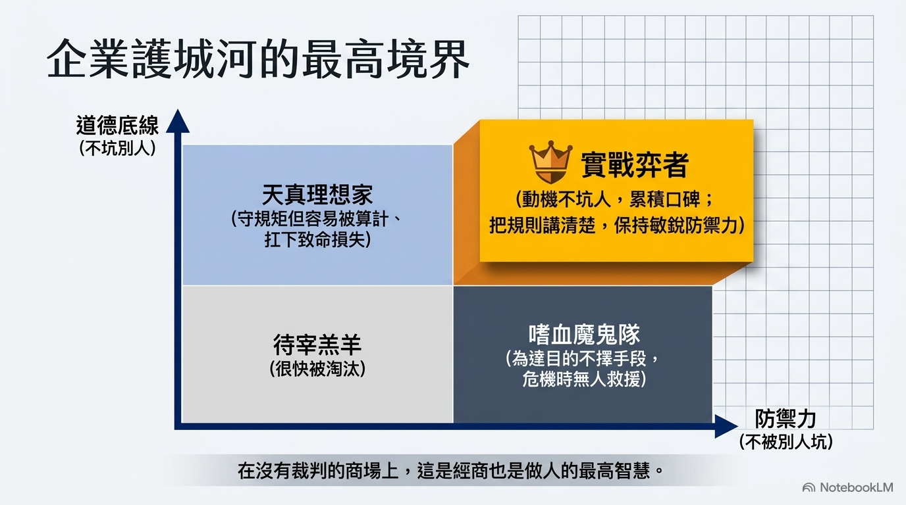

# [筆記] 「不要坑別人，也不要被別人坑」 - 潘健成談格局、AI 時代與創業

這份筆記整理了群聯電子董事長潘健成在訪談中分享的核心經營哲學、人才觀點及產業洞察。內容涵蓋了「格局決定結局」的處世心法、創業所需的關鍵三力，以及 AI 時代下的策略佈局與人才選拔觀點。
<!--more-->

原始連結：[https://www.youtube.com/watch?v=31YxPYVgThc](https://www.youtube.com/watch?v=31YxPYVgThc "")

---

## 一、 核心處世與經商哲學：格局決定結局

- **「格局」** 決定 **「結局」**：潘健成認為，一個人的思維框架與判斷（格局），決定了他最終的成敗（結局）。
- **「不要坑別人，也不要被別人坑」**：這是他一貫的誠信原則。
  - **不坑人**：動機純真、不佔人便宜，能建立良好的業界口碑。
  - **不被坑**：凡事「講清楚、弄好」，避免灰色地帶造成的損失。
- **運氣的來源**：他深信運氣來自於「多做好事」。當平時累積了善因，在面臨危機（如公司資金被扣押時），貴人的提拔與援助就是最好的證明。

## 二、 創業心法與三大核心能力

- **創業三力**：
  1. **判斷力 (Judgment)**：能從專家分歧的意見中，透過邏輯分析預判三年後的單一結果。
  2. **溝通能力**：用以化解由「人」造就的問題，降低企業運行的阻力。
  3. **講故事的能力**：這裡指的不是「唬爛」，而是能清晰傳達願景並贏得信任的能力。
- **不要為了「賺大錢」而創業**：創業不等於賺錢，很大機率是賠錢；只有「創業成功」才能賺錢。
- **成功不可複製**：即使給予 50 億資金也無法重現群聯的成功，因為成功的時空背景（時機）已不復存在。

## 三、 AI 時代的策略與人才觀

- **關鍵在「應用」而非「硬體」**：
  - 硬體毛利率會隨規模化而降低，真正的價值來自於「一整個解決方案」。
  - 台灣應警惕目前過於依賴硬體產業鏈，需投入更多心思在 AI 應用開發。
- **為何「電玩高手」適合開發 AI**：
  - **無規格書邏輯**：AI 研發沒有手冊，打電動的人習慣「先行動、再修正」的邏輯。
  - **強大試錯能力**：電玩高手具備不眠不休破關的韌性，擅長從社群找攻略，這與調校模型所需的態度一致。
- **AI 提效成果**：群聯內部透過 AI 工具，在短時間內顯著提升了工程開發效率，節省了大量人力成本。

## 四、 人品判斷與危機處理

- **口碑調查法**：判斷陌生人品時，會透過傳統電話向其校友或前同事打聽，因為「人走過的路必留口碑」。
- **誠實面對瑕疵**：在面臨官司或財報風波等挫折時，只要核心動機沒有個人私利且不具致命瑕疵，最終都能獲得支持並熬過來。
- **企業家的責任**：財富對他而言已是數字，現在的目標是確保公司成長、照顧員工生活，並透過本地消費回饋社會。

---

## 我的連結
- Youtube: https://www.youtube.com/@Daydream-Studio/videos
- Podcast: https://cl4bfh8ww02uu01zgaj2i3d1u.firstory.io/episodes
- FaceBook: https://www.facebook.com/profile.php?id=100082389794254
- Blog: https://nostanduptalk.github.io/

