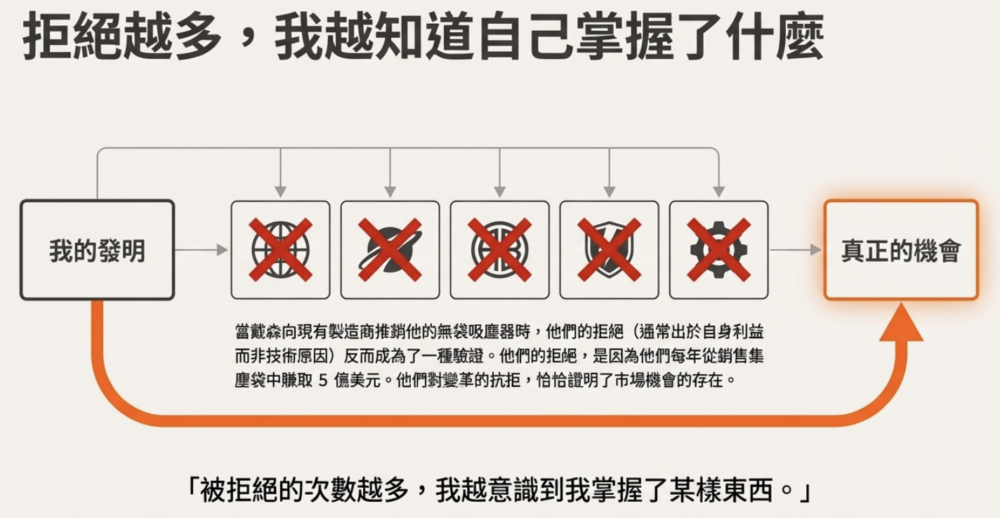

# [筆記] 詹姆斯・戴森的失敗哲學：為何失敗比成功更有趣？

如果成功有一條必經之路，而這條路上佈滿了無數次的實驗與探索，你還敢走嗎？這不是一個假設性的問題，而是發明家詹姆斯・戴森（James Dyson）的真實寫照。
<!--more-->

在革命性的無袋式吸塵器問世前，戴森花了五年打造了 **5,127 個原型**。這不是 5,126 次失敗，而是 **5,127 次學習的機會**。

## 1. 傳統教育下的「失敗」 vs 創新者的「失敗」

戴森指出教育體系常要求「第一次就把答案做對」，但真實世界的創新法則截然相反。

| 傳統觀念 (Traditional View) | 戴森的創新觀念 (Dyson's Innovation View) |
| :--- | :--- |
| **是終點**：代表一次嘗試的結束與評價。 | **是過程**：是通往最終解決方案的必經之路。 |
| **應被避免**：被視為能力不足，令人羞愧。 | **應被享受**：每一次失敗都帶來寶貴的學習機會。 |
| **浪費時間**：一次就做對才是最高效率。 | **最有價值的學習**：從錯誤中學到的遠比成功多。 |
| **令人沮喪**：打擊信心，讓人想放棄。 | **激發動力**：被拒絕讓他更堅信走在對的路上。 |

> 「擁抱失敗，因為那是唯一能讓你前進的方式。」

## 2. 戴森的失敗哲學：從挫折中提煉智慧

戴森名言：**「失敗遠比成功有趣」（Failure is so much more interesting than success）**。

*   **成功時**：人們只會慶祝，很少深入思考成功原因，學習就此停止。
*   **失敗時**：迫使你停下來問：`「為什麼會出錯？」`，這正是學習與發現的起點。

### 實踐方法：
1.  **提問與質疑 (Questioning)**：深入探究根本原因，像是材料、設計缺陷或初始假設。
2.  **實驗與迭代 (Experimenting)**：將經驗應用於下一次嘗試，這是有目的的修正而非盲目重複。

## 3. 戴森的史詩級失敗案例分析

### 3.1 5,127 次「有價值的」原型
戴森強調這並非失敗，而是 **「學到一些東西」的步驟**。雖然當時債務累積、壓力巨大，他卻形容這是「極其享受的掙扎」，因為他有真正的目標。
*   **關鍵啟示**：毅力（doggedness）遠比才智更重要。

### 3.2 失去公司與專利
在「Ballbarrow」球輪手推車時期，他因引入不解創業艱辛的投資者，最終被開除並失去專利。
*   **教訓一**：謹慎選擇合作夥伴，需理解創業的痛苦與成長陣痛。
*   **教訓二**：掌握絕對控制權，這使他後來創立公司時堅持獨資。

### 3.3 授權模式的碰壁
當時行業巨頭（如 Hoover）因集塵袋利潤而不願採用新技術。
*   **核心洞見**：當被「專家」一致拒絕時，反而可能證明你走在顛覆性創新的正確道路上。

## 4. 如何培養你的「戴森心態」？

1.  **心法一：擁抱「菜鳥」的無知 (Embrace Naivete)**
    經驗豐富的人滿腦子是「行不通」的理由；天真的人不知道答案，所以會更努力、更大膽地思考。
2.  **心法二：將拒絕視為驗證 (See Rejection as Validation)**
    被拒絕的次數越多，越覺得自己手上握有寶物。
3.  **心法三：像騾一樣固執 (Be Stubborn as a Mule)**
    這種固執源於對核心目標的專注。即使經歷 5,126 次挫折，依然相信第 5,127 次會成功。

 

## 結論：跌倒了，那就再試一次

失敗並非旅程的終點，而是地圖本身。戴森的故事告訴我們，失敗是創新的必要成本。

> 「我希望戴森的故事能激勵你，當你被擊倒時，會說：『好吧，那我們再試一次。』」

## 參考連結

[詹姆斯·戴森影片](https://www.youtube.com/watch?v=Se64B8TKfjA)

---

## 我的連結
- Youtube: https://www.youtube.com/@Daydream-Studio/videos
- Podcast: https://cl4bfh8ww02uu01zgaj2i3d1u.firstory.io/episodes
- FaceBook: https://www.facebook.com/profile.php?id=100082389794254
- Blog: https://nostanduptalk.github.io/

