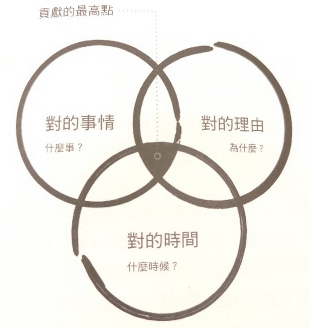
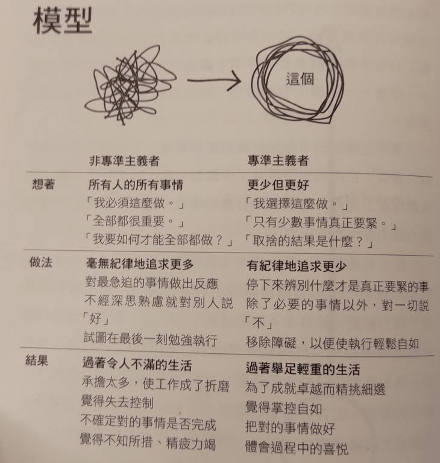

# [筆記] 少，但是更好

在這個忙碌的世界裡，我們常常被各種任務和期望所淹沒。專準主義提供了一個全新的視角，教導我們如何專注於真正重要的事物，做出有意識的選擇，並在生活和工作中實現`「更少但更好」`的理念。
<!--more-->
## 專準主義的核心理念

專準主義（Essentialism）的核心理念是`「更少但更好」`。這種思維方式鼓勵我們專注於真正重要的事物，而不是盲目追求數量。以下是專準主義的幾個關鍵原則：

1. 持續追求：專準主義者不斷以有紀律的方式實踐「更少但更好」的理念。
2. 專注於重要事物：專準主義強調`做好對的事情，而不是做更多事情`。例如，專注於精通一兩種最有價值的語言，而不是同時學習十種語言。
3. 有意識的選擇：專準主義者會不斷反思自己投入的活動是否恰當，並選擇真正重要的事物。
4. 資源分配：將時間和精力集中在少數重要的事物上，而不是分散在眾多不那麼重要的事情上。
5. 做出艱難決定：專準主義要求我們做出艱難但必要的取捨和犧牲。
6. 主動選擇：在做選擇時，專準主義者會主動思考並排除不必要的事物。

## 克服錯誤假設

要實踐專準主義，我們必須克服三個根深蒂固的錯誤假設：

- 「我必須這麼做」
- 「全部都很重要」
- 「我可以兩者兼顧」

相反，我們應該用三個核心真理來取代這些錯誤假設：

- `「我選擇這麼做」`
- `「只有少數事情真正重要」`
- `「我可以做任何事情，但不是每件事情」`

## 沒有解決方案，只有取捨

在面對問題時，我們應該改變思維方式：

- 不要問「我要如何兩者兼顧？」，而是問`「我想要哪個問題？」`
- 不要想「我必須放棄什麼？」，而是思考`「我要在哪裡全力衝刺」`

此外，我們還要記住：

1. 過分忙碌和操勞並不能證明一個人的生產力。
2. 創造、探索、思考和反省的空間應該被維持，而不是最小化。
3. 許多人被不必要的忙碌所困擾，這妨礙了他們區分真正重要的事情。
4. 專注主義者會投入時間去探索、傾聽、討論和思考。
5. 探索的目的是為了區分多數瑣事和少數重要事項。

## 玩很必要

工作中的「玩」雖看似無用，實則必要。純粹為樂趣而非目的的活動能`激發探索精神，增強大腦可塑性、適應性和創造性`。這種看似不必要的行為對工作創新極為重要。

## 睡眠很重要

我們最高優先事項是保護我們排定優先順序的能力。`睡眠能在你醒著的時間裡增強你探索建立連結以及做得更少但更好的能力`。

## 非專準主義者 vs. 專準主義者

### 非專準主義者

- 採用寬鬆、含混的標準
- 對大部分要求或機會說好

### 專準主義者

- 採用嚴格、具體的標準
- `只對約10%的機會說好`

## 決策方式比較

| 非專準主義者 | 專準主義者 |
|------------|-----------|
| 「如果經理要我做，我就應該去做。」 | `「這確實是我在找的嗎？」` |
| 「如果有人要我做，我就應該試著去做。」 | 審慎評估機會是否符合個人目標 |
| 「如果公司裡的其他人都這麼做，我就應該去做。」 | 只接受真正重要且有價值的任務 |

## 實例：軟體工程師面對非技術性專案

### 非專準主義者的思維

- 「大家都在幫忙，我也應該參與。」
- 「經理看起來很需要人手，我應該去幫忙。」

### 專準主義者的思維

- `「這個專案是否能幫助我提升核心技能？」`
- `「它是否符合我的職業發展目標？」`
- `「我是否是這個任務的最佳人選？」`

## 設定有效目標的方法：

- 提出關鍵問題：`「如果我們只能在一件事情上出類拔萃，它會是什麼事情？」`
- 定義成功標準：`「我們怎麼知道自己做到了？」`

## 目標的特質：

- 鼓舞人心又具體。
- 一勞永逸的決定。

## 職場適時說「不」很重要

回答主管：`「為專注新任務，您建議我暫緩哪個現有項目？」`

## 沉默成本偏誤

| 特性 | 非專準主義者 | 專準主義者 |
|------|--------------|------------|
| 提問 | 「我們已經在這個專案上投入了這麼多，為什麼現在要停呢？」 | `「如果我不是已經在這個專案上投入了這麼多，我現在會投入多少？」` |
| 思維 | 「只要繼續嘗試，我就能讓它成功。」 | `「如果我現在中止這個專案，這些時間和金錢還能用來做什麼？」` |
| 特徵 | 討厭承認錯誤 | 不介意停損 |

## 「最低限度的可行進展」的概念：

1. 概念來源：矽谷流行的`「完成勝過完美」`理念。
2. 核心思想：不要在不必要的事情上浪費時間，只要把事情完成就好。
3. 在創業中的應用：創造`「最低可行產品」(minimal viable product)`來實現這個概念。
4. 關鍵問題：對目標客戶而言，既有用又有價值的最簡單產品是什麼？
5. 應用擴展：這種方法不僅適用於創業，也可以應用到個人發展中。
6. 自我反思：我們可以問自己`「對我們試圖完成的必要任務而言，既有用又有價值的最小進展是什麼？」`
7. 實際應用：作者在寫作過程中也採用了這種方法，例如在探索書的架構時就應用了這個概念。

總的來說，這個概念強調在各種任務中找出最關鍵、最有價值的部分，先完成這些核心內容，而不是追求完美但遲遲無法完成。這種方法可以幫助我們更快地取得進展，並根據回饋不斷改進。

‌

## 連結

[博客來-少，但是更好](https://www.books.com.tw/products/0010802460 "‌")

