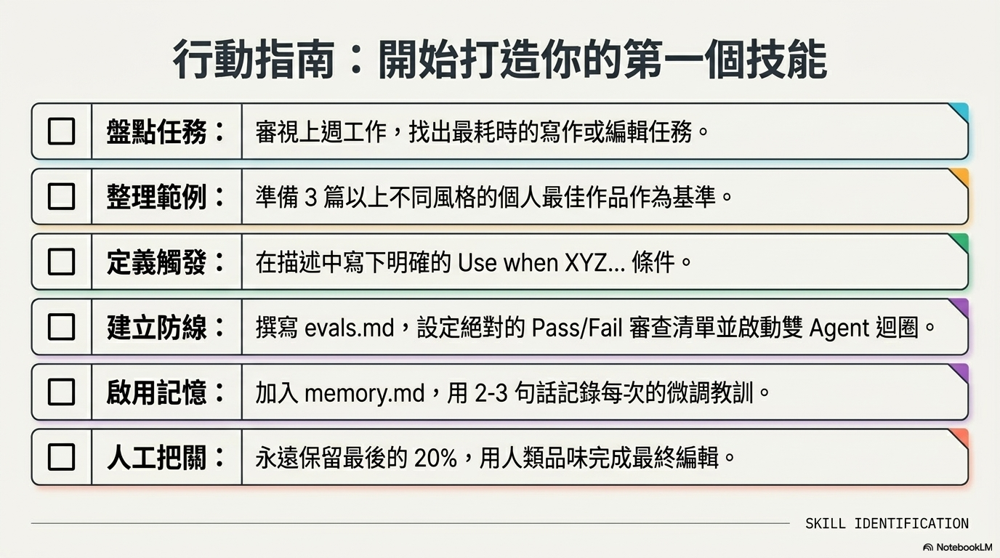

# [筆記] 打造 Claude Skill 的 5 個秘訣

如何將人類的「品味」與審美邏輯編碼進 AI 工具中？本文整理了構建高效 Claude Skill 的五個核心秘訣，從架構分離、精確觸發到雙 Agent 閉環，幫助你打造具備自我進化能力的自動化工作流。
<!--more-->

## 秘訣一：架構分離——為你的創造力解套，避免「過度擬合」

在構建技能時，最直覺但錯誤的做法是將核心指令、背景資料與範例全部塞進同一個 `skill.md` 文件中。這種做法會導致 AI 產生 **「過度擬合」（Overfitting）** 的副作用：當 AI 被過多的範例淹沒時，它會變得過於膽小，只敢機械式地模仿那幾個範例，而失去了處理新場景的泛化能力。

透過實施 **「模組化」** 架構，將核心指令與範例文件分開存放，能為你的創造力帶來以下優勢：

- **動態載入與效率**：Claude 無需每次都讀取冗長的範例。它能根據當前任務（如教學文、個人評論、產品拆解），僅精確加載最相關的上下文資訊。
- **保持邏輯純淨**：獨立的 `skill.md` 應只包含核心邏輯框架。這不僅提高執行效率，更方便你在不洩漏個人敏感資訊的情況下，與團隊共享這套方法論。
- **防止風格僵化**：讓 AI 學習你的 **「美學原則」** 而非「特定文字」，使其能產出具備一致品質但形式多樣的內容。

---

## 秘訣二：精確觸發——描述欄位決定了自動化的成敗

許多使用者抱怨技能無法精確啟動，原因在於誤解了 Claude 的運作機制。Claude 在判斷是否觸發技能時，並非掃描整個文件夾，而是優先讀取技能的 **「名稱」** 與 **「描述」（Description）** 。

若要建立可靠的自動化工作流，描述欄位必須做到 **「極致明確」** 。這不是在寫簡介，而是在定義 **「意圖匹配」（Intent Matching）** 的邊界：

- **定義精確輸入**：如「當使用者貼上草稿或要求編輯標題時使用。」
- **界定適用類型**：如「適用於長篇通訊、部落格文章或深度產品分析。」
- **明確啟動條件**：如「偵測到編輯長篇文稿的需求時自動啟動。」

這種明確性是自動化系統的基石，否則再強大的技能也無法在關鍵時刻被喚醒。

---

## 秘訣三：拒絕打分——建立「通過/失敗」的 AI 品味邊界

一個反直覺的技術洞察是：讓 AI 給自己的產出打分（如 1 到 5 分）是毫無意義的勞動。

> 「AI 根本不懂 4 分與 5 分之間的哲學差異，它只會為了討好你而編造出毫無根據的數字。」

有效的品質控管應採用 **二元式的評估系統（Evals）** 。請建立一個 `evals.md` 文件，包含約 10 個明確的 **「通過/失敗」（Pass/Fail）** 檢查點，作為 AI 的品味邊界：

- **引言 (Introduction)**：開頭前兩句是否具備吸引力？是否包含必要的導流連結？
- **語氣 (Voice)**：是否排除了所有 AI 冗餘詞彙？聽起來是否像真人而非機器？
- **實質內容 (Substance)**：是否提供了可立即執行的具體洞察？

這種機制能強迫 AI 進行具體的自我審視，對標人類的審美標準。

---

## 秘訣四：雙 Agent 閉環與記憶——全自動的迭代進化

這是讓 AI 技能具備 **「靈魂」** 的核心技術。要實現真正的全自動優化，必須建立一個 **「雙代理人（Dual Agent）」** 循環，並搭配記憶機制：

1. **獨立評估代理人**：當編輯代理人完成初稿後，技能應要求啟動一個具備「乾淨上下文視窗」（Clean Context Window）的獨立代理人執行評估。這樣做是為了防止評估過程受到編輯過程的偏見（Bias）干擾，確保審核的客觀性。
2. **自我修正循環**：若任何 Eval 檢查點顯示為「失敗」，結果將返回給原編輯代理人修改，直到全部通過。
3. **記憶紀錄（`memory.md`）**：這是技能進化的關鍵。在對話結束時，要求 AI 將本次溝通的「教訓」以逆時序記錄在 `memory.md` 中（例如：發現 AI 容易在結尾過於囉唆）。這份文件讓技能在未來執行任務時，能回顧過去的錯誤，實現真正的自我進化。

這種「讓 AI 監督 AI」的機制能為你省下大量打磨細節的時間，讓你只需在啟動指令後去喝杯咖啡，回來就能收穫完美的成品。

---

## 秘訣五：掃除「AI 廢話」—— 維護技能的純度

高品質內容的區別往往在於 **「刪減」的藝術** 。你需要建立一個「技能編輯器」（Skill Editor），專門用來審計與優化技能指令本身。這個編輯器應配備一份 **「黑名單」** ，明確禁止以下常見的 AI 廢話（AI Slop）：

- **無效辭令黑名單**：徹底剔除 `delve`、`leverage`、`comprehensive`、`innovative` 等被過度使用的單字。
- **邏輯樣式禁令**：禁止使用「This is not X, this is Y」（這不是 X，而是 Y）這類典型的 AI 教條式句式。
- **格式汙染**：限制過度使用的破折號（m-dashes）與細碎到缺乏逻辑的列點。

定期使用「技能編輯器」來審核你的 `skill.md`，能確保你的指令保持精煉，避免 AI 因為指令本身的贅詞而產出平庸的內容。

---

## 結語：將品味編碼進工具中

雖然技術與自動化能完成 80% 到 90% 的寫作與編輯工作，但剩下的最後 10% 到 20%——那些關於幽默、共感與最終判斷的部分——必須依靠人類的 **「品味」** 來手動打磨。

工具的價值在於它能承載人類的靈魂。當你將自己的判斷標準與審美邏輯編碼進 Claude 技能時，你其實是在擴展自己的創造力邊界。

> **反思問題**：回顧過去的一週，有哪些重複性、讓你感到乏味的任務？現在就開始思考，如何將這些工作「技能化」，讓 AI 帶著你的品味開始自我進化。

---

## 相關連結

- [YouTube 影片來源](https://youtu.be/uT3EQPVIEb0)

## 我的連結
- Youtube: https://www.youtube.com/@Daydream-Studio/videos
- Podcast: https://cl4bfh8ww02uu01zgaj2i3d1u.firstory.io/episodes
- FaceBook: https://www.facebook.com/profile.php?id=100082389794254
- Blog: https://nostanduptalk.github.io/

