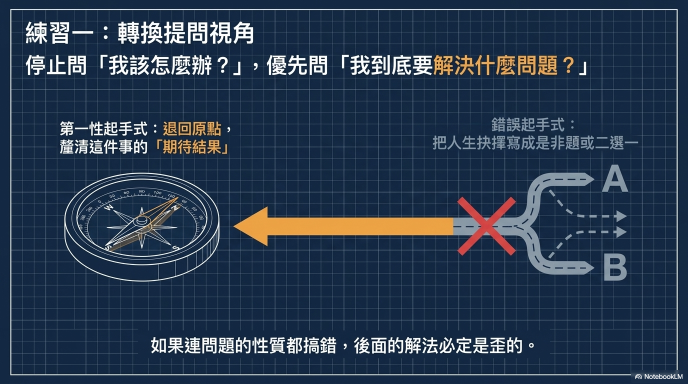
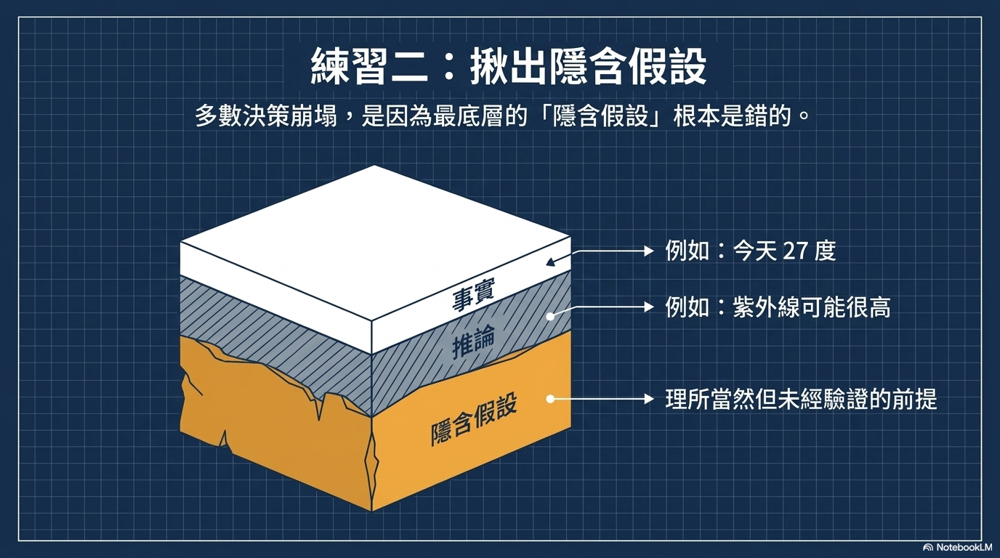

# [筆記] 如何運用「第一性原理」？

在職涯轉職或進修前，如何運用「第一性原理」來驗證隱含假設，避免盲目決策？本文將帶您深入了解第一性原理的核心概念，並提供三步驟實踐方法，幫助您釐清底層邏輯、主動查驗事實，並透過低成本實驗，掌握職涯主導權。

原文影片：https://www.youtube.com/watch?v=hToO6daVuSw

<!--more-->

## 💡 核心觀念
運用「第一性原理」來驗證職涯決策（如轉職、進修）的核心，在於將思維拆解為以下三個層次，並針對最底層未經證實的 **「假設」** 進行嚴格的查核與實驗：
1.  **事實 (Fact)**：客觀發生的狀況。
2.  **推論 (Inference)**：基於事實所延伸的想法。
3.  **假設 (Assumption)**：未經證實、視為理所當然的直覺。

---

## 三個練習

---

## 實踐三步驟：如何驗證隱含假設？

### 步驟一：釐清底層邏輯，揪出決策背後的「理所當然」
在面對職涯卡關或萌生轉職念頭時，我們常會直覺尋求特定解法（例如：「去念個研究所就能成功轉職」或「拿到碩士學位就能升遷」）。此時，必須先退一步反思，這些直覺中是否藏有**未經證實的隱形假設**。

*   **常見盲點舉例**：
    *   **觀察到的事實**：「公司裡獲得升遷的人都有碩士學歷。」
    *   **錯誤的假設**：「碩士學歷」就是促成他們升遷的原因。
    *   **實際狀況**：兩者可能只是「相關」而非「因果」。這些人可能本身就具備積極上進的特質，因此既願意進修，也能在工作上爭取好表現。

### 步驟二：走出主觀認知，主動向業界人士查驗「事實」
找出隱含假設後，必須將其與客觀的「事實」連上線，避免落入一廂情願的腦補。在投入大量時間與金錢進修前，應主動向外驗證。

*   **具體行動**：
    *   **研讀真實需求**：直接檢視目標職缺的市場招募條件。
    *   **向業界前輩請益**：直接詢問目標領域的專業人士。例如問：*「如果過去完全沒有相關產業背景，僅憑兩年碩士學位，業界真的會錄取這樣的新手嗎？」*
*   **驗證結果**：透過實際打聽，極有可能發現業界真正看重的是「專案經驗」或「數據分析能力」，而非單純的學歷。這就能成功推翻原本「念碩士就能轉職」的危險假設。

### 步驟三：降低試錯風險，透過「最小可行計畫」進行低成本實驗
如果能收集到的資訊不夠充分，或是缺乏前人的相似經驗可參考，應設計成本最低的「最小可行計畫（MVP）」來試水溫，而不是一次性重壓兩年的時間去念書。

*   **具體行動**：
    *   先嘗試報名短期課程。
    *   利用業餘時間參與相關的微型專案。
*   **策略意義**：用最低的成本去測試自己的假設是否成立。如果在低成本實驗階段就發現假設被推翻（驗證不通過），就能果斷放棄這條路，替自己省下數百萬的開銷與寶貴的光陰。

---

## 總結：掌握職涯主導權的關鍵思維
不要因為「大家都這樣做」就盲目跟從。在做出重大職涯決定前，請養成不斷追問自己的習慣：
*   **「這真的是這樣嗎？」**
*   **「這個假設可以被驗證嗎？」**

只要確保每個決策最底層的邏輯足夠紮實，你就能將有限的時間與資源真正花在刀口上，解決核心的職涯問題並真正掌握人生的主導權。

## 我的連結
- Youtube: https://www.youtube.com/@Daydream-Studio/videos
- Podcast: https://cl4bfh8ww02uu01zgaj2i3d1u.firstory.io/episodes
- FaceBook: https://www.facebook.com/profile.php?id=100082389794254
- Blog: https://nostanduptalk.github.io/
