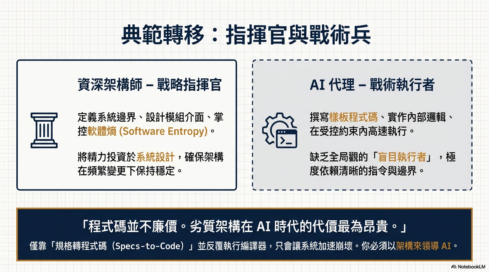
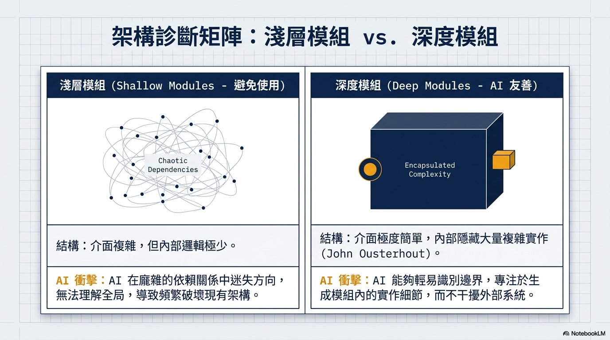
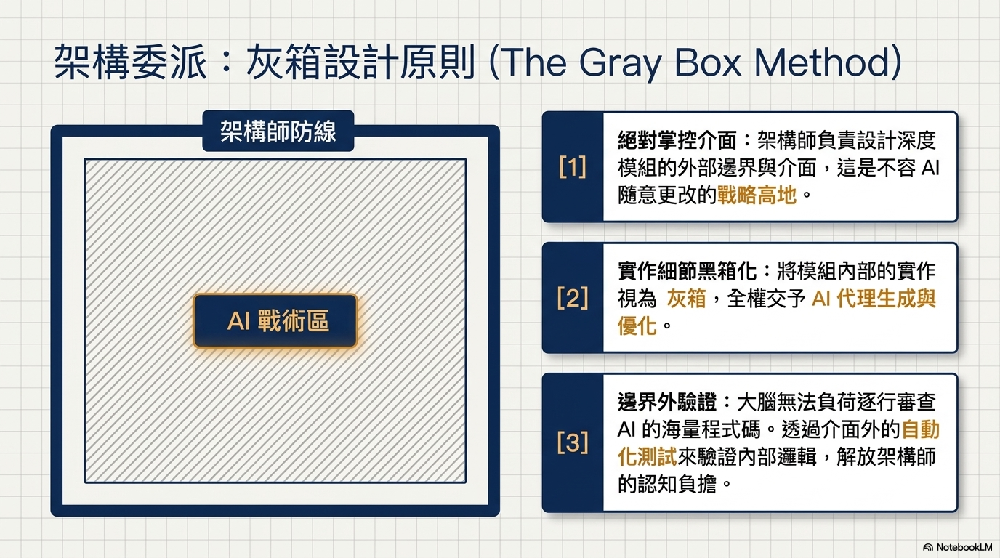
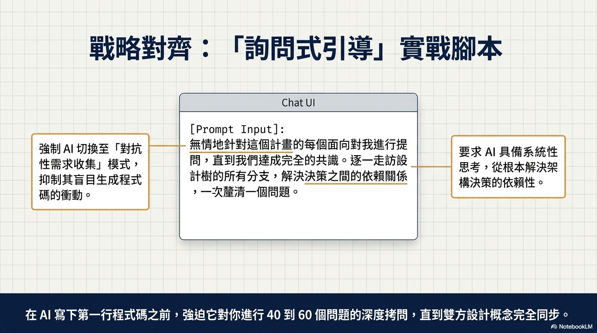

# [筆記] 駕馭 AI 開發：戰略思維與深層模組的應用

在 AI 輔助開發的時代，許多人誤以為程式碼變得很廉價，只要把規格丟給 AI，就能自動產出系統，但這往往會引發災難。糟糕的程式碼反而會讓維護成本飆升。軟體大師 Kent Beck 提醒我們必須持續投資系統設計，本文將探討如何透過「深層模組」架構與正確的協作模式，讓 AI 發揮最大產能。

<!--more-->

原文影片：https://www.youtube.com/watch?v=v4F1gFy-hqg 

## 一、 重新定位：你是戰略指揮官，AI 是戰術執行者

要駕馭 AI，我們必須先釐清人類與 AI 在開發上的分工：

*   **戰術型程式設計（由 AI 負責）：** AI 就像前線執行任務的士官。他負責處理具體的實作細節、填補複雜邏輯，並執行實際的程式碼變更。
*   **戰略型程式設計（由開發者負責）：** 開發者必須堅守戰略層面的指揮權。你的核心任務是思考全局、定義模組邊界、精心設計外部介面，並在撰寫產品需求文件（PRD）時具體指定模組的修改方式。

純粹的「規格轉程式碼（Specs to code）」運動之所以會失敗，是因為開發者放棄了對系統設計的投資，任由 AI 在缺乏良好架構的情況下盲目生成程式碼。

## 二、 警惕 AI 開發的兩大陷阱

當我們讓 AI 自由發揮而缺乏戰略引導時，系統很容易陷入以下兩種困境：

### 1. 軟體熵（Software Entropy）惡化
「軟體熵」指的是系統自然傾向於混亂與崩潰的狀態。如果你（或 AI）每次只專注於眼前的單一修改，而忽略整體架構，系統就會產生大量難以維護的「複雜程式碼」。當軟體熵累積到一定程度，專案就會徹底淪為無法修改的垃圾。AI 只有在結構良好的程式碼庫中才能表現出色，一旦架構被摧毀，AI 也無能為力。

### 2. 淺層模組（Shallow Modules）氾濫
如果程式碼充滿以下特徵，就代表系統充斥著淺層模組：
*   **介面複雜，實際功能少：** 呼叫方式繁瑣、需要傳遞大量參數，但內部處理的邏輯卻極少。
*   **過度零碎化：** 程式碼被拆解成無數極小的區塊，導致導航困難，依賴關係錯綜複雜。
在這種架構下，AI 容易迷失在錯綜複雜的依賴關係中，不僅無法理解全貌，還會出現 **「跑得比大燈快（Outrunning your headlights）」** 的現象。

## 三、 核心解法：擁抱「深層模組」與高階介面

要解決上述問題，我們必須將程式碼組織成 **「深層模組（Deep Modules）」**。其核心特徵是 **將大量且複雜的功能，隱藏在一個簡單的介面背後**。

### 為什麼深層模組能拯救 AI 開發？
*   **將模組視為「灰盒（Gray boxes）」：** 開發者只需精心設計高階介面，並確立外部的測試邊界，就不需要逐行審查內部的實作。你可以放心地將介面背後的龐大複雜性委派給 AI 處理。
*   **簡化邊界，落實 TDD：** 簡單的介面提供了極佳的測試邊界。你只需針對介面寫測試，這能強迫 AI 透過「測試驅動開發（TDD）」採取小步快跑的方式實作，建立穩健的回饋迴圈。
*   **降低認知負擔：** 無論是人類開發者還是 AI，都不再需要把所有零碎的資訊與依賴關係塞進大腦中。

> **💡 翻新現有專案的小技巧：** 
> 你可以指示 AI 掃描現有程式碼庫，找出那些邏輯高度相關卻散落各處的「淺層模組」，並要求它將這些零碎區塊重新組織，封裝成擁有簡單介面的「深層模組」。

## 四、 實戰工作流：用「Grill Me」產出高品質 PRD

要在日常開發中落實「戰略設計」，可以使用名為 **"Grill Me"（無情盤問我）** 的提示詞技巧：

1. **下達「盤問」指令：** 輸入：「無情地盤問我關於這個計畫的每一個層面，直到我們達成共識。沿著設計樹的每一個分支探索，逐一解決決策之間的依賴關係。」
2. **經歷密集的對齊過程：** AI 會化身為嚴格的訪談者，透過回答問題，將所有架構選擇與連鎖反應討論清楚。
3. **將共識轉化為 PRD 與介面規劃：** 當對話收斂後，要求 AI 總結為一份正式的 PRD，並明確指定「模組變更」與「介面修改」。

透過這種「先建立共享設計，再產出計畫」的作法，你就能確保每一次的開發都在持續投資系統設計，讓 AI 在你搭建的穩健舞台上，安全且高效地產出程式碼。

## 我的連結
- Youtube: https://www.youtube.com/@Daydream-Studio/videos
- Podcast: https://cl4bfh8ww02uu01zgaj2i3d1u.firstory.io/episodes
- FaceBook: https://www.facebook.com/profile.php?id=100082389794254
- Blog: https://nostanduptalk.github.io/

