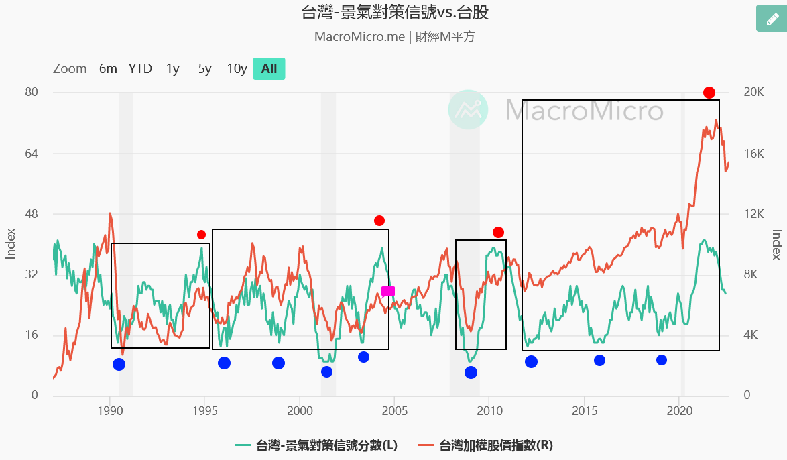

# [筆記] 錢要投資 : 賺到退休賺到自由健康 : 阮慕驊的人生體悟

## 引言
> p36，覺察、接受、改變這三件事是序列,是我體會的人生哲學。提高對萬事萬物的覺察能力。接受一切不可接受的。改變一切已有的。

<!--more-->
心得：這世界不停在變化，我們的人生經歷是判斷事情的墊腳石，也可能是絆腳石。建立價值觀有三步驟：動搖、植入、強化。一直以來，我總是試圖在資訊叢林中，尋找與我現有觀念**不符**的理論，藉此動搖我的價值觀。另外，我也會**避免**去尋找認為理所當然的理論，深怕強化過的價值觀不容易被動搖。

## 搖搖欲墜的勞保基金，退休金要自己照顧
作者從勞保基金說明，退休金要自己照顧，以下數目取近似值：

* 月薪四萬多，所得替代率46%，也就是每個月2萬初的勞保月退休金
* 如果改制，可能減少1/4，剩下1.5萬
* 另外加上勞退1萬元
* 退休後只有2.5萬，還沒考慮幾十年後的通膨

心得：勞保基金不知道會不會活到我退休，但可以肯定的趨勢是「繳更多」「領更少」，三十年後的3萬能吃幾碗麵呢。

## 投資三要素：本金、時間、利率
> p69，巴菲特說過投資就像滾雪球,需要三個要。首先,一開始的雪球本身最好要夠大,接著要有一個長長的下坡道,最後,坡道的雪要夠濕。這三要素講白話就是本金、時間和利率三個理財要素。本金就是夠大的雪球,長長的坡道就是足夠的時間,夠濕的雪就夠高的複利。

心得：這邊指的投資是*金錢的投資*需要注意的重點，那如果套用到技術能力的投資呢？技能三要數：市場定位？開發成本？與其他技術的整合？

## 標準普爾家庭資產配置圖
> p69，標準普爾是全球三大信用評等公司之一,它綜合和研究了家庭財富穩固的許多個案例後,得出了一個四宮格的家庭資產配置方式的結論。這四宮格主要的意義在於資產配置,也就是家庭或個人財富的比例分配。四個象限

- 要命錢：生活費，柴米油鹽醬醋茶房租房貸水電瓦斯管理費網路費。
- 保命的錢：緊急預備金，預防不可預期的重大意外開銷。
- 保財的錢：保本的儲蓄，定存與可以持有到期的債券。
- 生錢的錢：風險投資，可能失去本金，但可以獲得更多獲利。

心得：理財的教學中總是會提到，記得要保留6個月的生活費，其背後的意義就是要保障「要命錢」「保命的錢」。這邊我想設定為36個月，其中30個月當作股票在低檔加碼的錢(就是把**股災**也被當作不可預期的意外)。而定存與儲蓄險就是我的保財的錢。定期定額市值型ETF就是生錢的錢。以項目來說還算符合，至於配置比例我覺得不需要完全模仿。

<iframe src="https://open.firstory.me/embed/story/cl72wh7wp06rp01xo5wlxbvxe" height="180" width="500" frameborder="0" scrolling="no"></iframe>

## 買股的時機很重要
> p76-77，大買股票的時機是景氣差到不行,股價跌到不行,所有人都看空、都悲觀的時候,就是拿大錢買好股的機會。這時候因為景氣不好,銀行天收傘借錢不易,只有用良好而且有優質抵押品的人才能借到錢。什麼是優質抵押品?就是**投資等級債券和好地段的不動產**。這些優質抵押品都在有錢人手上,景氣不好時,利率一定低,有錢人就拿優質抵押品向銀行借錢,借出來低成本的資金就拿去買好股放著。等到景氣春燕來臨,股票價格回升,有錢人即賺股息和賺價差時,再高高的把股票賣掉,還銀行借款本金,多出來的錢就再去買優質不動產。

心得：俗話說「打不贏就加入」，想要加入這個循環有一個要點，至少要有一個***優質抵押品***，但這樣的物品價格肯定不會低，看樣子貧富差距無法縮小了。但我可以透過不追高股票，持有類*類現金產品*以逸待勞，但就要承受Cash Drag了。

## 景氣燈號，有一種說法：藍燈買股票，紅燈賣股票。
作者的說法是這樣回測不見得有辦法賺夠。我想調數據，改成「離開藍燈向上買股，離開紅燈向下賣股」。不知道這樣回測準度，跟定期定額對比差多少。
燈號含義：
1. 紅燈：38 ～ 45 分，景氣過熱。
2. 黃紅燈：32 ～ 37 分，景氣活絡。
3. 綠燈：23 ～ 31 分，景氣穩定。
4. 黃藍燈：17 ～ 22 分，景氣欠佳。
5. 藍燈：9 ～ 16，景氣低迷。

圖資來源[台灣-景氣對策信號 | 圖組 | MacroMicro 財經M平方](https://www.macromicro.me/collections/10/tw-monitoring-indicators-relative)

2004年**紅燈**位置，還是很靠近前幾次藍燈的價位。整體而言，勝率與期望值都是高的。

## 買房的建議
人口變少的地方，房價可能跟日本鄉下一樣，沒有支撐。但有就業機會的地方，就會有強烈需求，價格可以穩住。新竹vs南投，東京vs四國。最後很有可能房價走向出現城鄉差距，都市繼續因為通膨繼續漲，鄉下地方因為沒有需求而跌價。

## 本息均攤vs本金均攤
貸款期數條件相同，本息均攤會比本金均攤，最終付出的利息會比較多，銀行不會主動說明差異，會直接給本息均攤，可以多收利息。

## 未來五年到十年,看好的三大產業
1. 電商
2. 雲端
3. 電動車

心得：作者是2021年5月出書，臉書2021年底才改名Meta，這邊沒有列到元宇宙，是因為時間差，還是已經算在雲端，還是不認為可以成為主流呢？虛擬貨幣與Web3.0也沒有被提到，是不是因為不認同？

## 股票波段策略
* 選擇的標的
 1. p262,
 2. 成交量在前百大
 3. 市場題材性強的
* 如何判斷是否見底：只要一檔好的中大型股票在**三個月內**未見新低價

心得：三個月沒有買，可能也漲回不少，不一定有足夠的安全邊際。選擇的標的業不可能百發百中，需要更多策略輔助才行。

## 後記
本書用了不少篇幅在講述那2020-2021年發生的事情，我很快就翻過去了，倒是對於作者小時候的成長經歷，還有小時候第一次對股票的第一直覺覺得有趣。

**我覺得看一個人的想法，也要同時看他「為什麼」會有這些想法。**

# 連結
[博客來-錢要投資 賺到退休 賺到自由健康](https://www.books.com.tw/products/0010890965)

[國發會-景氣指標查詢系統-景氣對策信號](https://index.ndc.gov.tw/n/zh_tw)

[讀懂“標準普爾家庭資產配置圖”](https://zhuanlan.zhihu.com/p/357228526)
