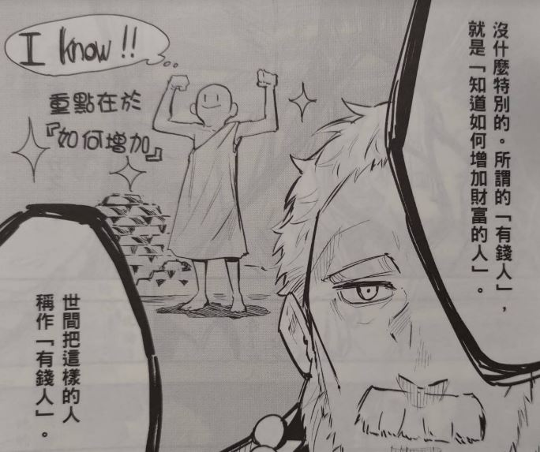

# [筆記] 巴比倫致富聖經 : 用10%薪水, 賺到100%的人生

>本書對1926年在美國出版的《巴比倫富翁》（The Richest Man In Babylon）進行翻譯、改編腳本並繪製成**漫畫**。這篇故事以古巴比倫為舞台，教導人們儲蓄、守財與增加財富的道理，在被資產家及銀行員閱讀之後，轉眼便成為暢銷書籍，至今依舊吸引許多讀者，亦堪稱是現今市面上許多理財讀物的原點。

<!--more-->
## 吸引黃金的七句箴言
### 1. 存下收入的十分之一。
書中沒有說明為什麼是十分之一，而不是十分之二，但意思就是要先累績資本，之後才可以靠錢轉錢。
### 2. 為欲望排定優先順序。
減少支出的分法之一。
### 3.  讓存款為你工作。
賺「睡覺財」
### 4. 堅守財富,避開危險和天敵。
總是會有人畫大餅，我們想要賺他的利息，他要賺我們本金。
### 5. 選擇良好的住所。
這點漫畫中沒有特別畫出來理由，我把住所解釋為「生活圈」，我看過一種說法，人常常會選擇省力輕鬆的做法，如果周圍的人都好逸惡勞，遇到人生的難題，很可能就跟著放棄。相反的，如果周圍的人都積極面對挑戰，自己遇到的難題不會第一時間放棄，說不定還可以透過幾句話就想通。
### 6. 從現在開始替未來的生活做好準備。
這也是存錢的目的。
>雖然金幣的確可以買到**眼前**的幸福, 可是卻買不到**未來**的安定。

### 7. 讓自己成為最大的資本。
投資自己也是很重要。

## 有錢人的定義
「知道如何增加財富的人」，才是有錢人，一般人拿到一大筆財富，可能很快就花完了，重要的是可以「使用金錢的智慧」。

> 只要擁有智慧, 並依循智慧採取行動,不論是誰都可以變成有錢人!

心得：找到並增強自己的核心競爭力，距離有錢人的階段就更接近了。

## 有錢人，為什麼要工作
> 為了被感謝,把握當下,努力工作,財富就會隨之而來

心得：我無法被這種論點說服。不想要閒著等死，並可以同時在工作中找到成就感，我覺得才是有錢人持續工作的原因。

<iframe src="https://open.firstory.me/embed/story/cl7bi1hlx04gd01tahc44ayoe" height="180" width="500" frameborder="0" scrolling="no"></iframe>

# 連結
[博客來-巴比倫致富聖經：用10%薪水，賺到100%的人生【經典新譯．漫畫版】](https://www.books.com.tw/products/0010895385)

[漫画 バビロン大富豪の教え 「お金」と「幸せ」を生み出す五つの黄金法則 | ジョージ・S・クレイソン, 坂野旭, 大橋弘祐 |本 | 通販 | Amazon](https://www.amazon.co.jp/dp/4866511249)
