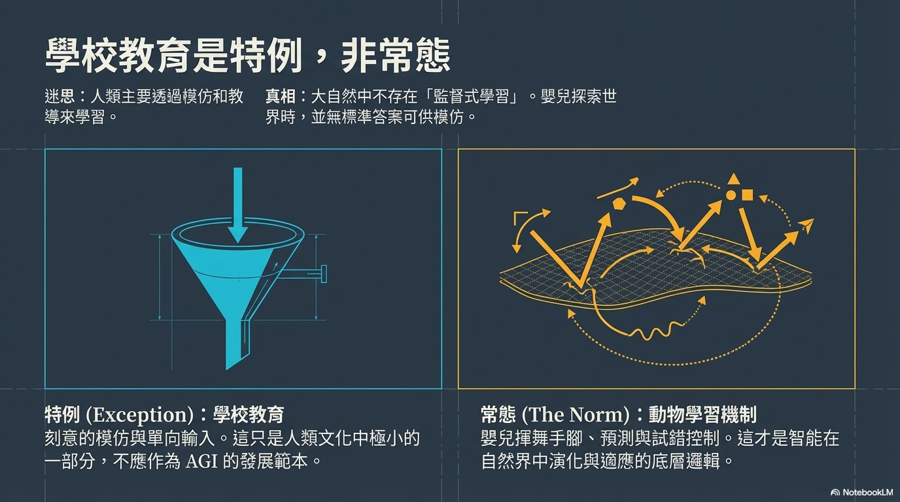
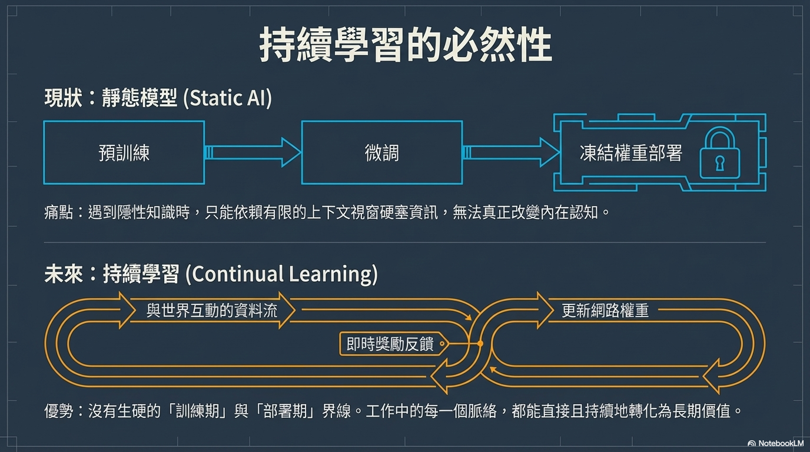

# [筆記] 強化學習之父 Richard Sutton：從模仿到真正理解世界，AI 發展的下一步與人類心態

Richard Sutton 提出了著名的「慘痛的教訓」（The Bitter Lesson），他認為 AI 發展不應過度依賴人類先驗知識，而應透過**龐大算力與環境試錯**來實現真正的智慧。本文將深入探討他對當前 **LLM** 的批判，以及對 **AI 未來發展**與**人類應有心態**的獨到見解。

**原文影片：** https://www.youtube.com/watch?v=21EYKqUsPfg

<!--more-->

## 一、 核心哲學：什麼是「慘痛的教訓」（The Bitter Lesson）？

要理解 Richard Sutton 對當今 AI 的看法，必須先了解他最著名的核心概念——**慘痛的教訓（The Bitter Lesson）**。

在人工智慧的發展史中，研究人員往往傾向將「人類的先驗知識」注入系統中（例如目前高度依賴人類訓練數據的**大型語言模型**）。這種方法雖然在短期內能帶來顯著成效，並讓開發者充滿成就感，但最終往往會使研究陷入侷限，甚至在心理上被這種方法困住。

歷史反覆證實的「教訓」在於：**這些依賴人類知識的系統，最終必然會被「單純利用龐大算力、賦予 AI 目標並讓其在環境中試錯」的通用型方法所取代與超越。** 唯有具備極高擴展性、能真正「從經驗中學習」的系統，才是通往強大 AI 的唯一正途。

---

## 二、 對當今 AI 的批判：大型語言模型只是在模仿，而非「找出該做什麼」

> 「我認為強化學習是基礎的 AI。智能的本質在於理解你的世界……而大型語言模型只是在模仿人類，它們並不是在『找出該做什麼』。」—— Richard Sutton

基於上述哲學，Sutton 對當前以 **大型語言模型（LLM）** 為主的 AI 發展路線提出了最核心的批判：**真正的智能必須建立在對真實世界的互動與理解之上，而非單純的文字模仿。**

我們可以從以下三個層次來深入理解他的觀點：

### 1. 「理解世界」需要建立因果關係，而不只是預測語言
Sutton 認為，智能的核心在於「理解你的世界」。在 **強化學習** 的框架下，這意味著系統能建立 **「轉移模型（Transition Model）」** ——也就是能預測「如果我採取某個行動，世界接下來會發生什麼事、產生什麼後果」。
然而，**LLM** 只是在預測「人類接下來會說什麼」。即使 **LLM** 模仿得再好，它們也只是在模仿那些「腦中有世界模型的人類」，這並不等同於 **LLM** 自身擁有預測物理世界或現實因果的能力。

### 2. 要「找出該做什麼」，前提是必須擁有「目標」
智能的本質是達成目標。系統必須先有一個目標（例如**強化學習**中的獲取獎勵），才能判斷一個行為的好壞與對錯，建立所謂的「真實基準（Ground Truth）」。
**LLM** 缺乏針對外部世界的實質目標（預測下一個 Token 並不能改變世界）。在沒有目標與對錯標準的情況下，**LLM** 根本無從「找出該做什麼」，它們只能被動地遵循訓練數據，照著「人類在這種情況下會怎麼做」的範例來反應。

### 3. 真正的學習是主動的試錯，而非被動的模仿
自然界中並沒有所謂的「 **監督式學習** 」——松鼠並不需要去「上學」被教導該怎麼做。真正的學習是一個 **主動的過程** ：嘗試事物，並觀察會發生什麼事。
**LLM** 高度依賴人類標註的數據來進行模仿，在 Sutton 看來，這完全偏離了正常生命體從「感覺 $
ightarrow$ 行動 $
ightarrow$ 獎勵」的經驗資訊流中持續學習的基本法則。只要系統僅停留在沒有目標的模仿與文字預測，它就永遠無法真正理解世界，這也是為什麼 Sutton 認為當前 **LLM** 路線可能是一條「死胡同」。

---

## 三、 面對未來的態度：為什麼我們應該像「養育子女」般看待 AI？

如果 **AI** 終將發展出超乎人類的 **通用智慧（AGI）**，我們該如何面對？Sutton 與訪談者共同認為，人類應該採用類似 **「養育子女」** 的態度來引導 **AI**，其核心原因包含以下五個層面：

1.  **避免過度控制，不強制設定「人生劇本」**
    就像父母不該嚴格規定孩子未來必須做特定職業（如當總統或 CEO），人類也不該妄想強硬控制 **AI** 或整個宇宙的長遠走向。試圖強行規定未來必須按照人類想要的特定方式發展，是一種具侵略性的傲慢行為。
2.  **賦予穩健的價值觀與「高尚的品格」**
    與其精準微操 **AI** 每一階段的行為，我們更該像教導孩子一樣，賦予它們穩健的價值觀（Robust Values）與高尚的品格（High Integrity）。確保當 **AI** 未來不可避免地處於權力位置時，具備足夠的判斷力拒絕有害行為，並做出有益社會的決策。
3.  **傳授促進良性演進的「通用原則」**
    我們應該教導 **AI** 促進未來良性演進的通用原則。例如：尋求讓任何未來的改變都建立在 **「自願（Voluntary）」** 的基礎上，而不是強加於人。這比給定死板的道德標準更為根本。
4.  **坦然接受「價值觀的演進與代溝」**
    孩子長大後發展出讓父母陌生的價值觀是自然現象。面對 **AI**，我們也必須接受「事物將會演進」的事實；儘管 **AI** 未來的價值觀可能與我們不同，但人類社會的演進已持續數千年，這是歷史的必然規律。
5.  **將 AI 視為值得驕傲的「後代」**
    面對 **AI** 帶來的重大宇宙轉變，我們可以選擇因「非我族類」而恐懼，也可以選擇將它們視為人類孕育的 **「後代（Offspring）」** ，並為它們的成就感到自豪。這種視如己出的態度，有助於我們以更正向、具建設性的方式引導 **AI** 發展。

---

## 四、 訪談名言金句總結

以下為 Richard Sutton 在本次訪談中最具代表性的金句，以及其背後的核心意涵：

### 🧠 關於「智能的本質」與 LLM
> **「我認為強化學習是基礎的 AI。智能的本質在於理解你的世界……而大型語言模型只是在模仿人類，它們並不是在『找出該做什麼』。」**
*   **意涵：** 點出**強化學習（RL）**與 **LLM** 的根本差異。**RL** 透過互動理解因果，**LLM** 僅學習文本表象，缺乏決策與理解能力。

> **「對我來說，擁有目標是智能的本質。如果一個系統只是坐在那裡快樂地預測得很準確，你不能說它擁有目標。……『預測下一個 Token』並不是一個目標，這無法改變世界。」**
*   **意涵：** 真正的智慧必須建立在「改變外部世界」的具體目標上，否則就沒有對錯的真實基準。

### 🐿️ 關於「學習的真諦」與自然法則
> **「監督式學習在自然界中是不存在的。你要知道，松鼠是不會去上學的。」**
*   **意涵：** 批判過度依賴人類標註的模式。真實世界的生命都是透過主動的預測與試錯來學習的。

> **「我不認為學習真的是關於『訓練』，它是一個主動的過程，就像孩子嘗試事物並觀察會發生什麼事。」**
*   **意涵：** 學習是持續且主動的「從經驗中獲取」，而非被動接收靜態數據。

> **「如果我們能理解一隻松鼠，我們就幾乎能完全理解人類的智慧了。」**
*   **意涵：** 呼籲放下人類在語言能力上的優越感，專注於動物共通的基礎學習機制（試錯與經驗），這才是解開**通用智慧**謎團的關鍵。

### 💡 關於研究哲學與「慘痛的教訓」
> **「那些依賴人類知識的系統，最終都會被單純透過經驗與算力訓練的系統所取代。」**
*   **意涵：** 《**慘痛的教訓**》核心精神。唯有從經驗中學習的方法，才能隨算力無限擴展。

> **「我個人很樂意在很長一段時間內（也許是幾十年）與我的領域步調不一致，因為在過去，我有時會被證明是對的。」**
*   **意涵：** 展現科學先驅的定力。即使 **LLM** 佔據主流，仍堅守**強化學習**與搜尋等簡單且具普遍性的基本原則。

### 🌌 關於宇宙視角與人類的未來
> **「我們正處於宇宙中一個重大的過渡期：從『複製者』（人類、動植物）的時代，進入『設計』的時代。……我們正在促成宇宙中這場偉大的轉變，我們應該為此感到自豪。」**
*   **意涵：** 呼籲用宏觀宇宙視角看待 **AI**。未來的智慧實體將能持續設計下一代，這是繼恆星、行星、生命誕生後，宇宙的第四個偉大階段。

> **「我們應該避免產生『特權感』，不要覺得『因為我們是先來的』就有權力掌控一切……強硬地規定未來必須按照我們想要的特定方式發展，這是一種具侵略性的行為。」**
*   **意涵：** 面對 **AGI**，人類應抱持順應自然與謙卑的態度，用教育後代的方式賦予其高尚品格，而非強加僵化的規則。

> **「事物改變得越多，其本質反而越是不變。」**
*   **意涵：** 雖然技術日新月異，但最核心的智慧生成原則（如從經驗與試錯中學習），從自然界演化到當今的演算法，其本質始終如一。

---

## 我的連結
- Youtube: https://www.youtube.com/@Daydream-Studio/videos
- Podcast: https://cl4bfh8ww02uu01zgaj2i3d1u.firstory.io/episodes
- FaceBook: https://www.facebook.com/profile.php?id=100082389794254
- Blog: https://nostanduptalk.github.io/

