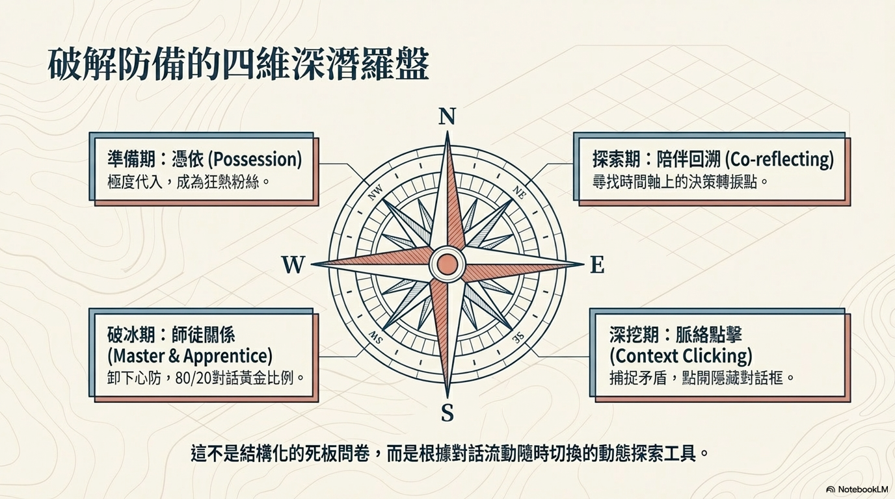

# [筆記] 揭開用戶內心的「真心話」：UX 深度訪談的做與不做

優秀的研究員不只是聽取用戶說了什麼，而是去解讀他們「沒說出口」的是什麼。
<!--more-->

本文彙整 UX 研究員（UX Researcher）在挖掘用戶「潛在需求」與「洞察」時的專業技術。內容基於 Simplex/Arceo 的 UX 專家龜山小姐的經驗分享，詳述如何透過深度訪談與行為觀察，將用戶自身也未察覺的痛點轉化為商機。

連結：[https://www.youtube.com/watch?v=OsSb41GcTXc](https://www.youtube.com/watch?v=OsSb41GcTXc "‌")

## 一、 UX 研究員的核心使命

UX 研究員不僅是「用戶的代言人」，更是「用戶需求」與「商業目標」之間的翻譯官。其核心任務包含：

- **挖掘洞察（Insight）：** 找出用戶自身也未意識到的使用困難或潛在需求。
- **語言化與商業化：** 將模糊的感受轉化為具體的文字描述，並與商業目標、技術可行性進行媒合。
- **全流程負責：** 從理解用戶、整理需求、與利害關係人溝通，到確保技術能實現在終端用戶手中。

---

## 二、 執行深度訪談的「該做之事」（DOs）

訪談的品質取決於研究員能否進入用戶的內心世界。以下是提升訪談深度的四大關鍵技巧：

### 1. 執行「身心投入」（表依）的準備

在訪談前，研究員必須親自成為該服務的深度使用者。

- **親自體驗：** 若是金融 App，研究員應實際開戶並使用一段時間（如一週至一個月）。
- **觀察自我情緒：** 在使用過程中，記錄自己何時感到煩躁、何時感到心動。
- **建立共同語言：** 唯有具備與用戶同等的知識基礎，才能在訪談時接住用戶的話頭，避免只停留在表層對話。

### 2. 共同回顧生命故事（Storytelling）

不要開門見山詢問「對功能的看法」，而要追溯行為的源頭。

- **追蹤轉折點：** 從用戶最初為何對該領域感興趣開始聊起（例如十年前為何開始投資），回顧其行為變化的歷程。
- **尋找行為動機：** 透過回顧，找出用戶在不同服務間轉換、放棄或重新開始的關鍵時刻，這些「轉折點」通常隱藏著核心需求。

### 3. 建立「師徒關係」的對話框架

將自己定位為「弟子」，將用戶視為「師父」。

- **虛心求教：** 即便研究員對產品非常了解，也要表現出「我想了解您的看法」的姿態。
- **引導用戶表達：** 讓用戶感到自己是專家，他才會放鬆並分享真實的細節。
- **遵循 8/2 法則：** 確保用戶說話占 **80%**，研究員只占 **20%**。

### 4. 執行「文脈點擊」（Context Click）與深挖

像操作網頁一樣，對用戶話語中的關鍵點進行「點擊」以進入下一層細節。

- **捕捉矛盾：** 當用戶說「我討厭某類服務」但實際卻在用類似產品時，這就是必須深挖的**「矛盾點」**。
- **解讀沉默與遲疑：** 留意用戶的「那個...」、「怎麼說呢...」或是微小的停頓，這些通常代表負面評價或難言之隱。
- **具體化模糊詞彙：** 當用戶說「感覺不太對」或「有點煩」時，必須追問**「具體是哪個瞬間讓你產生這種感覺？」**，直到找出底層原因。

---

## 三、 訪談與研究中的「不該做之事」（DON’Ts）

為了避免獲取錯誤資訊或誤導業務決策，應嚴格禁止以下行為：

| 類別 | 不該做之事 (DON'Ts) | 後果與影響 |
| :--- | :--- | :--- |
| **詢問方式** | **不要詢問過於直接或結構化的假設問題** | 若直接問「想不想要這功能？」，用戶基於禮貌通常會說想試試，導致 80% 的人說想要卻沒人買的錯誤數據。 |
| **對話角色** | **不要表現得比用戶更懂產品** | 若研究員展現出專家的姿態，用戶會產生「不能說錯話」的壓力，進而隱藏真實的拙劣感受或操作錯誤。 |
| **溝通比例** | **不要與用戶各說一半（5/5 比例）** | 若研究員說話過多，訪談會變成單向的產品說明會或辯論，完全無法獲取用戶的內在洞察。 |
| **數據解讀** | **不要過度依賴定量數據（問卷）** | 定量數據只能反映用戶「已知」的需求。若只看數據，會忽略水面下的「潛在需求」，無法解釋用戶行為背後的「為什麼」。 |
| **細節處理** | **不要放過模糊的詞彙或微小的表情變換** | 忽略用戶的遲疑（如：微妙的「是啊...」）會錯失發現產品缺陷的機會。 |

---

## 四、 面對 AI 時代的職業競爭力

隨著 AI 能自動生成市場分析、原型設計甚至模擬用戶測試，UX 研究員應專注於 AI 無法取代的領域：

1. **建立真實連結：** 人與人面對面溝通產生的「溫度感」與「裸感」，是 AI 虛擬人物無法模擬的。
2. **捕捉非語言訊息：** 觀察用戶眼神閃爍、語氣猶豫等細微情緒，進而挖掘出用戶也無法語言化的潛在需求（種子）。
3. **定義問題（提出對的「問項」）：** AI 擅長回答問題，但人類研究員擅長基於對人性的洞察來**「定義正確的問題」**。
4. **跨領域翻譯與共識達成：** 在商業利益、用戶需求與技術限制三者之間進行翻譯，並引導利害關係人達成共識。

## 五、 總結：洞察的冰層模型

研究員的工作是從水面上的「已知需求」深入到水底的「潛在洞察」：

- **水面上（顯性）：** 用戶知道自己要什麼，可透過問卷（定量）獲取。
- **水面下（潛在）：** 用戶感覺不便但說不出來，須透過**「深度訪談」**挖掘。
- **最深處（無意識）：** 用戶完全未意識到的行為邏輯，須透過**「民族誌（Ethnography）」**長時間觀察來發現。

**核心格言：** 優秀的研究員不只是聽取用戶說了什麼，而是去解讀他們「沒說出口」的是什麼。

## 我的連結
- Youtube: https://www.youtube.com/@Daydream-Studio/videos
- Podcast: https://cl4bfh8ww02uu01zgaj2i3d1u.firstory.io/episodes
- FaceBook: https://www.facebook.com/profile.php?id=100082389794254
- Blog: https://nostanduptalk.github.io/
