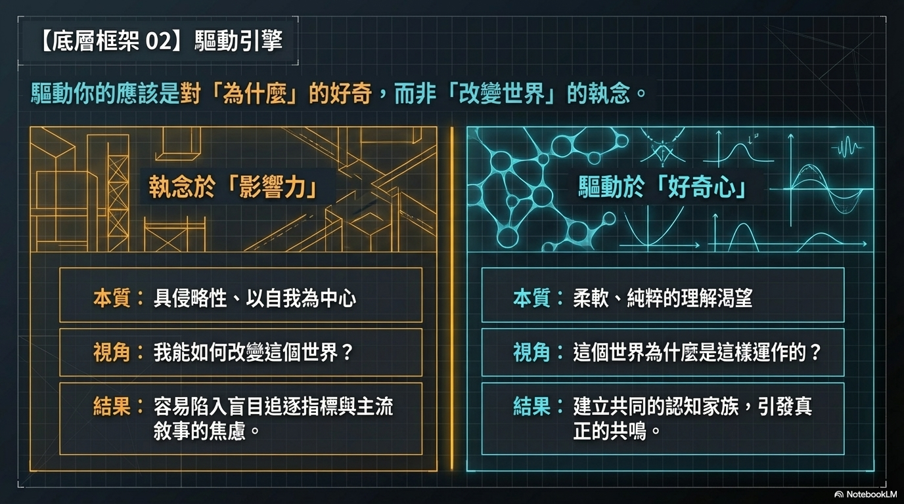
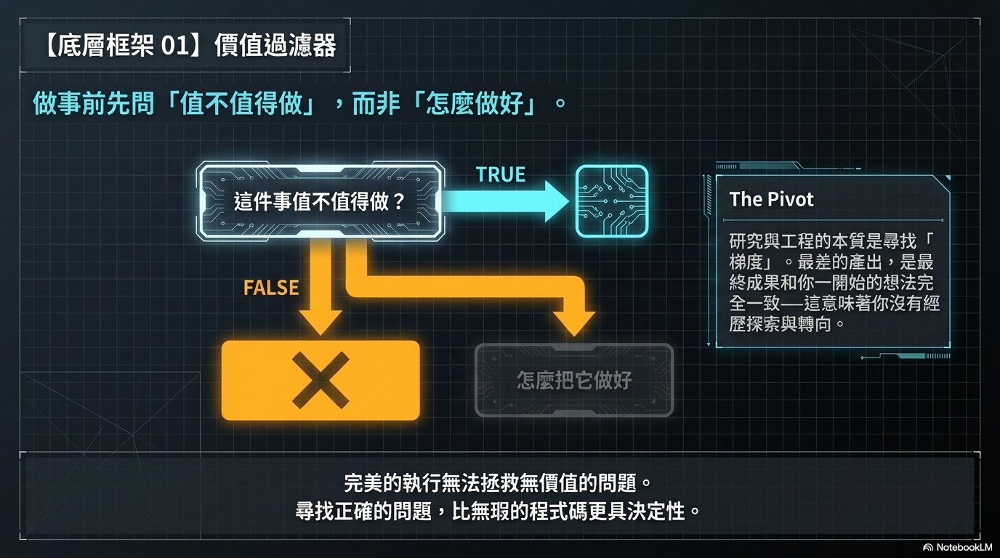

# [筆記] 從謝賽寧訪談看研究品味與 AI 未來

這份筆記整理自謝賽寧的一場七小時訪談，以軟體工程師的視角萃取出八個核心主題，涵蓋思維框架、工作習慣與長期視角。
<!--more-->

訪談連結：[https://www.youtube.com/watch?v=rIwgZWzUKm8](https://www.youtube.com/watch?v=rIwgZWzUKm8 "‌")

---

## 第一優先：影響判斷與決策的思維框架

### ① Impact 與理解 → 做事的心態底色

講者對於「impact」這個詞抱持著某種抵觸與反思的態度，他認為這是一個過於強勢且以自我為中心的概念。

他引用了政治哲學家漢娜·阿倫特（Hannah Arendt）的觀點：「**impact 這個詞是一個過於 aggressive，過於男性化的一個詞，對她來說，她做這些事情的目的不是創造 impact，而是為了理解本身**」。

講者進一步指出，追求「impact」往往伴隨著強烈的自我中心主義以及強行改造世界的意圖：「我覺得創造 impact 這件事情，沒有問題，特別以我為中心⋯⋯我要創造這個 impact，我要改變這個世界，但這個世界的人同意我這樣改變他嗎？」他甚至深刻地反思了這種心態的危險性：「這個世界上很多的災難，其實是因為大家要創造 impact，要去改造這個世界所帶來的」。

相較於刻意追求「impact」，講者更傾向於一種柔軟的表述，也就是尋求「理解」與被他人理解的「共鳴」。他認為研究的真正目的，在於自己對事物產生奇妙的理解後傳播出去，讓世界上更多人對問題有新的認知。他總結道，如果研究能做到這一點，「**這個地球上的智能總量就會被提上去，它永遠是一個對世界來說有利的事**」。

> **工程師的對應**：不要執著於「我要改變世界」這種 aggressive 的敘事，而是真心想弄清楚「為什麼」，讓理解本身驅動你。這也許是支撐長期投入最重要的內在燃料。

---

### ② 定義問題的能力 → 做對的事，而不只是把事做對

講者認為「定義問題的能力」是科學研究與創新過程中最核心、最重要，但也最容易被低估的能力。

**李飛飛與 ImageNet 的啟示**

講者非常敬佩史丹佛大學教授李飛飛，他認為李飛飛最厲害的點就在於「她是一個能夠定義問題的人」。大眾普遍認為李飛飛最大的成就是建立了 ImageNet 這個龐大的資料集，但講者指出，在 2011 或 2012 年時，「圖像分類（Image Classification）」根本還不是一個被學界明確定義的問題。李飛飛的偉大之處在於她「**把這個問題定義清楚，遠比 build 這樣一個資料集，要強得多得多，要重要得多得多**」。她設定了這個研究議程，才為接下來深度學習的爆發提供了一個可以施展拳腳的平台。

**失去定義問題的能力，就等於喪失了創新能力**

講者觀察到，在現今競爭壓力極大、大家急於追趕大廠腳步的環境下，研究人員很容易淪為只會解題的機器。他直言警示：「**如果失去了定義問題的能力，基本上也喪失了很多創新的能力，基本上也喪失了做 research 的能力**」。

> **工程師的對應**：在動手之前，先搞清楚這個需求是否值得解、問題的本質是什麼。技術實作只是後半段，前半段是判斷你在解的是不是對的問題。

**重點：真實問題的定義人在生活之中**

走向創業後，講者有了更具社會意義的體悟：真正的問題不應該只是由研究人員坐在實驗室裡憑空想出來，或者由幾家頭部科技巨頭強加於人。有大量 AI 尚未觸及的隱形需求（例如農場的運作、醫院的照護等），那些在真實世界裡生活、面對具體困難的人，才是「**這個問題的定義人**」。

---

### ③ 有限 vs 無限遊戲 → 怎麼衡量自己的成長

**「看最差的一次」vs「只要成功一次」**

講者用兩種遊戲的對比，深刻解釋了做研究的本質與評估標準。

對於下棋的棋手或是參加奧運的運動員來說，他們的職業生涯是一場「有限遊戲」。在這種高度競爭且容錯率極低的環境中，「**你最後的成就取決於你最差的一步**」——中間只要落錯一次子，就會滿盤皆輸。

相較之下，研究人員的角色更像是發明家，做研究是一場「無限遊戲」。在這個遊戲中，你不需要成功 100 次，「**你這輩子，真的只需要成功一次就夠了**」。即便過程中經歷了無數次的失敗與彎路，只要有一次突破性的成功，就能達到職涯的頂峰。

**核心邏輯：優化最高點（Max），而非平均值（Average）**

講者引用 MIT 教授 Bill Freeman 提出的一個非線性圖表：

- 在研究領域，一篇很差或表現平平的工作，其實沒有人會在意（nobody cares），也不會對你的職業生涯造成實質的傷害。
- 然而，一旦你做出一篇非常傑出、每個人都知道的頂級工作，它帶給你的影響力就會瞬間衝到最頂點。
- 因此，學術界衡量一個人的標準是看他的「**代表作（最高點 / Max）**」，而不是他過去所有工作的「平均值（Average）」。

---

## 第二優先：直接影響日常工作品質

### ④ 研究方法論 → 解決問題的方法

**拒絕空想，把研究當作遊戲來探索**

一個典型的研究週期大約是 6 個月，前 1 到 2 個月必須是純粹的探索期。找尋 Idea 不能單憑大腦空想，原話說：「不能坐在那想問題」。因為如果你憑空想出一個 Idea，通常不是已經有成千上萬的人正在競爭，就是別人早就試過且行不通的爛 Idea。

正確的做法是動手去寫代碼、復現基線模型。原話指出：「**你要真的像一個 hacker（黑客）一樣，去 play with，去玩一些東西，就把 research 當做一個遊戲，當做一個玩具去玩**」。

> **工程師的對應**：不要在腦子裡設計太久，先跑起來再說。

**在過程中尋找「梯度（信號）」才是真正的 Idea**

研究的過程就像是機器學習中的「隨機梯度下降（Stochastic Gradient Descent）」，你必須在不斷試錯中尋找信號。

原話提到：「**這個梯度本身，這件事情才是你真正的 idea 的來源**」，只有在探索過程中碰撞出來的 Idea，才真正屬於你自己。他更直言批評無聊的研究：「最差的 research 是什麼樣的 research？就是一開始你定義好的一個問題，你說這是我的 idea，最後你發了一篇論文，這個論文的 idea 跟你一開始想的 idea 完全一致⋯⋯這件事情說明，你的這個 idea 是一個 boring idea」。

**精細追蹤實驗並學會「預測」結果**

何愷明教導他利用 Excel 表格精細化地管理每一個實驗，不要瞎跑實驗，而是要讓每一次對照都能帶來最大的信息量。

關於如何看待實驗失敗，原話說：「**一個 negative 的信號的反方向，就是一個正向的信號⋯⋯你最害怕的事情是，它的 performance 停留在原地，不好也不差**」。只要有變化就是好信號，最怕的是沒有信號。

在跑實驗前必須先做假設，原話要求：「**你要學會做預測，在你跑每一個實驗的時候，你要預測這個實驗的結果應該是怎麼樣**」。如果預測對了，說明思路可以延續；如果錯了，這個「意外（surprise）」就能促使你去重新審視思路。

**接受研究的「非線性」發展**

研究往往不是一帆順的，可能前 5 個月都在碰壁，直到最後一個月才突然靈感迸發並收斂出結果。原話總結：「**research 從來不是一個線性的發展，或者說一個線性發展的 research，永遠不是好的 research**」。在過程中一定要學會轉換方向（pivot），最好的工作往往是經歷了無數彎路才達到的。

---

### ⑤ 研究品味（Research Taste）→ 工程品味

講者認為「Research taste」是一種很難具體定義的「研究審美」，包含哲學層面的認知、對細節的極致追求，以及高度個人化的表達。

**看透表象，直擊本質的哲學思維**

講者深受何愷明送他的《金剛經》啟發，引用了「凡所有相皆是虛妄」來解釋研究品味。好的研究品味意味著不能沉迷於「虛無的相」（例如論文是否被接收、外界的虛名、或一時的追捧與稱讚），而是要能拋開這些表象，堅持通往真理與實質的道路。

**追求極致的細節與「賞心悅目」的溝通介面**

Research taste 也體現在對論文寫作與呈現細節的強迫症（OCD）上。論文是知識的載體，是寫給別人看的，因此「**溝通介面要賞心悅目**」。

例如，何愷明會提前一個月就把論文寫完，然後花整整一個月的時間去打磨每一個表格、每一個字和標點符號。他們甚至規定論文中的每一行字不能少於 60% 的排版空間，以此來保證論文視覺上的「**優雅（elegant）**」與統一。

> **工程師的對應**：寫 PR、文件、技術設計時，受眾是別人，不是自己。

**像拍電影一樣的 Storytelling 能力**

講者認為做研究和拍電影的過程沒什麼兩樣，都需要展現高度個人化的創意與品味。一篇有品味的論文不應該是流水帳，而是要能講述一個好故事：你到底是如何到達這裡的？中間做了哪些決策（Decision making）？為什麼這個決策很重要？把決策過程呈現出來並啟發讀者，這是 Research taste 的重要組成部分。

---

### ⑥ 質疑精神 → 不被現有方案綁架

**在競爭激烈的環境中，更需堅守質疑精神**

講者認為，做研究必須要有某種「質疑精神」來指導做事的方法。他也坦言，在現今競爭壓力極大、大家急於追趕前沿的環境下，研究者很容易慢慢喪失這種質疑的能力，這是一件相當困難但也必須警惕的事。

**質疑主流共識，才能催生真正的技術突破（以 ConvNeXt 為例）**

講者的代表作之一 ConvNeXt 就是建立在質疑精神之上。當時學界普遍認為 Vision Transformer（ViT）最重要、最核心的技術是「自注意力機制（Self Attention）」。但講者與團隊質疑這件事情到底是不是真的，並基於這個質疑鋪疊了大量的對照實驗。最後他們打破了共識，發現 `Self Attention` 可能是其中最不重要的一環，真正決定效能的其實是宏觀與微觀的架構設計。

> **工程師的對應**：在技術選型、架構討論時，質疑現有假設往往比跟風更有價值。

**質疑是通往深刻理解的必經階段（以 JEPA 為例）**

質疑不是為了盲目反對，而是為了尋求真理。講者在面對 Yann LeCun 提出的 JEPA（聯合嵌入預測架構）時，經歷了「從質疑 JEPA、到理解 JEPA、再到成為 JEPA」的人生三個階段。

---

## 第三優先：偶爾提醒自己用的長期視角

### ⑦ 視覺與世界模型 → 理解 AI 技術方向

**視覺是一種「視角（Perspective）」，是智能必須解決的問題總和**

講者認為計算機視覺不是一個具體的任務或領域，而是一種「觀點（Perspective）」，它代表了智能系統為了解構真實世界所必須解決的一系列問題的總和。視覺智能必須具備三大核心處理能力：處理連續空間的、高維度的、有噪音的信號；建立層次化的表徵（Hierarchical Representation）；以及大規模並行處理空間中大量物體的物理變化與因果規律。

**視覺是推動地球智能演化的大爆發力量**

講者舉了地球歷史上的「寒武紀大爆發（Cambrian Explosion）」為例。在 5 億多年前，生物演化出視覺後，為了捕食與躲避天敵，引發了一場關於視覺能力的「軍備競賽」，進而促成物種數量的劇增。

**視覺智能與語言大模型（LLM）的本質區別**

語言是「溝通工具」，視覺是「真實的智能」。語言是人類演化出的高度抽象與精練的溝通介面，但它省略了物理世界的動態細節。LLM 更像是一種存在於數位空間的「虛擬智能」，而不是直接與物理世界交互的真實智能。

圖靈獎得主楊立昆（Yann LeCun）形容，現在的多模態大模型其實是「拄著拐杖」在走路，這根拐杖就是語言模型。如果缺乏強大的視覺表徵作為另一條腿，AI 系統永遠無法真正跑起來。

**視覺的終局：打造預測性的「世界模型」**

視覺領域未來的「北極星（終極目標）」，是建立一個可預測的世界模型（Predictive World Model）。這種視覺大腦不僅能接收連續的視覺流信號，還能看透像素背後的空間狀態與物理規律，進而進行推理（Reasoning）、規劃（Planning），並預測其行為（Action）在真實物理世界中會產生什麼後果。

---

### ⑧ 機制、組織與生態 → 理解你所在的組織

**學術界的「貢獻歸因」機制正在崩壞**

講者指出，過去幾十年來支撐學術界不斷向前的核心機制，就是「貢獻歸因（Credit Assignment）」——也就是讓大家清楚知道「是誰做了什麼事情」。然而，在現今由 LLM 引發的強烈商業競爭下，這個機制正慢慢被大公司打破。

**頂尖研究機構的管理機制：DeepMind vs 後期的 FAIR**

講者對比了兩家頂尖機構的做法。DeepMind 他非常推崇，認為他們將探索與執行完美結合——一開始允許研究小組有自下而上（bottom-up）的純粹探索空間；但一旦想法成型，立刻就會無縫銜接進入一種「自上而下（top-down）、講究執行力」的嚴密組織管理機制中。

他強烈批評 FAIR 後期出現的「對齊會議（Alignment meeting）」機制。講者認為這種強制從上而下要求確定的管理機制，完全違背了研究本該是「自下而上（bottom-up）」自然探索的邏輯，本質上是「**反研究（anti-research）**」的。

> **工程師的對應**：這個視角幫你判斷你所在的環境是否有利於真正的創新，以及什麼樣 of 組織結構會扼殺還是激發好的工程。

**對抗壟斷的「草根聯盟」商業生態機制**

在談及自己的創業公司（AMI Labs）未來的生態鏈時，講者引用了「萬事達卡（Mastercard）」誕生的歷史機制。講者認為，他們做世界模型也是要建立一個去中心化（Decentralized）的聯盟機制，把那些不願被矽谷 LLM 敘事壟斷的人聯合起來，形成一個反向的、開放共建的生態鏈。

## 我的連結
- Youtube: https://www.youtube.com/@Daydream-Studio/videos
- Podcast: https://cl4bfh8ww02uu01zgaj2i3d1u.firstory.io/episodes
- FaceBook: https://www.facebook.com/profile.php?id=100082389794254
- Blog: https://nostanduptalk.github.io/
