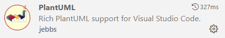
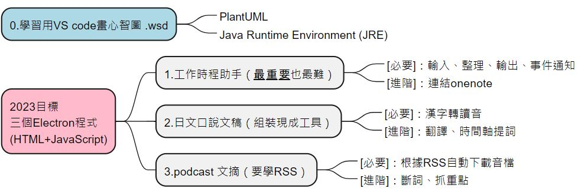

# 回顧2022與展望2023 


## 回顧2022
* 年初 - 開始建立部落格
* 年終 - 開始錄製podcast
* 年尾 - 日檢N2

## 展望2023
三個Electron程式
<!--more-->

## 學習用VS code畫心智圖
1. 在VS code安裝 PlantUML




2. preview 



3. 如果遇到不能顯示preview ，要安裝 [Java Runtime Environment (JRE).](https://www.java.com/en/download/)

4. 存檔在.wsd
```
@startmindmap
+[#lightblue] 0.學習用VS code畫心智圖 .wsd
++_ PlantUML
++_ Java Runtime Environment (JRE)

*[#FFBBCC] 2023目標\n三個Electron程式\n(HTML+Javascript)
** 1.工作時程助手（<b><u>最重要</u></b>也最難）
***_ [必要]：輸入、整理、輸出、事件通知
***_ [進階]：連結onenote

** 2.日文口說文稿（組裝現成工具）
***_ [必要]：漢字轉讀音
***_ [進階]：翻譯、時間軸提詞

** 3.podcast 文摘（要學RSS）
***_ [必要]：根據RSS自動下載音檔
***_ [進階]：斷詞、抓重點
@endmindmap

```


## 參考
https://plantuml.com/zh/mindmap-diagram#c45ac8a561d4656c

https://www.planttext.com/

https://stackoverflow.com/questions/70039939/how-to-use-the-plantuml-preview-in-vscode

<iframe src="https://open.firstory.me/embed/story/clcewqtv20c2g010gglr5dorc" height="180" width="500" frameborder="0" scrolling="no"></iframe>
