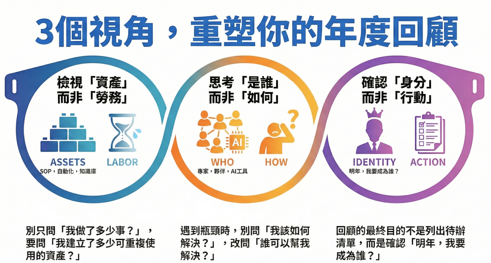

# [思考] 2026 願景：建立系統化學習與 LLM 輔助開發實踐

這不僅是技術學習的旅程，更是自我成長與身份轉變的實踐，我將透過 LLM 輔助開發，從零開始打造跨平台的 Flutter 應用程式。
<!--more-->

> **核心理念：「身份 > 行動」、「資產 > 勞務」**

新的一年，我為自己設定了一個充滿挑戰的目標：透過 **LLM 輔助開發**，從零開始打造一個跨平台的 **Flutter** 應用程式。這不僅是技術學習的旅程，更是自我成長與身份轉變的實踐。

## 🎯 三大核心支柱

### 一、持續進步：建立系統化學習習慣

**閱讀計畫**
- 目標：全年 12 本書，每月 1 本
- 主題分布：技術 → 架構 → 管理 → 領導
- 重點：不只是讀完，每本書都要產出心得與行動清單

**課程學習**
- 規劃：3 堂深度課程（實體或線上）
- 執行：Q2、Q3、Q4 各一堂
- 產出：筆記 + 實踐計畫

**週記與覆盤**
- 每週日投入 30-60 分鐘撰寫週記
- 每季進行一次深度覆盤
- 全年累積 52 篇週記 + 4 次季度總結

### 二、用 LLM 開發 Flutter 應用

這是今年最核心的技術挑戰：在 LLM 的協助下，完成一個完整的跨平台應用程式。

#### 📅 四季開發路線圖

**Q1：Web + Mac（地基與原型）**
- 學習 `FastAPI` 與 `Dart` 基礎
- 定義 **User Stories** 與 **API 規格 (PRD)**
- 建立 `FastAPI` 後端 **CRUD** 功能
- 搭建 `Flutter` 靜態 UI（優先支援 Web/Desktop）

**Q2：Mobile（核心與適配）**
- 實作邏輯與狀態管理
- 串接真實 API（JWT 驗證）
- **RWD** 手機版面適配與觸控優化
- 引入 `Riverpod` 管理複雜狀態

**Q3：Win + AI（整合與桌面）**
- 優化桌面體驗（快捷鍵、視窗管理、右鍵選單）
- 整合 `Claude/OpenAI API` 打造 AI 功能
- 實作 `SQLite` 本地緩存（離線模式）

**Q4：全平台（部署與上架）**
- **App Store / Play Store** 上架準備
- **GitHub Actions** 自動化建置 (**CI/CD**)
- 撰寫技術架構文件與使用手冊

### 三、開發原則：三階段嚴謹流程

#### Phase 1: 設計 (No Code)
1. **PRD**：定義 MVP、優先級、流程
2. **DB（首要）**：設計 Schema，使用 `snake_case`
3. **API（次要）**：規劃 Spec、Request/Response
4. **UI**：繪製 Wireframe、定義 States

#### Phase 2: 建構 (Coding)
1. **DB**：建立 Models、Migrations
2. **API**：開發 Endpoints、產生 `Swagger` 文件
3. **UI**：開發 Widgets、整合 `Riverpod`
4. ⚠️ **嚴格依據文件實作**

#### Phase 3: 整合與測試
1. **整合**：前後端串接
2. **測試**：**E2E 測試**、Edge Case 驗證
3. **驗收**：UAT、Bug Fix

---

## 💼 CTO 三大工作面向準則

作為技術領導者，我將持續精進以下三個面向：

### 【面向一】對工具/技術 (Working with Technology)

**重點：不只是寫程式，而是經營一個健康的系統。**

- **架構與決策**：設計不僅要滿足現在，還要能支撐未來（可維修、可延展）。避免過度設計，但要對技術選型負責。
- **品質與還債**：程式碼要易讀、易測、易交接。主動管理「**技術債**」，用數據向管理層說明償債的必要性，避免炸彈在未來引爆。
- **穩定性**：建立「**可觀測性**」(Monitoring/Logging)，確保出事能秒懂原因，並具備災難恢復的韌性。

### 【面向二】對任務/專案 (Working with Tasks)

**重點：不只是接單照做，而是確保做「對」的事並拿到結果。**

> **「你的價值不是做了多少，而是讓多少事情發生。」**

- **定義與規劃**：在動手前先確認「為什麼做」。將大目標拆解為可執行的路徑與里程碑。
- **推進與取捨**：主動清理阻礙，管理進度。在資源有限時，能區分輕重緩急（優先級），果斷進行 Scope 或交期的取捨。
- **覆盤與優化**：任務結束不是句點。透過 **覆盤** 將經驗轉化為團隊的流程與資產，避免重複造輪子或犯同樣的錯。

### 【面向三】對人/團隊/關係 (Working with People)

**重點：不只是管理他人，而是建立信任與共同成長。**

- **溝通與對齊**：確保資訊透明流通，消除跨部門摩擦。向上管理時，明確傳達風險與需求，爭取資源。
- **培育與文化**：透過授權與回饋培養新人。建立具備「**心理安全感**」的環境，讓問題能被真實討論。
- **價值與傳承**：懂得包裝與呈現成果，建立影響力。將個人知識轉化為團隊知識庫，降低對單一成員的依賴。

---

## ✈️ 生活體驗：工作與生活的平衡

除了技術成長，今年也規劃了豐富的生活體驗：

- **1月**：滑雪之旅（7天）
- **9月**：歐洲深度旅行（15天）
- **Q4**：日本秋季之旅（7天）

全年共 **29 天** 的旅行時間，讓自己在高強度的學習與開發之餘，也能充分休息與充電。

## 📊 資源配置策略

今年的資源配置遵循「**投資自己**」的原則：

- **持續進步**：投資在書籍、課程、LLM 訂閱等學習資源
- **滑雪 & 旅遊**：體驗與探索，拓展視野
- **基本生活**：房租、餐飲、交通等日常開支
- **購物 & 特支**：3C 設備、生活用品及彈性支出

## 🎯 結語：從行動到身份的轉變

2026 年的計畫不只是一份待辦清單，而是一個系統化的成長藍圖。透過：

1. **持續學習**：建立知識複利
2. **實戰開發**：將理論轉化為實際產出
3. **嚴謹流程**：培養專業的工作習慣
4. **生活體驗**：保持身心平衡

我期待在年底回顧時，不只是完成了一個 App，更重要的是，我已經成為一個更好的技術領導者、更有系統的學習者、更懂得平衡工作與生活的人。

---

## 參考連結
- [【年度回顧】如何進行年度回顧與展望？我的 2025 年計畫實踐紀錄](https://readingoutpost.com/annual-review-yearly-plan-2025/)

## 我的連結
- Youtube: https://www.youtube.com/@Daydream-Studio/videos
- Podcast: https://cl4bfh8ww02uu01zgaj2i3d1u.firstory.io/episodes
- FaceBook: https://www.facebook.com/profile.php?id=100082389794254
- Blog: https://nostanduptalk.github.io/
