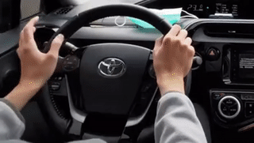

# [思考] 學習的兩種「型態」

<!--more-->
## 分享駕車經驗給新手
我距離拿到駕照已超過十年，但因為沒有自己買車，大部分時候都是回老家才有機會開。雖然一年不到三天自駕，但我也不用重新熟悉，每次上車就開，而且常常是一小時的高速公路，**可能已經跟騎腳踏車一樣有肌肉記憶了吧。**

這個周末，分享駕車經驗給新手，他似乎有方向盤控制問題，但我也不知道怎麼解說，後來透過錄影來比較後，我才發現我的手根本是淺意識的自動操作，根本不知道自己甚麼時候手交叉了，而在駕訓班的他，卻常常用口訣處理每個轉折點，導致沒辦法一邊轉方向盤一邊移動。

淺意識的自動操作：把右手讓開，以利右轉

## 新手按照食譜做，總舖師按感覺做
剛開始學習做食物的時候，通常會看食譜，多少克的糖，配上幾CC的水，再加熱到多少度。另一方面，總舖師做菜都是靠手感，調味也不知道應該是幾克，但配出來的口感都很棒。

## 結語：無招勝有招
嬰兒牙牙學母語，成人從單字文法學外語，也是同樣的意思，所以我學新語言的時候，盡量使用*嬰兒的環境*去學習，培養「語感」，而不是硬背文法，畢竟對於中文為母語的我來說，我也不知道中文法是甚麼。

# 連結
[ezgif-線上影片轉GIF並resize](https://ezgif.com/video-to-gif)

<iframe src="https://open.firstory.me/embed/story/cle1kxn1r0orc01t49un661ow" height="180" width="81%" frameborder="0" scrolling="no"></iframe>
